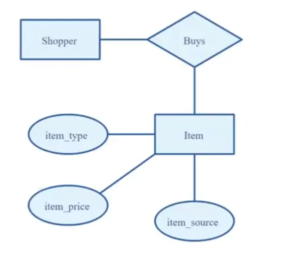
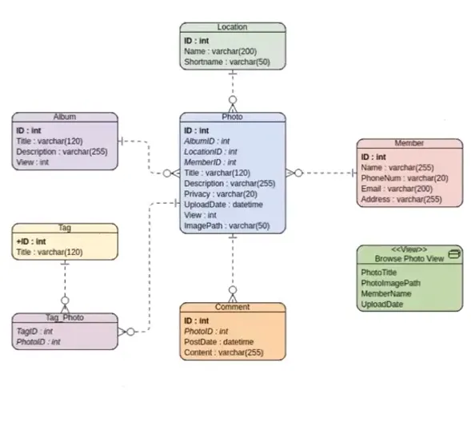

# Database Designing Process

## Unnamed System

> **Customer does not know what they need.**

### Overview
Customer explain the business, requirements, and problems we need to solve.

#### Key Points:
- A stakeholder explains the current business or departments (of an office), and the responsibilities of a department or
  an individual.
- Types of reports and documents they need.
- Explanation of the government or company policies they have to maintain.

#### Objective:
- Identify challenges the stakeholders face.
- Overcome those challenges or tasks by building suitable software.

## Named System with Customizations

> **Customer knows what they need to some degree.**

### Requirements
We need a system with the following features:

1. **Point of Sales (POS):**
    - Efficient and user-friendly interface for transactions.
    - Integration with inventory and accounting systems.
2. **E-Commerce Platform:**
    - Online sales channel to complement physical sales.
    - Customizable storefronts and payment gateways.
3. **Inventory Tracking:**
    - Real-time tracking of stock levels.
    - Alerts for low stock and reordering.
4. **Accounting Software:**
    - Automated financial reporting.
    - Tax compliance and expense tracking.
5. **HR and Payroll:**
    - Employee management system.
    - Payroll processing with tax calculations.

## Design Process
* Conceptual Design
* DBMS Selection
* Logical Design
* Physical Design

Source: Database Systems Design, Implementation, and Management by Carlos Coronel, Steven Morris 13th Edition

# Database Design Process

## 1. Requirement Collection & Analysis

Discover **information** that is required to **manage** to run the operations while **maintaining policies and 
regulations**.

### Site Visit/In-depth Interview

- Talk with stakeholders for around 30 minutes to gain initial insights (approximately 5% of the requirement).
- Identify keywords and processes mentioned by stakeholders and follow up with individuals managing those processes.
- Visit offices or factories to observe and understand workflows in-depth.
- Document daily, weekly, monthly, and yearly tasks and reports required.

### Study Current Processes and Practices

Analyze existing documentation and tools such as:
- Forms
- Reports
- Registers
- Receipts / Challans / Memos
- Bills / Invoices
- Acknowledgements / GRNs (Good Receive Notes)
- Books / Printed Copies / Excel Sheets

### Persona Interview

> An archetype of a user that helps designers and developers empathize by understanding their user’s business and 
> personal contexts.

### Prepare Wireframe

- **Interactive Wireframe (Figma):** 
  - Simulate user activities.
- **Low-Fidelity Design:**
   - Easy to change.
   - Avoid irrelevant feedback.
- **Focus:** Prioritize processes over design elements.

### Intensive Demonstration and Feedback Cycles

Engage in continuous iterations to refine the understanding of requirements.

### Outcome of Requirement Collection & Analysis

- Identified data requirements.
  - What data must be available?
  - How this information (and their modifications) will satisfy the business operations end-to-end.
- Defined relationships between data elements.
- Documentation: **BRS** (Business Requirement Specification) and **SRS** (System Requirement Specification).

---

## 2. Conceptual Data Model

Source: [Database for Software Developers - ostad](https://ostad.app/course/database-for-developer)

- Define entities.
- Identify attributes for each entity.
- Define relationships between entities.
- Visualize user activities against the data model to identify gaps.
- Iterate until all gaps are addressed.

### Outcome

- Captured data and operation requirements.
- Visual representation of data relationships.

### Tools and Techniques

- **Lego Serious Play:** A design thinking tool for collaborative problem-solving.

---

## 3. Logical Data Model

> Transitioning from high-level conceptual schema to implementable database structures.

Source: [Database for Software Developers - ostad](https://ostad.app/course/database-for-developer)

- **Define Tables, Columns, Keys, and Relationships:**
   - Mapping super-type entities.
   - Mapping multi-valued attributes.
   - Breaking down composite entities.
   - Detailing relationships and their attributes.
- Specify data types and constraints.
- Verify model accuracy with realistic datasets.
- Visualize user activities and refine the data model as needed.

### Outcome

- Database schema diagram.
- Visual representation of tables, fields, and relationships.

### Tools

- **https://www.dbdesigner.net/**: For creating and refining logical database models.

---

## 4. Physical Design

> Implementing the logical schema with considerations for performance, storage, and scalability.

- **Indexing:**
   - Create indexes for frequently queried columns to enhance performance.
   - Use composite indexes where applicable to optimize multi-column queries.
- **Partitioning:**
   - Split large tables into smaller, manageable pieces to improve query performance and maintenance.
   - Employ horizontal or vertical partitioning based on data usage patterns.
- **Sharding:**
   - Distribute data across multiple servers to handle large-scale datasets.
   - Ensure proper configuration to avoid data inconsistencies.
- **Storage Optimization:**
   - Choose appropriate data types to minimize storage requirements.
   - Normalize or denormalize data as per the application needs.
- **Backups and Recovery:**
   - Set up regular automated backups to ensure data safety.
   - Implement recovery plans for disaster scenarios.
- **Performance Monitoring:**
   - Continuously monitor database performance and query execution times.
   - Use database profiling tools to identify and resolve bottlenecks.

### Outcome

- Optimized database implementation ready for deployment.
- Configurations that ensure scalability and high performance.

### Tools

- **https://www.mysql.com/products/enterprise/monitor.html**: For performance monitoring.
- **https://www.pgadmin.org/**: For managing PostgreSQL databases.

# Data Migration and Handling CRUD Operations During Migration (SQL Server to MySQL)

## Handling CRUD Operations During Migration

If you need to perform CRUD (Create, Read, Update, Delete) operations on your old SQL Server database while the 
migration to MySQL is still in progress, you have several strategies to manage this, each with its own tradeoffs. 
Here's a breakdown:

**1. Dual Writes (Write to Both Databases):**

* **How it works:**
    * Modify your application to write data to both the SQL Server and MySQL databases simultaneously.
    * Reads can continue to be served from SQL Server until the migration is complete.
* **Pros:**
    * Ensures data consistency between the old and new databases.
    * Minimizes data loss during cutover.
* **Cons:**
    * Increases application complexity.
    * Requires careful error handling to ensure both writes succeed.
    * Increased load on both databases.
    * Latency can be an issue.
* **When to use:**
    * When data consistency is critical.
    * When you can tolerate increased application complexity.
    * When you can tolerate increased database load.

**2. Data Synchronization/Replication:**

* **How it works:**
    * Set up a data synchronization or replication mechanism to keep the MySQL database in sync with the SQL Server
      database.
    * This can be done using tools like:
        * Change Data Capture (CDC) in SQL Server and similar mechanisms in MySQL.
        * Third-party replication tools.
    * Reads can continue to be served from SQL server.
* **Pros:**
    * Automates data synchronization.
    * Minimizes data loss during cutover.
    * Can provide near real-time updates.
* **Cons:**
    * Can be complex to set up and configure.
    * Requires careful monitoring to ensure data integrity.
    * Can add overhead to the databases.
* **When to use:**
    * When you need near real-time data synchronization.
    * When you have the technical expertise to set up and manage replication.

**3. Application Logic to Route CRUD Operations:**

* **How it works:**
    * Modify your application logic to route CRUD operations to the appropriate database based on certain criteria (e.g.
      , specific tables, user roles).
    * For example, new data might be written to MySQL, while existing data is still read from SQL Server.
* **Pros:**
    * Provides granular control over data migration.
    * Allows for phased migration.
* **Cons:**
    * Increases application complexity.
    * Requires careful planning and testing.
    * Can be hard to maintain.
* **When to use:**
    * When you need a phased migration approach.
    * When you have complex data routing requirements.

**4. Temporary Freeze/Read-Only Mode:**

* **How it works:**
    * Temporarily freeze or put the SQL Server database into read-only mode during a short window to perform the final 
      data synchronization.
    * This is typically done during off peak hours.
* **Pros:**
    * Simplest approach for final cutover.
    * Minimizes data inconsistency.
* **Cons:**
    * Causes application downtime.
    * Requires careful planning and coordination.
* **When to use:**
    * When you can tolerate a short period of downtime.
    * For the final cutover.

**5. Feature Flags:**

* **How it Works:**
    * Use feature flags to control which database your application uses for different operations.
    * This allows you to gradually switch over to MySQL while maintaining the ability to roll back if necessary.
* **Pros:**
    * Allows for gradual rollout and easy rollback.
    * Reduces risk during cutover.
* **Cons:**
    * Increases application complexity.
    * Requires a robust feature flag management system.
* **When to use:**
    * When you want a gradual rollout and easy rollback.
    * When you have a robust feature flag management system.

**Key Considerations:**

* **Data Consistency:** Choose a strategy that minimizes data inconsistency between the old and new databases.
* **Application Complexity:** Balance the need for data consistency with the added complexity of your application.
* **Downtime:** Minimize downtime during the cutover process.
* **Testing:** Thoroughly test your chosen strategy before implementing it in production.
* **Rollback Plan:** Have a clear rollback plan in case of issues.
* It's crucial to thoroughly evaluate your specific requirements and choose the strategy that best fits your needs.

## Migrating Data from SQL Server to MySQL

Migrating data from SQL Server to MySQL involves several steps, and the best approach depends on the size and complexity 
of your data, as well as your available resources and technical expertise. Here's a breakdown of common methods and 
considerations:

**1. Understanding the Challenges:**

* **Data Type Differences:** SQL Server and MySQL have different data types. You'll need to map them appropriately (e.g.
  , `nvarchar` to `VARCHAR`, `datetime` to `DATETIME`).
* **Schema Differences:** Table structures, constraints, indexes, and stored procedures might need adjustments.
* **Character Sets and Collations:** Ensure character sets and collations are compatible to avoid data corruption.
* **Large Data Volumes:** 15-20 GB requires efficient methods to minimize downtime and resource usage.
* **Foreign Keys and Relationships:** Properly migrate and maintain relationships between tables.

**2. Migration Methods:**

* **SQL Server Migration Assistant (SSMA) for MySQL:**
    * This is a Microsoft tool that automates much of the migration process.
    * It assesses schema differences, converts data types, and migrates data.
    * **Pros:** Automates schema conversion, handles data type mapping, provides migration reports.
    * **Cons:** Might require manual adjustments for complex schemas, can be slow for very large datasets.
    * **How to:** Download and install SSMA for MySQL, connect to both SQL Server and MySQL instances, create a 
      migration project, and follow the wizard.
* **Using ETL (Extract, Transform, Load) Tools:**
    * Tools like Talend, Pentaho, or Apache NiFi provide visual interfaces for data migration.
    * They offer advanced data transformation capabilities and can handle complex scenarios.
    * **Pros:** Flexible data transformation, handles large datasets, provides detailed logging.
    * **Cons:** Requires learning a new tool, setup and configuration can be complex.
    * **How to:** Configure data sources (SQL Server) and destinations (MySQL), create data transformation pipelines, 
      and execute the migration.
* **Using `bcp` (SQL Server) and `mysqlimport` (MySQL):**
    * `bcp` (Bulk Copy Program) exports data from SQL Server to flat files.
    * `mysqlimport` imports data from flat files into MySQL.
    * **Pros:** Fast for large datasets, command-line based, simple to use.
    * **Cons:** Requires manual data type conversion and schema adjustments, limited error handling.
    * **How to:** Use `bcp` to export data from SQL Server to CSV files, manually adjust data types if needed, create
      corresponding tables in MySQL, and use `mysqlimport` to import data.
* **Using Programming Languages (Python, etc.):**
    * Write custom scripts using libraries like `pyodbc` (for SQL Server) and `mysql.connector` (for MySQL).
    * **Pros:** Highly flexible, allows for custom data transformations and error handling.
    * **Cons:** Requires programming expertise, development time can be significant.
    * **How to:** Connect to SQL Server and MySQL databases, fetch data from SQL Server, transform data as needed, and 
      insert data into MySQL.
* **Using Database Replication Tools:**
    * Tools exist that can replicate data from one database type to another.
    * **Pros:** Can provide near real time data migration, keeps databases in sync.
    * **Cons:** Can be complex to setup.

**3. Migration Steps (General Outline):**

* **Schema Assessment:** Analyze the SQL Server schema and identify differences with MySQL.
* **Schema Conversion:** Convert the SQL Server schema to MySQL, adjusting data types and constraints.
* **Data Extraction:** Extract data from SQL Server using your chosen method.
* **Data Transformation:** Transform the data to match the MySQL schema and data types.
* **Data Loading:** Load the transformed data into MySQL.
* **Data Validation:** Verify the data integrity and accuracy in MySQL.
* **Application Testing:** Test your application with the migrated data.
* **Cutover:** Switch your application to use the MySQL database.

**4. Important Considerations:**

* **Downtime:** Plan for minimal downtime during the cutover.
* **Backup:** Back up both SQL Server and MySQL databases before starting the migration.
* **Testing:** Thoroughly test the migration process and the migrated data.

# References
- [Database for Software Developers - ostad](https://ostad.app/course/database-for-developer)
