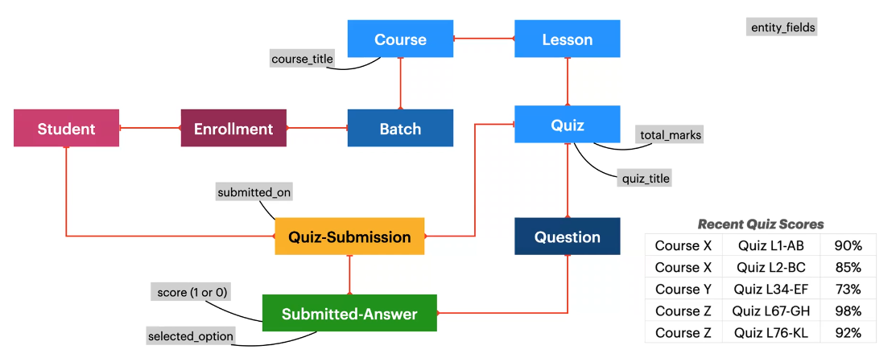
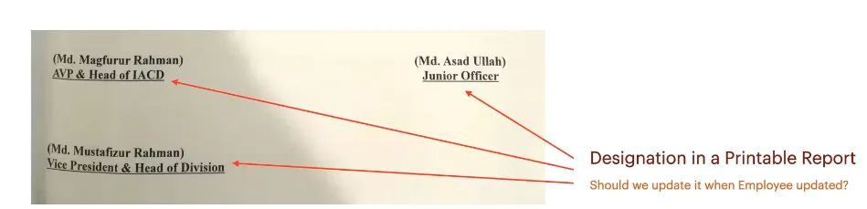
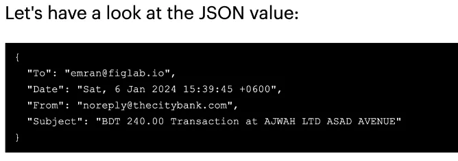
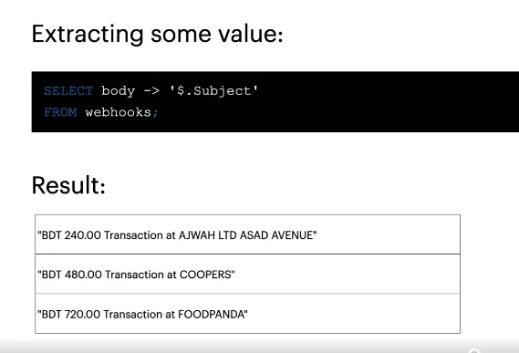
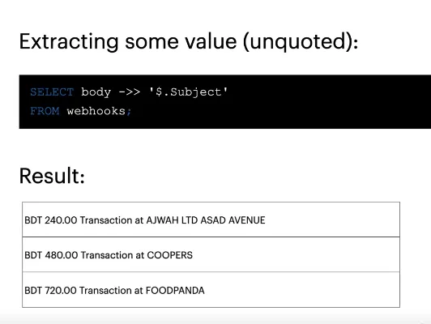
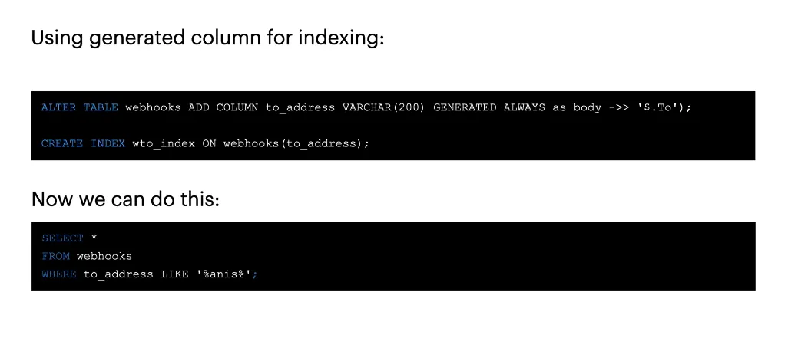
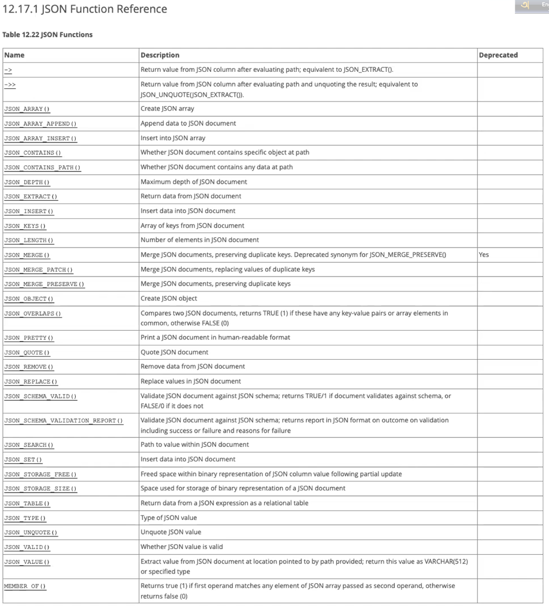

# Advanced Concepts

# **Storage | Performance | Materialized View | Transactions**

## Storage Engines

⇒ Can define storage engine for a particular table.

### InnoDB

The default storage engine in MySQL 8.0. InnoDB is a transaction-safe(ACID compliant) MySQL storage engine with commit, rollback, and crash-recovery capabilities. It has row-level locking that increases mulit-user concurrency and performance.

⇒ This can recover crashed file by itself at the most of the cases. If it cannot then we have to take this from backup. Also can recovery of level while configuring.

⇒ It lock row instant of table while executing complex or time consuming update task.

⇒ Oracle is a performance RDBMS.

⇒ can use full text search

### MyISAM

They have a small footprint. Table-level locking limits the performance in read/write workloads, so it is often used in read-only or read-mostly workloads in Web and data warehousing configurations.

⇒ can use full text search

### Memory

Stores all data in RAM, for fast access in enviroments that require quick lookups of non-critical data.

⇒ Can use instance of Radis, Memcachse

⇒ In postgress we have this engine.

### CSV

Its tables are text files with comma-separated values. CSV tables let you import or dump data in CSV format, to exchange data with scirpts and applications that read and write that same format.

⇒ Do not have index, not usefull for complex query. Can use if get data in CSV format.

⇒ We can read data easily as it remain text format in other database it remains as binary file. Can not get data direactly from file need another database engine to read/write the data.

### Archive

These compact, unidexed tables are intended for storing and retriving large amounts of seldom-referenced historical, archived, or security audit information.

⇒ Read only data, can store very old log entry, history, order or product history

### Blackhole

The Blackhole storage engine in MySQL is a unique type of storage engine that does not store any data. When you use the Blackhole engine for a table, any data written to the table is accepted and then discarded. This means that no data is actually stored on disk or in memory for that table.

The Blackhole engine has several practical applications:

1. **Replication Filtering**: One of the primary uses of the Blackhole engine is in complex MySQL replication setups. You can set up a replication slave with tables using the Blackhole engine. This slave then processes the replication log, but does not store any actual data. This can be useful for filtering replication data before it is passed to other slaves or for reducing the load on certain database servers in a replication topology.
2. **Security and Auditing**: Since queries against Blackhole tables are written to the binary log (if binary logging is enabled), this can be used for security and auditing purposes. You can see what data was intended to be written without actually storing the data.
3. **Testing and Benchmarking**: The Blackhole engine can be used for performance testing and benchmarking, especially in replication scenarios. It helps in understanding the overhead of the binary logging and replication without the additional overhead of actual data storage and retrieval.
4. **Query Routing in a Proxy**: In a MySQL proxy setup, you might use Blackhole tables to analyze or transform queries before they are sent to the actual storage engine in the backend server.

To use the Blackhole engine in MySQL, you can create a table as follows:

```sql
CREATE TABLE example_table (
    id INT,
    value VARCHAR(100)
) ENGINE=BLACKHOLE;
```

This table creation command will create a table that accepts data but doesn't store it. It's important to understand that while the Blackhole engine is useful in specific scenarios, it's not suitable for general-purpose data storage due to its inherent characteristic of not storing data.

## Transactions

A database transaction is a single execution of the database where multiple data operations are carried out and written as a whole.

- Ensure consistency
- Allows recovery on error
- Useful for testing
- Essential for same industries(bank, e-commerce)

⇒ MongoDB does not give ACID compliance so instructors do not recommend it for e-commerce, it’s strengths are sharding, document data presentation, dashboard, log

1. Initiate the transaction
2. Perform create, read, update, or delete operations
3. if successful, **commit** the transaction.
4. Alternatively, **rollback** the transaction.

```sql
START TRANSACTION;

INSERT INTO users(name, email) VALUES ('John Deo', 'johndeo@example.com');
UPDATE accounts SET balance = 5000 WHERE user_id = 15;

COMMIT; 
```

⇒ MySQL does transactions at temp space and then commits it to the main disk space if the transaction is successful. Should give enough RAM to MySQL.

⇒ Monitoring tool setup for detecting synchronization off, and replication off.

⇒ 1 master node and 3 slave nodes and the master node gets down if we do this by clustering then MySQL will make one as the master node this why for this setup we need at least 3 nodes and if did manually set then have to make one node as master manually and will have downtime.

⇒ MySQL router for load-balancing SQL node.

⇒ master-master used for

- For e-commerce,
- Used for write load balancing

⇒ master-slave used for

- Backup: If the physical disk or the container containing the MySQL database crashed then if we had a raid then we can get data back but will take time. So if any reason master gets lost then we can use the slave. Have to do write on master must and can read from slave first then master for the faster read operation.

⇒ connection

- Multiple connections can make applications faster.
- persistence connection

⇒ batch insertion in MongoDB is not atomic in MySQL this is also not atomic should use transaction for atomicity.

⇒ No-SQL gives eventual consistency but in SQL it is consistency. This means that the update operation No-SQL will confirm success after retrieving the data not after successfully running the operation but in the SQL it will retrieve and update data and then will tell the operation completed successfully. Although in milliseconds operation will done(if have a low load and with enough hardware) in No-SQL and 98% time it will not be a problem. In a No-SQL database for e-commerce get an order and decrease the stock quantity from 100 to 80 but if another connection tries to get the stock quantity at that moment it could get the stock quantity as 100 eventually in milliseconds it will be updated to 80. That is why banks always use SQL.


# Denormalization

Denormalization is the process of adding redundancy to a database to improve the read performance.

- Avoid complex relation chain
    - With the cost of redundancy
- Improve read performance
    - And risking data integrity

Imagine an LMS Requirement



Source: [Database for Software Developers - ostad](https://ostad.app/course/database-for-developer)

## Some common scenarios

### Improving Query Performance

Keep some redundant data / reference for faster retrieval (based on data access pattern)

### Reporting and Data Warehousing

Create denormalized tables(or materialized views) that combines and pre-aggregate relevant data.

### Caching Frequently Accessed Data

Duplicate frequently accessed data in a separate, flat table to avoid complex joins and real-time aggregations.

### Improve Analytical Ability

Keep reference of connected entities in multiple levels to empower critical, on-demand analysis with efficiency.

## Power and Responsibilty

- The key is to strike a balance between the benefits of normalization and the performance improvements that denormalization can provide.
- Carefully analyze the specific data access patterns and performance requirements of your application before deciding to denormalize.

## Reference vs Snapshot

We have to make the designation a snapshot as it is a letter if a person’s designation change we do not need to change it on the letter.Another this price of a product in the invoice should take the price as a snapshot as if product price increase or decreases we can not change the price on the invoice which is already paided by customer. it is curtial for ecommerce.



Source: [Database for Software Developers - ostad](https://ostad.app/course/database-for-developer)

## JSON

```sql
CREATE TABLE webhooks (
	id INT(11) NOT NULL AUTO_INCREMENT,
	source VARCHAR(50) NOT NULL,
	body JSON NULL,
	PRIMARY KEY (id)
);
```



Source: [Database for Software Developers - ostad](https://ostad.app/course/database-for-developer)

```sql
SELECT body -> '$.Subjet'
FROM webhooks;
```







Source: [Database for Software Developers - ostad](https://ostad.app/course/database-for-developer)

### UseCase

- To check what I give to third-party API and what they send with date and time.
- To keep a log. ⇒ Purge policy. No-SQL best fit for it.



Source: [Database for Software Developers - ostad](https://ostad.app/course/database-for-developer)

recovery when database table replaced by mistake ⇒ InnoDB

import topic for interview

⇒ syntax

⇒ schema design after showing dashboard

⇒ extract data from schema design

⇒ join

⇒ subquery

⇒ aggregate

⇒ grouping, ordering


# **Purging, Archiving, and Partitioning**

## **1. Data Purging**
Data purging refers to the process of permanently removing or deleting irrelevant, obsolete, or redundant data from a 
database, system, or data repository.

### **Why is Data Purging Important?**
- **Optimize Storage Space:** Frees up valuable storage by removing unnecessary data.
- **Enhance Performance:** Reduces database size, leading to faster query execution.
- **Maintain Data Accuracy:** Eliminates outdated or incorrect information.
- **Compliance and Security:** Helps meet data retention policies and securely deletes unnecessary data.

### **Steps in Data Purging**
1. **Identify Data for Purging:** Define rules to classify obsolete data.
2. **Backup Critical Data:** Ensure important data is archived before purging.
3. **Implement Purging Rules:** Use scripts or tools to delete data based on criteria.
4. **Test the Purge Process:** Verify correctness in a test environment.
5. **Execute the Purge:** Perform during non-peak hours to minimize disruptions.
6. **Monitor and Validate:** Ensure only intended data is deleted.

### **Example SQL Query for Data Purging**
```sql
-- Purge data older than a specific date
DELETE FROM orders
WHERE order_date < '2023-01-01';
```

---

## **2. Data Archiving**
Data archiving refers to the process of moving data that is no longer actively used to a separate storage system for 
long-term retention.

### **Benefits of Data Archiving**
- **Data Retention:** Ensures historical data is available for reference or compliance.
- **Storage Optimization:** Frees up space in active systems by moving less-used data.
- **Cost Savings:** Uses cheaper storage solutions for archived data.

### **Steps in Data Archiving**
1. **Identify Archivable Data:** Determine which data should be archived.
2. **Choose an Archive Location:** Decide where archived data will be stored (e.g., cloud storage, tape).
3. **Move Data:** Use ETL tools or database commands to move data.
4. **Test and Validate:** Ensure data integrity during and after the archive process.

### **Example of Data Archiving in SQL**
```sql
-- Move archived data to a separate table
INSERT INTO archived_orders
SELECT * FROM orders
WHERE order_date < '2023-01-01';

-- Delete data from the original table
DELETE FROM orders
WHERE order_date < '2023-01-01';
```

---

## **3. Data Partitioning**
Partitioning is a database management technique where large tables are divided into smaller, more manageable pieces, 
called partitions.

### **Types of Partitioning**
1. **Range Partitioning:** Divides data based on a range of values.
   ```sql
   CREATE TABLE orders (
       order_id INT,
       order_date DATE
   ) PARTITION BY RANGE (YEAR(order_date)) (
       PARTITION p2021 VALUES LESS THAN (2022),
       PARTITION p2022 VALUES LESS THAN (2023)
   );
   ```
2. **List Partitioning:** Divides data based on a list of values.
3. **Hash Partitioning:** Uses a hash function to evenly distribute data.
4. **Composite Partitioning:** Combines two or more partitioning strategies.

### **Benefits of Partitioning**
- **Improved Query Performance:** Queries can scan specific partitions instead of the entire table.
- **Efficient Data Management:** Easier to manage subsets of data individually.
- **Storage Optimization:** Allows different partitions to be stored on separate storage devices.

---

## **Comparison: Purging vs. Archiving vs. Partitioning**

| **Aspect**         | **Purging**                            | **Archiving**                           | **Partitioning**                             |
|--------------------|----------------------------------------|-----------------------------------------|----------------------------------------------|
| **Purpose**        | Deletes obsolete data permanently.     | Moves data to long-term storage.        | Splits data into smaller, manageable parts.  |
| **Recoverability** | Data cannot be recovered.              | Data is recoverable from archive.       | Data remains accessible within partitions.   |
| **Use Case**       | Optimize storage, enhance performance. | Retain historical data for reference.   | Improve query performance and manageability. |
| **Impact**         | Irreversible.                          | Data is stored elsewhere.               | Transparent to end-users.                    |

---

## **Best Practices**
1. **For Purging:**
  - Define clear rules and test before executing.
  - Ensure compliance with data retention policies.
2. **For Archiving:**
  - Use cost-effective storage solutions.
  - Maintain data integrity during migration.
3. **For Partitioning:**
  - Choose the partitioning type based on query patterns.
  - Monitor and maintain partitions for optimal performance.

---

By effectively implementing purging, archiving, and partitioning, organizations can optimize their database management,
ensure data compliance, and enhance system performance.


# Data Migration Strategy: SQL Server to MySQL

## Context
Previously, the database was managed using SQL Server, which has grown to a size of 15-20 GB. Now, we plan to transition
to MySQL for storing new data while retaining the SQL Server database for historical data. This ensures efficient
management of old and new records without disrupting existing workflows.

## Strategy Overview

### 1. **Old Data in SQL Server**
- **Purpose**: The SQL Server database will continue to store historical data. Users can query this database for records
  created before the migration.
- **Approach**:
  - The SQL Server database remains operational for read-only purposes. This prevents any accidental modifications to 
    historical data.
  - Create views or APIs to allow seamless querying of historical records from SQL Server when needed.
  - Maintain proper documentation of the schema and metadata for reference during future data extraction or analysis
    tasks.
  - Regularly back up the SQL Server database to ensure data safety.
  - Optimize the SQL Server for read-heavy operations by creating indexes and optimizing queries used for accessing 
    historical data.
  - Establish user access policies to restrict modifications, ensuring the integrity of the historical data.
  - Use reporting or analytics tools to generate insights from the historical data without affecting operational 
    workflows.
  - **Handling Write Operations**:
    - If any write operations are required on the historical data in SQL Server:
      1. Extract the relevant data from SQL Server.
      2. Transfer the extracted data into MySQL.
      3. Perform the write operation in the MySQL database.
      4. Delete the corresponding data from SQL Server to ensure consistency and prevent duplication.
- **Benefits**:
  - Avoids the immediate need for migrating a large dataset (15-20 GB) into MySQL.
  - Ensures continuity of existing processes reliant on SQL Server.
  - Preserves historical data integrity and provides a fallback for audit or compliance needs.

### 2. **New Data in MySQL**
- **Purpose**: All new data will be stored in the MySQL database starting from the last record in SQL Server. This 
  ensures continuity and prevents duplication.
- **Approach**:
  - Design the MySQL database schema to match the requirements of new data while considering the schema of the SQL 
    Server database.
    - Map similar fields between SQL Server and MySQL.
    - Ensure that MySQL schema incorporates optimizations for the types of queries and operations expected on the new 
      data.
  - Configure auto-increment values in MySQL tables to start from the last known record ID in SQL Server, ensuring no 
    conflicts or overlaps.
  - Develop middleware or APIs to direct all new data writes to MySQL. This ensures a seamless transition for
    applications.
  - Test and validate data insertion workflows in MySQL to ensure performance and data integrity.
  - Regularly monitor and optimize the MySQL database for performance by indexing frequently queried columns and
    analyzing query patterns.
  - Establish a process for periodic backups of the MySQL database to ensure data safety.
  - **Ensuring Zero Downtime During Data Transfer**:
    - Use database replication tools to replicate SQL Server data into MySQL in real-time or near real-time.
    - Implement a dual-write mechanism during the transition phase to ensure updates are written to both databases.
    - Gradually switch read operations to MySQL as confidence in the system grows.
    - Monitor and validate data consistency throughout the transition process.
- **Benefits**:
  - Leverages the advantages of MySQL, such as scalability, open-source flexibility, and community support, for managing
    future data growth.
  - Reduces dependency on SQL Server for new operations, simplifying the technology stack.
  - Ensures efficient management of data growth by segregating new and old data.

## Optional Data Consolidation
To consolidate old data into the new MySQL database, an ETL (Extract, Transform, Load) process can be employed. This can
be done incrementally or for specific datasets as needed.

### ETL Process Overview
1. **Extract**:
  - Use an ETL tool (e.g., Talend, Apache Nifi, or custom scripts) to extract data from SQL Server.
  - Extract data incrementally to avoid impacting SQL Server’s performance.

2. **Transform**:
  - Map SQL Server schema to MySQL schema.
  - Clean and validate data to ensure compatibility with MySQL.

3. **Load**:
  - Import transformed data into the MySQL database.
  - Ensure referential integrity and avoid duplicate records.

## Implementation Steps
- **Step 1**: Close SQL Server for write operations and make it read-only.
- **Step 2**: Configure MySQL to handle all new data operations.
- **Step 3**: If necessary, set up the ETL process to migrate selected historical data from SQL Server to MySQL.
- **Step 4**: Document the workflow and maintain logs for auditing and troubleshooting purposes.

## Tools and Recommendations
- **ETL Tools**: Talend, Apache Nifi, or custom Python scripts with libraries like `pymssql` and
  `mysql-connector-python`.
- **APIs**: Use REST APIs or GraphQL for data access across both databases.
- **Monitoring**: Set up monitoring for both databases to ensure performance and availability.

---
This strategy provides a balanced approach to manage both historical and new data efficiently, ensuring continuity while
leveraging the strengths of both SQL Server and MySQL.


# References
- [Database for Software Developers - ostad](https://ostad.app/course/database-for-developer)
