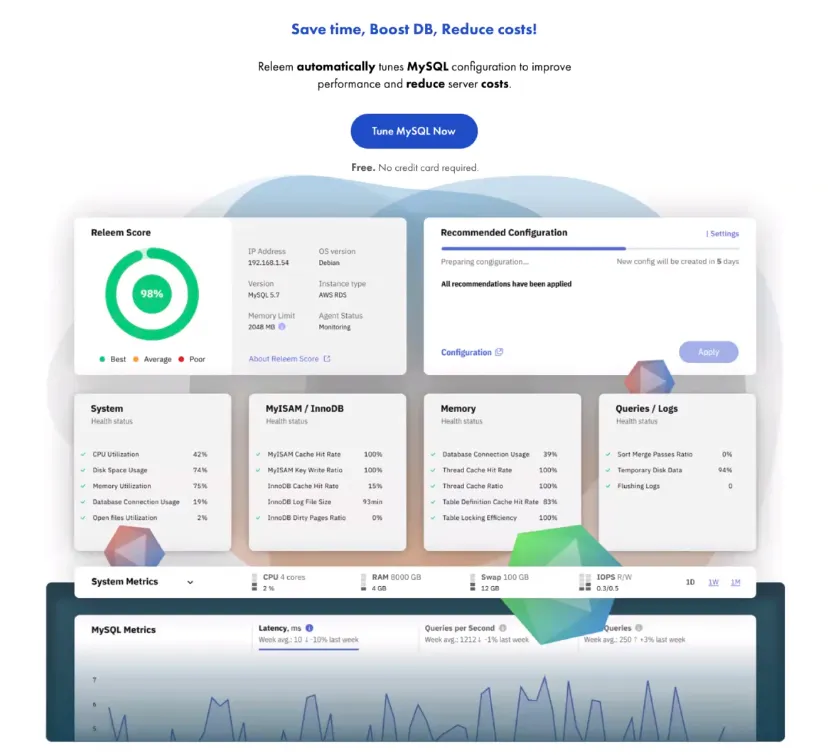
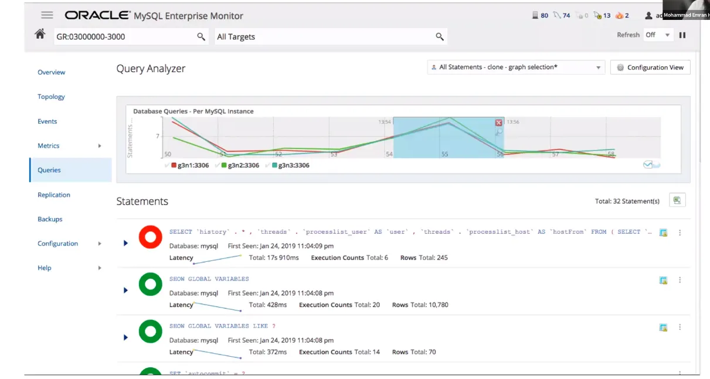

# Basic Administration & Performance Optimization

# **MySQL Server Optimization | InnoDB Optimization**

### Performance Tuning Basic Guideline

- Think before making any changes.
- Monitor your system using available tools. ⇒ swap, read, write
- Be careful in using “best practices”
- Make incremental changes
- Test your changes before deploying to production.
- Application metrics
- Slow Query Log
- Manually executing queries to determine if
    - queries are too slow, or
    - queries are using too much memory
- MySQL Enterprise Monitor - Query Analyzer

90% of the time, the problem is in the SQL query, Indexing, Schema Changes Data Growth. Hardware is rarely the issue.




Source: [Database for Software Developers - ostad](https://ostad.app/course/database-for-developer)

## InnoDB Configuration

### InnoDB Buffer Pool - innodb_buffer_pool_size

- Size of the buffer pool, memory area where InnoDB cache table and index data.
- A larger buffer pool requires less disk I/O to access the same table data more than once.
- Since MySQL 5.7, innodb_buffer_pool_size can be changed dynamically.
- Optimal Size:
    - Total memory of the host(or allocated for MySQL)
    - (-) memory required by OS and other process
    - (-) memory required by MySQL other than the InnoDB buffer pool.
    - Choose the minimum of this and the size of the “working data set”.
    - ⇒ Some tools can suggest buffer size by calculating the load after the start of MySQL.

### Number of InnoDB Buffer Pools - innodb_buffer_pool_instances

- Specifies how many instances to split the buffer pool into.
    - Can reduce concurrent workload to improve scalability on a busy server.
    - Only takes effect only when innodb_buffer_pool_size ≥ 1GB
- Generic suggestion = max(4, CPU cores / 2)
- Test with your workload!
- Requires restart.

### Automatically configure - innodb_dedicated_server

- When innodb_dedicated_server is enabled, InnoDB automatically configures the following variables:
    - innodb_buffer_pool_size
    - innodb_redo_log_capacity
    - innodb_flush_method
- Explicit settings can always be set(doesn't prevent automatic setting for other variables)
- Only consider if the MySQL instance resides on a dedicated server where it can use all available system resources.

⇒ MySQL SOUNDEX, ingesten

### Connections, Opend Tables and Opened Files

- max_connections
    - Maximum permitted number of simultaneous client connections.
    - Be careful setting this too large as each connection require memory.
    - Affect the maximum number of files the server keeps open.
    - **Rememer to set limits and file descriptors in Linux servers**
- table_open_cache
    - Number of maximum allowed open tables for all threads
    - Increasing this value increases the number of file descriptors that mysqld requires.

### Schema Optimization Tips

- Design your tables to minimize their space on the disk
    - Reduce the amount of data written to and read from disk.
    - Smaller tables normally require less main memory.
    - Smaller indexes that can be processed faster.
- Use the most efficient(smallest) data types possible
    - TINYINT vs MEDIUMINT vs INT vs BIGINT etc.
    - CHAR vs VARCHAR vs TEXT etc.
- Declare columns to be NOT NULL if possible.
- The primary key of a table should be as short as possible.
    - This makes identification of each rows easy and efficient.
    - For InnoDB tables, a short PK saves considerable space.
- Create only the indexes that you need to improve query performance
    - Indexes are good for retrieval but slow down insert and update operations
    - Indexes use disk and memory spaces
- Declare columns with identical information in different tables with identical data types, charsets & collations to speed up joins

### Solving Query Performance Problems

- Identify Slow Queries
    - Retrieve from the slow query log
    - Use EXPLAIN to analyze the query execution plan and apply fixes
- Use the power of Indexes
    - The best way to improve the performance of SELECT operations
    - Be careful about too many indexes as they add to the cost of INSERT, UPDATE & DELETE
- Use replication/InnoDB Clusters to split read/write operations
- Use fast enough SSD or NVMe disks
- Cleanup obsolete/infrequently used data (pruning)
- Use the right storage engine for the task
- Use foreign keys with care
- Avoid long-running transactions

1:47:48

⇒ MySQLTunner-perl

# Class 2

# Managing Database Users | Data Importing/Exporting

### ACL In MySQL

Managing Users And Permissions

## Users in MySQL

**Types of Users**

- Superuser(root)
    - Highest Privilege
    - Server-Wide Control
    - Installation and Configuration
    - User Management
- Database Administrator
    - Generally Database Specific
    - User and Permission Management
    - Backup and Recovery
    - Performance and Security Tuning
    - Routine Maintenance
- Application User
    - Database Specific
    - Schema creation and tuning
    - Data manipulation
    - Executing stored routines
    - Indexes, views, triggers

## Access Management in MySQL

### Authentication in MySQL

**Create User**

```sql
CREATE USER 'username'@'hostname' IDENTIFIED BY 'password';

CREATE USER 'anis'@'localhost' IDENTIFIED BY '123123';
CREATE USER 'anis'@'144.155.166.178' IDENTIFIED BY '123123';
CREATE USER 'anis'@'%' IDENTIFIED BY '123123';
```

`hostname` can be

- [localhost](http://localhost) ⇒ only can be connected locally and can not get connected from remote
- myapp.bd.com
- myadd.bd.%
- %.bd.com
- 144.155.166.177
- 144.155.166.%
- % ⇒ If do not matched with other hostname then it will work means can be login from any origin means local matching to any domain like myapp.bd.com

**Getting User List**

```sql
SELECT `user`, `host`, plugin, account_locked
FROM mysql.`user`;
```

N ⇒ user account is not locked.

Y ⇒ user account is locked.

| **user** | **host** | **plugin** | **account_locked** |
| --- | --- | --- | --- |
| root | % | mysql_native_password | N |
| mysql.infoschema | localhost | caching_sha2_password | Y |

**Modify User**

```sql
ALTER USER 'username'@'hostname' IDENTIFIED BY 'new_password';
ALTER USER 'anis'@'localhost' IDENTIFIED BY 'abcdef';
```

**Delete User**

```sql
DROP USER 'username'@'hostname';
DROP USER 'old_admin'@'localhost';
```

**Getting User Information**

```sql
-- Get current user
SELECT CURRENT_USER();

-- Get user creation details
SHOW CREATE USER FOR '<user>'@'<host>';
```

**Login with user credential**

port number is optional

```sql
mysql -u<username> -p -P<port_number>
```

## Authorization

**Manage Privileges in MySQL**

- **GRANT:** Assign new privileges to a user account.
- **REVOKE:** Remove existing privileges from a user account.

- **GRANT OPTION:** Allows you to grant or revoke any privilege.
- Whatever privileges you wish to assign to other users.
- SELECT on mysql. used to execute SHOW GRANTS for other accounts.

**Assign Privilege To User**

```sql
GRANT <privileges> ON <database>.<object> TO '<user>'@'<host>';

-- Global Permission
GRANT SELECT ON *.* TO 'anis'@'%';

-- Database-specific permission
GRANT UPDATE ON dokan.* TO 'anis'@'%';

-- Table-specific permission
GRANT DELETE ON dokan.products TO 'anis'@'%';

-- Column-specific permission
GRANT UPDATE (delivery_status) ON dokan.orders TO 'order_tracker'@'localhost';

-- Grant multiple permissions together
GRANT SELECT,INSERT,UPDATE,DELETE,INDEX ON *.* TO 'anis'@'%';

-- See list of permissions
SHOW PRIVILEGES;
```

**Assign Privilege To Assign Privilege**

```sql
GRANT <privileges> ON <database>.<object> TO '<user>'@'<host>' WITH GRANT OPTION;

-- Grant permissions with assigned privilege
GRANT SELECT,INSERT,UPDATE,DELETE ON *.* to 'anis'@'%' WITH GRANT OPTION;

-- Grant option as a regular permission
GRANT SELECT,INSERT,UPDATE,DELETE,GRANT OPTION ON *.* TO 'anis'@'%';
```

**Assign Full Access**

```sql
GRANT ALL PRIVILEGES ON ...;

-- Grant full privilege
GRANT ALL PRIVILEGES ON *.* TO 'dbadmin'@'localhost';

-- Grant full privilege of a database
GRANT ALL PRIVILEGES ON app_db.* TO 'app_admin'@'localhost';

-- Grant full privilege with assigned authority
GRANT ALL PRIVILEGES ON *.* TO 'sysadmin'@'localhost' WITH GRANT OPTION;
```

**Granting Purpose-Specific Access**

```sql
-- Grant READ ONLY access
GRANT SELECT ON sales.* TO 'report_engine'@'localhost';

-- Grant READ-WRITE access
GRANT SELECT,INSERT,UPDATE,DELETE ON sso_central users TO 'sso_sevice'@'%';

-- Grant APPEND-ONLY access
GRANT SELECT,INSERT ON website.eventlog TO 'weblogger'@'localhost';
GRANT UPDATE (comments) ON website.eventlog TO 'weblogger'@'localhost';

-- Grant READ access on a view
GRANT SELECT ON dbname.view_all_sales_data TO 'report_engine'@'localhost';
GRANT SHOW VIEW ON dbname.view_all_sales_data TO 'report_engine'@'localhost';

-- Grant access to run a stored procedure
GRANT EXECUTE ON PROCEDURE dbname.proc_name TO 'service_name'@'%';
```

**Revoke Privilege For User**

```sql
REVOKE <privileges> ON <database>.<object> TO '<user>'@'<host>';

-- All databases, all table
REVOKE UPDATE ON *.* TO 'profiler'@'%';

-- Database-specific permission
REVOKE UPDATE ON secrect_app.* TO 'profiler'@'%';

-- Table-specific permission
REVOKE DELETE ON ecommerce.payment_transactions TO 'app_user'@'%';
```

**See User’s Current Permissions**

```sql
-- Get the user's permission
SHOW GRANTS;
SHOW GRANTS FOR '<user>'@'<host>';
```

## ACL Best Practices

- Use the password for ALL users.
- Use strong passwords and avoid common, dictionary words.
- Use different users for each application and agent (services).
- Try to limit access by the host as much as possible.
- Give a user the minimum permission it requires.
- Do not ever give anyone (except root) to access to the mysql.user!
- Regularly review and adjust user permissions.

## Data Import/Export

### MySQL Backup/Restore And Data Exchange

### Data Export

Extracting data from MYSQL databases to external files or formats.

- Sharing data with other systems
- Creating Backups
- Data Migration

### Export Formats

- SQL ⇒ Data and Structure
- CSV ⇒ Data Only
- JSON ⇒ Data Only
- XML ⇒ Data Only

For CSV, JSON, XML we have to run scripts to create tables and in those formats we only have data but for SQL we get schema along with data.

- mysqldump
- MySQL Workbench
- SELECT INTO OUTFILE
- Percona XtraBackup (Supports incremental backup)
- Other third-party tools: PHPMyAdmin, Tableplus, DataGrip, Navicat, DBeaver, …

**Exporting with mysqldump**

for more https://mysqldump.guru

```sql
#Install
sudo apt update
sudo apt install mysql-client

#Taking backup with mysqldump
mysqldump -u<username> -p db_name > backup_db_name.sql

#Taking backup of all databases
mysqldump -u<username> -p --all-databases > backup_all.sql

#Taking a compressed backup
mysqldump -u<username> -p db_name | gzip > backup.sql.gz

#Taking backup of data only
mysqldump -u<username> -p db_name \
		--no-create-info --skip-triggers --compact -no-create-db \
		> backup.sql
```

**Exporting with OUTFILE**

```sql
SELECT customer_id, name, email, phone FROM customer
	INTO OUTFILE '/tmp/exportdata/customer.csv'
	FIELDS TERMINATED BY ','
	OPTIONALLY ENCLOSED BY '"'
	LINES TERMINATED BY '\n';
```

## Data Import

**Load data from external files to MySQL database**

- Import data from other systems
- Restoring Backups
- Data Migration
- Loading default dataset for a target system

**Import with MySQL CLI**

```sql
#From CLI (not inside MySQL shell)
mysql -u username -p database_name < backup_file.sql

#From inside MySQL shell
mysql> use db_name;
mysql> SET autocommit=0; source the_sql_file.sql; COMMIT;
```

**Import with mysqlimport**

```sql
mysqlimport -u root -p \
	--ignore-lines=1 \
	--fields-terminated-by=, \
  --local \
  database \
	customers.csv
```

**Import with LOAD DATA**

⇒ this is more faster than querying from SQL file and dumping

```sql
LOAD DATA LOCAL INFILE '/path/to/filename.csv'
INTO TABLE table_name
	FIELDS TERMINATED BY ','
	ENCLOSED BY '"'
	LINES TERMINATED BY '\n'
	IGNORE 1 ROWS;
```

Without LOCAL: File is on MySQL SERVER

With LOCAL: The file is on LOCAL Machine.

### Copying Data Within Database

```sql
# Creating table another table
USE backup_db;
CREATE TABLE users LIKE app_db.users;

# Loading Data from another table
INSERT INTO users
SELECT * FROM app_db.users;

# Loading data from another table - selective fields
INSERT INTO users (id, username, email, password)
SELECT id, username, email, password FROM app_db.users;

# Creating table based on result set
CREATE TABLE blacklisted_customers
SELECT id, name, email, status FROM customers WHERE id IN(...);

# Creating table based on combined result set
CREATE TABLE all_users_backup (id, username, email, password)
SELECT id, username, email, password FROM students
UNION
SELECT id, username, email, password FROM personnels;
```

# References
- [Database for Software Developers - ostad](https://ostad.app/course/database-for-developer)
