////TODO:
- write ⇒ exclusive lock no query at this time
- select ⇒ shared lock


# Indexing

A database index is like an index in a book. It helps MySQL find data faster.

For an index, a database creates a separate table with index data and a column to refer to this record with the original 
table. Indexes generally use a B+ tree.

Index on `shipment_type` column:

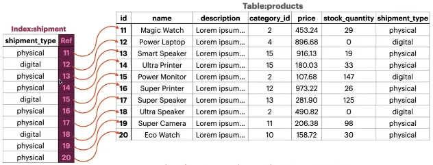

Source: [Database for Software Developers - ostad](https://ostad.app/course/database-for-developer)

**Why Use Indexes?**

- Significantly speeds up data operations.
- Improves the performance of joining, searching, and analytical operations.
- Essential for enhancing performance on large databases.

---

## Types of Index

### Primary Index
- Represents the primary key.
- **Characteristics:**
    - Always a unique index.
    - Cannot contain `NULL` values.
    - A table always has one primary key, even if not explicitly declared.

### Secondary Index
- Any index that is not the primary key.
- Any number of secondary keys may exist in a table.
- Always refers back to the original record using the primary key of that table. As the original table is sorted by the 
  primary key this is the fastest way to find any data in the main table.
- We have two types of secondary index by the perspective of uniqueness
    - Unique Index
    - Non-Unique Index
- We have two types of secondary index by the perspective of the data structure or how we use/build the index
    - Functional Index
    - Full Text Index


## Primary Key

**Characteristics:**
- A unique and `NOT NULL` index.
- A table will have a primary key even if not explicitly declared and it will be a hidden column. Table will use that 
  column to refer to the record.
- The primary key index sorts the column of the primary key.
- A single table can only have one primary key.

**Data Type Recommendations for Primary Keys:**
- `CHAR`/`VARCHAR` columns.
- `UUID`/`ULID`.
- `INT`/`BIGINT` (with `UNSIGNED` for optimal performance).

**Key Points for Consideration:**
- **Redundancy:** The size of the primary key affects storage and secondary indexes.
- **Update Cost:** Adding more indexes increases update costs since all associated indexes must also be updated.
- **Index Re-balancing:** Re-balancing B-trees during updates can be resource-intensive.

**Best Practices:**
- Use `BIGINT UNSIGNED AUTO_INCREMENT` for primary keys to maintain order and reduce indexing costs.
- Use `UUID` for distributed systems requiring sharding or unique IDs across databases.

### Index Update and Storage Considerations

### Index Update Behavior

When a table has indexes on columns `x`, `y`, `z`, and a primary key `id`, the following occurs during **update** or 
**insert** operations:

- **Updating columns (`x`, `y`, or `z`):**
    - Only the specific index related to the updated column (`x`, `y`, or `z`) is updated.
- **Inserting new rows:**
    - All indexes (`index-x`, `index-y`, `index-z`) must be updated to include the new row.
- **Updating the primary key (`id`):**
    - All secondary indexes (`index-x`, `index-y`, `index-z`) need to be updated because they store a copy of the 
      primary key as a reference to the main table.

In all **secondary indexes**, the primary key is included as a reference to locate the full row in the main table.

### Key Considerations When Using Indexes

1. **Redundancy (Storage Concerns):**
    - Keeping the primary key small reduces storage requirements in the main table and all secondary indexes.
    - Larger primary keys lead to increased size for all associated indexes and negatively impact performance.
2. **Cost of Update:**
    - Each additional index increases the cost of update operations because:
        - Updates need to modify the main table and all relevant indexes.
        - Index updates may require **exclusive locks**, blocking other operations and impacting concurrency.
3. **Re-balancing B-Trees:**
    - Inserting or updating indexed data can require the B-Tree structure to re-balance, which is computationally
      expensive.
4. **Obfuscation of IDs:**
    - If IDs need to be obfuscated (e.g., for security or privacy), consider using `UUID` or a similar approach. However:
        - Avoid using `UUID` as the primary key due to its lack of sequential order, which makes indexing costly.
        - Use `BIGINT UNSIGNED AUTO_INCREMENT` for the primary key for better performance since it maintains sequential
          order.

---

### Handling UUIDs

- **Best Practice:**
    - Use `BIGINT UNSIGNED AUTO_INCREMENT` as the primary key for large ranges and efficient indexing.
    - If sharding or distributed databases are required, use `UUID` as the primary key to minimize the risk of 
      duplicates.
- **Alternative Approach:**
    - Maintain a mapping table to associate `UUID` with the original primary key for scenarios where `UUID` is required
      but performance must be optimized.


      
## Planning Indexes

MySQL evaluates whether using an index or scanning the full table is more efficient for a query. So it may or may not
use the index if it thinks that scanning the full table is more efficient.

### Key Considerations:
1. **Avoid Functions in WHERE Clause:**
   ```sql
   SELECT * FROM products WHERE YEAR(created_at) > '2022' LIMIT 10;
   ```
   If the `created_at` column has an index, this query will not utilize it due to the `YEAR()` function.
2. **Data Access Patterns:**
    - Analyze query patterns, including sorting, grouping, and joining.
    - Consider using composite indexes for multi-column queries.
3. **Wildcards and Indexing:**
    - `LIKE 'prefix%'` will use the index.
    - `LIKE '%suffix'` will not use the index.
    - `LIKE 'prefix%suffix'` may partially use the index for `prefix` it will use the index but for `suffix` it will not
      use the index.
4. **Multiple Conditions in WHERE Clause:**
    - Example:
      ```sql
      WHERE shipment_type = 'physical' AND stock_quantity > 10
      ```
    - If only `shipment_type` has an index, MySQL will filter rows for `shipment_type = 'physical'` first, then apply 
      the condition on `stock_quantity`.
    - If both columns have indexes, MySQL will choose the index with higher cardinality (number of unique values) to 
      filter data efficiently. It may not use both indexes.
5. **Indexes in Joins:**
    - When joining tables, both columns involved in the join condition should have an index for optimal performance.
    - Example:
      ```sql
      SELECT *
      FROM orders
      JOIN customers ON orders.customer_id = customers.id;
      ```
        - Indexes on `orders.customer_id` and `customers.id` will make the query faster.
    - If one of the columns is a primary key, the query will perform even faster since primary keys are indexed by 
      default.
6. **Handling Large Offsets:**
    - For queries with a large `OFFSET`, indexes may not be used efficiently.
    - Example:
      ```sql
      SELECT * FROM products ORDER BY created_at LIMIT 10 OFFSET 10000;
      ```
    - Here, the query skips the first 10,000 rows and then orders the rest, making the use of the index suboptimal. This
      approach is computationally expensive and may lead to performance issues.
7. Understanding NULL in the Extra Column
   - When you have an index on the `name` column, the following query may not fully utilize the index:
      ```sql
      EXPLAIN
      SELECT * FROM products WHERE name = 'vero ut dicta';
      ```
   - **Reason:**
       - In the `possible_keys` column, `name` is listed as an index.
       - However, in the `Extra` column, it shows `NULL`. This occurs because the `name` index table contains only the `name` column and the primary key (`id`).
       - To retrieve all other column data, MySQL needs to access the main table, which prevents the query from fully utilizing the index.
   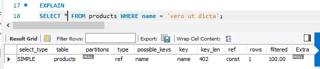
   Source: [Database for Software Developers - ostad](https://ostad.app/course/database-for-developer)


8. Using Index with SELECT Name or ID
   - If the query only requests the `name` or `id` (or both), MySQL can retrieve the data directly from the index without accessing the main table:
      ```sql
      EXPLAIN
      SELECT name, id FROM products WHERE name = 'vero ut dicta';
      ```
   - **Why This Works:**
       - The index contains all necessary data (`name` and `id`), so the main table lookup is unnecessary.
       - In this case, the `Extra` column will show `Using index`.

   - **Optimization Tip:**
       - If you frequently query a small set of columns (e.g., 4-5 columns), consider creating a composite index that includes these columns. This can eliminate the need to access the main table for such queries.

   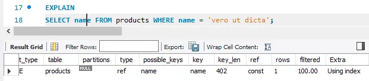
   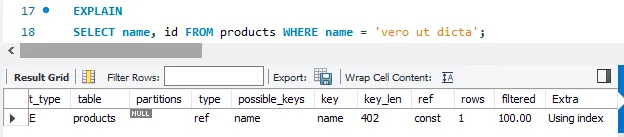
   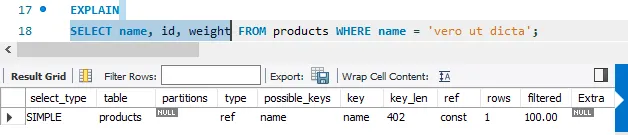
   Source: [Database for Software Developers - ostad](https://ostad.app/course/database-for-developer)


## Where to Add Index

#### Key Considerations
1. **Observe Data-Access Patterns (Retrieve Queries):**
    - Analyze how the application retrieves data from the database means which query runs frequently add index those 
      table if needed.
    - Identify frequently used queries and the columns involved in filtering (`WHERE` clauses), sorting (`ORDER BY`),
      grouping (`GROUP BY`), and joining.
2. **Consider All Queries and Access Patterns:**
    - Ensure the indexing strategy supports all critical queries efficiently.
    - For example, if multiple queries filter on `name` or `date`, adding indexes on these columns could speed up 
      performance.
3. **Consider the Entire Query:**
    - Don't focus only on the `WHERE` clause. Indexing can also optimize:
        - **Sorting:** (`ORDER BY` clauses).
        - **Grouping:** (`GROUP BY` clauses).
        - **Joining:** Queries involving foreign key relationships.

#### SQL Commands Example

The following commands demonstrate how to work with indexes in SQL:

```sql
CREATE TABLE categories LIKE dokan.categories;
INSERT INTO categories SELECT * FROM dokan.categories;

ALTER TABLE products ADD INDEX (name);
```

##### Command Breakdown
- `CREATE TABLE categories LIKE dokan.categories`:
    - Creates a new table with the same structure as `dokan.categories`.
- `INSERT INTO categories SELECT * FROM dokan.categories`:
    - Copies all rows from `dokan.categories` into the new `categories` table.
- `ALTER TABLE products ADD INDEX (name)`:
    - Adds an index on the `name` column of the `products` table, improving query performance for operations involving
      this column.

#### Why These Steps Matter

- Indexes improve query performance but come with overhead (e.g., storage and update costs). These steps ensure indexes
  are only added where they will have the most impact.
- For example:
    - Adding an index on `name` improves searches like:
      ```sql
      SELECT * FROM products WHERE name = 'Sample Product';
      ```
    - However, unnecessary indexes (on rarely queried columns) waste resources and slow down write operations (e.g., `INSERT` and `UPDATE`).


### Index Optimization in Queries
- For queries like:
   ```sql
   SELECT * FROM products WHERE name = 'some_name';
   ```
  MySQL may not use the index optimally if the query retrieves all columns.

  However, this query:
   ```sql
   SELECT name, id FROM products WHERE name = 'some_name';
   ```
  retrieves data only from the index table and avoids accessing the main table.

- Use composite indexes for frequently accessed columns to avoid main table lookups.

---

## Practical Considerations

### Effects of Updates:
- **Updating a Primary Key:**
    - Requires updating all associated secondary indexes.
- **Updating Secondary Index Columns:**
    - Updates only the specific secondary index.

### Balancing Indexes:
- Avoid creating too many indexes to minimize update costs.
- Use indexes judiciously based on query performance analysis.

---

## Index Management

### SQL Commands:
```sql
CREATE TABLE categories LIKE source_table.categories;
INSERT INTO categories SELECT * FROM source_table.categories;

ALTER TABLE products ADD INDEX (name);
```

### Using `EXPLAIN`:
```sql
EXPLAIN SELECT * FROM products WHERE name = 'specific_name';
```

- If the `Extra` column shows `NULL`, it means the query requires accessing the main table.
- If it shows `Using index`, it indicates the query retrieves data solely from the index.

---


# Partial / Prefix index
```sql
ALTER TABLE products ADD INDEX (name(4));
```

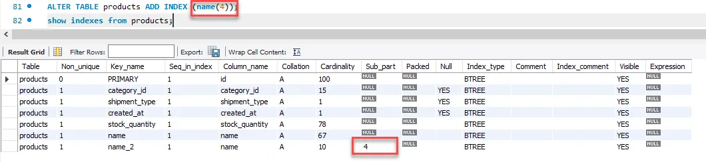

Source: [Database for Software Developers - ostad](https://ostad.app/course/database-for-developer)

### Functional Index
The functional index came in MySql after 5 so the older version will not work. But we can make a virtual column with and can do an index at that column that will work in both MySql 5 and latter.

```sql
-- Let’s make it faster with an index
ALTER TABLE users ADD INDEX(created_at);

-- Get the users registered in 2022
SELECT id, name, email
FROM users
WHERE YEAR(`created_at`) = 2022; --Index will not work here
```
Indexes created on fields can not be used for comparing function output. We can make an index on function output 
instead.

However, the query as written will not benefit from the index because it uses the `YEAR()` function on the `created_at`
column. When you use a function on a column within a WHERE clause, MySQL cannot use a regular index on that column 
because it has to compute the result of the function for every row before it can compare it to the value '2022'.

To optimize this query, you would need to avoid using functions on the column and instead directly compare against a 
range of values that cover the year 2022. For instance:

```sql
SELECT id, name, email
FROM users
WHERE created_at >= '2022-01-01' AND created_at < '2023-01-01';
```
This way, the query can take advantage of the index on the created_at column, as the comparison is against the actual
column values without any transformation.

Example of making index on function output (Here we have to give the extra pair of parentheses)
```sql
ALTER TABLE users ADD INDEX joining_year ((YEAR(created_at))); -- Now if we run SELECT id, name, email FROM users WHERE YEAR(`created_at`) = 2022; it will use the index as we 
-- made an index of the outcome of the function YEAR(created_at)
```

- Keep the comparison exactly the same as the function used in making the index.
- Can be used as a part of the composite index.
- The functional index internally works using the Generated column(MySql will store the output virtually we can not edit
  it directly MySQL will maintain it and can use it with `SELECT`).

`SHOW INDEXES FROM users;` Now we get the list of all indexes of the users table. The first three are indexed using
columns that are inside of the table and the last two indexes are created using function index(virtual columns that are
not present on the table and we can not edit those). That’s why there is a column name for the first three indexes and
there are no column names for the last two indexes inside the expression column there will be a noting for indexes that 
are created using the column of the table and will be an expression for functional index.

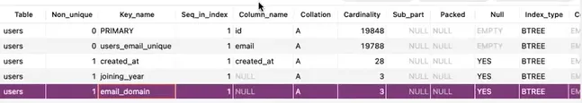
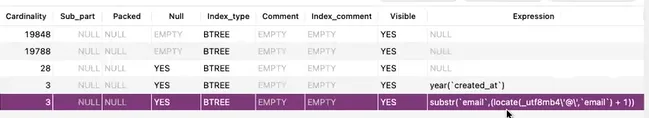

Source: [Database for Software Developers - ostad](https://ostad.app/course/database-for-developer)


Sometimes MySql uses different expressions such as for this SQL command it will use different expression.

```sql
ALTER TABLE users ADD INDEX email_domain ((SUBSTRING(email, INSTR(email, '@') + 1)));
```

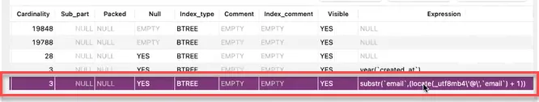

Source: [Database for Software Developers - ostad](https://ostad.app/course/database-for-developer)


That’s why if we run a SELECT query like this MySql will not use the index as it alters the expression mentioned in this
block .
```sql
EXPLAIN
SELECT id, name, email 
FROM users
WHERE SUBSTRING(email, INSTR(email, '@') + 1) = 'example.com';
```

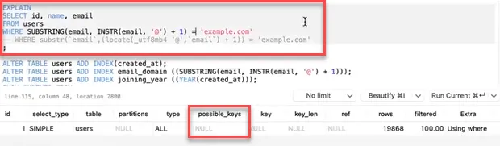

Source: [Database for Software Developers - ostad](https://ostad.app/course/database-for-developer)

But if we use the expression that MySql using for indexing then index will be used while using select query.

```sql
EXPLAIN
SELECT id, name, email 
FROM users
WHERE substr(`email`,(locate(_utf8mb4 '@',`email`) + 1)) = 'example.com';
```

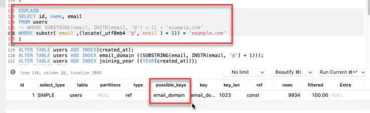

Source: [Database for Software Developers - ostad](https://ostad.app/course/database-for-developer)


## Composite Index
As we are using multiple columns for this select if there are only one index at shipment_type column so only for this
filter index will be used.
```sql
EXPLAIN 
SELECT name, price, stock_quantity, shipment_type
FROM products
WHERE shipment_type = 'physical'
	AND `name` LIKE 'Ultra%'
	AND stock_quantity != 0
LIMIT 10;
```

We can make an index including all relevant columns of that select query. Then for this query SQL can use all the
indexes. If shipment_type, name, and stock_quantity have own index individually then MySql will decide by itself which 
index will help for faster retriever.

```sql
ALTER TABLE products ADD INDEX search_q(shipment_type, name, stock_quantity);
```

### General rules of using composite index
- Composite index can be utilized for one or multiple columns.
- But, can access the index only in left-to-right index-defining order.
- Can’t skip or jump index columns.
- Index can used up to the first range condition(then skip subsequent conditions, if any).

For this query there are two possible indexes one is search_q composite index with shipment_type, name, and 
stock_quantity column and another one is shipment_type but for this query, search_q index will be efficient that’s why
mysql uses this, and key_len for this query is 404. key_len indicates how many portions of a composite index are getting
used by a select query.

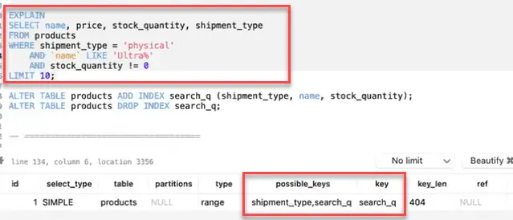

Source: [Database for Software Developers - ostad](https://ostad.app/course/database-for-developer)

If we delete the index of shipment_type and there will be only one index of search_q then if we run this query that will
partially use the composite key search_q we can see the key_ken is 2 instead of 404. So if the WHERE condition is like 
this order shipment_type > name > stock_quantity or shipment_type > name or shipment_type then the index will be used 
but if we break the chain of left to right like name > stock_quantity or shipment_type > stock_quantity or name or 
stock_quantity this will not use index.

```sql
EXPLAIN 
SELECT name, price, stock_quantity, shipment_type
FROM products
WHERE shipment_type = 'physical'
LIMIT 10;
```

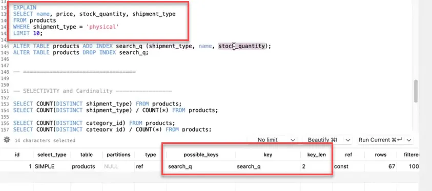

Source: [Database for Software Developers - ostad](https://ostad.app/course/database-for-developer)

But if we use a range in WHERE condition then the composite index will stop using the index condition after that range
condition.

```sql
ALTER TABLE products ADD INDEX multicol_inx (col_a, col_b, col_c);

WHERE col_a = 'X' AND col_b = 100 AND col_c ='Y'; -- will use fully index multicol_inx for col_a , col_b and col_c
WHERE col_a = 'X'; -- will use multicol_inx for col_a 
WHERE col_a = 'X' AND col_b = 100; -- -- will use multicol_inx for col_a and col_b
WHERE col_a = 'X' AND col_c = 'Y'; -- will use multicol_inx for col_a as sequence of multicol_inx index get broken
WHERE col_a = 'X' AND col_b > 100 AND col_c = 'Y'; -- will use multicol_inx for col_a and col_b as col_b has range after that it will not use index
```

mysql sample database sakila download ⇒ have to download

## FULLTEXT Index
While we are searching using multiple words or multiple keywords. As we have to use wildcard % at the start of the word 
the index will not work for this. If we have to use LIKE at the last sentence then it will be slow/inefficient.

```sql
-- Let's find films with the words 'Victory'

SELECT * from film_text WHERE title LIKE '%VICTORY%' 
                           OR description LIKE '%VICTORY%';
```

Let's find films with the words 'Victory' and 'Drama' we have to add all the columns in which those 'Victory' and 
'Drama' words can have which is not a good solution.

- Too many conditions.
- Not efficient at all(cannot use index).

```sql
EXPLAIN
SELECT * from film_text WHERE title LIKE '%VICTORY%' 
                           OR description LIKE '%VICTORY%' 
                           OR title LIKE '%DRAMA%' 
                           OR description LIKE '%DRAMA%';
													 OR .....;	
```
Adding FULLTEXT index
```sql
ALTER TABLE film_text ADD FULLTEXT INDEX search_film (title, description);
```
To use FULLTEXT index we have to query like
```sql
SELECT *
FROM flim_text
WHERE MATCH(title, description) AGAINST('Any number of keywords');
```
If we run `SHOW INDEXES FROM film_text;` then will see two indexes for two columns title and description and index_type 
is FULLTEXT, not a binary tree.

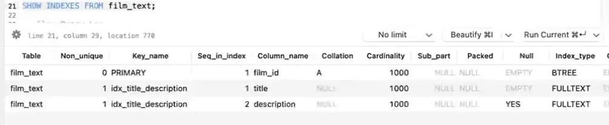

Source: [Database for Software Developers - ostad](https://ostad.app/course/database-for-developer)

- Only InnoDB or MyISAM supports fulltext index.
- Can be used with only CHAR, VARCHAR, and TEXT columns.
- Words with 3/4 characters and stop-words are ignored(by default).

### Selectivity and Cardinality

MySql uses selectivity to choose which index will it use it gives priority high whichever index has high selectivity.

We have 2 types of shipment_type, 15 categories,

id have highest selectivity as it 1.

```sql
SELECT COUNT(DISTINCT shipment_type) FROM products; --2, cardinality of this column is 2
SELECT COUNT(DISTINCT shipment_type) / COUNT(*) FROM products; --0.02

SELECT COUNT(DISTINCT category_id) FROM products; --15
SELECT COUNT(DISTINCT category_id) / COUNT(*) FROM products; --0.15

SELECT COUNT(DISTINCT stock_quantity) FROM products;
SELECT COUNT(DISTINCT stock_quantity) / COUNT(*) FROM products;

SELECT COUNT(DISTINCT id) / COUNT(*) FROM products; --1
```


# Slow Queries

- Consider the expectation and business requirements.
- Consider the scale of the application.
- Consider the use cases of customer.

### If we are using an ORM

- Check if the right queries are being executed.
- Beware of N + 1 Query issues. ////TODO: will add more details about N + 1 Query issues.

**Make use of debug information**

- Can use phpdebugbar, clockwork etc.
- Enable the query logger of your framework in dev mode.


Source: [Database for Software Developers - ostad](https://ostad.app/course/database-for-developer)

**Enable Slow Query Log**

We can turn on the option to write slow queries by the database on file or on the database table and have to be careful
while doing this for some time/days.

- Enable in on defined timeline, based on necessity.
- Make extensive use of application features to trace all possible issues.

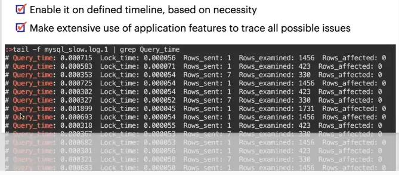

Source: [Database for Software Developers - ostad](https://ostad.app/course/database-for-developer)


```sql
-- Turn slow query loggin ON
SET GLOBAL slow_query_log = 'ON';

-- Keeping slow query log in file
SET GLOBAL slow_query_log_file = '/tmp/slow_queries.log';

-- Keeping slow query log in table
SET GLOBAL log_output = 'table';

-- Additional settings
SET GLOBAL log_queries_not_using_indexes = 'ON';
SET GLOBAL long_query_time = 1; -- will log if take more than 1 second

-- Turn slow query logging off
SET GLOBAL slow_query_log = 'OFF';


-- Checking the setting of slow query log
SHOW GLOBAL VARIABLES LIKE 'slow_query_log';
SHOW GLOBAL VARIABLES LIKE 'long_query_time';
```

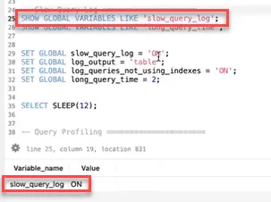

Source: [Database for Software Developers - ostad](https://ostad.app/course/database-for-developer)

We will get the slow_log table inside of the default mysql database

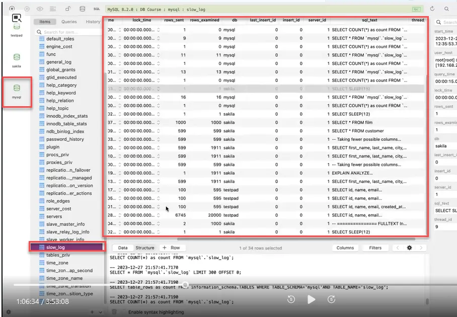

Source: [Database for Software Developers - ostad](https://ostad.app/course/database-for-developer)

We can sort by executing time if we log slow_log inside of the database table and if we store it on file then we can use
some tool as in file there is no sorting mechanism. We can analyze those using mysqldumpslow.

`sudo mysqldumpslow /tmp/slow_queries.log`

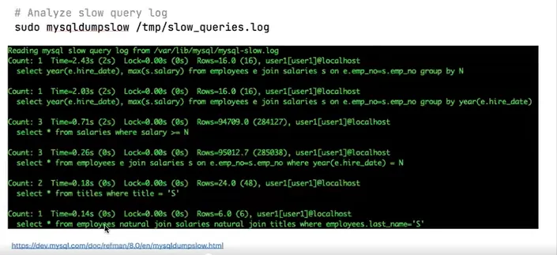

Source: [Database for Software Developers - ostad](https://ostad.app/course/database-for-developer)

### Query Profiling

```sql
SET SESSION profiling = 1;

SHOW PROFILES;

SHOW PROFILE FOR QUERY 47;--here 47 is query_id see the image
SELECT * FROM INFORMATION_SCHEMA.PROFILING WHERE QUERY_ID=47;

SET SESSION profiling = 0;
--Check the comparative cost immediately after execution
SHOW STATUS LIKE 'last_query_cost';
```

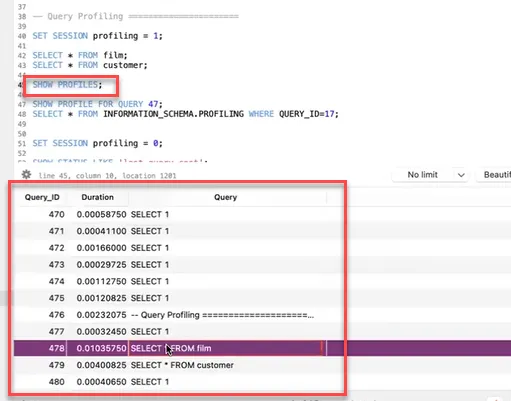

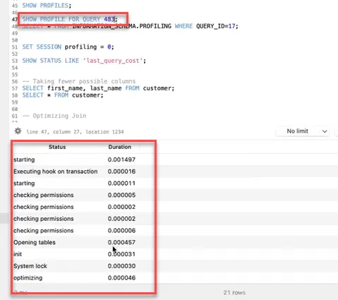

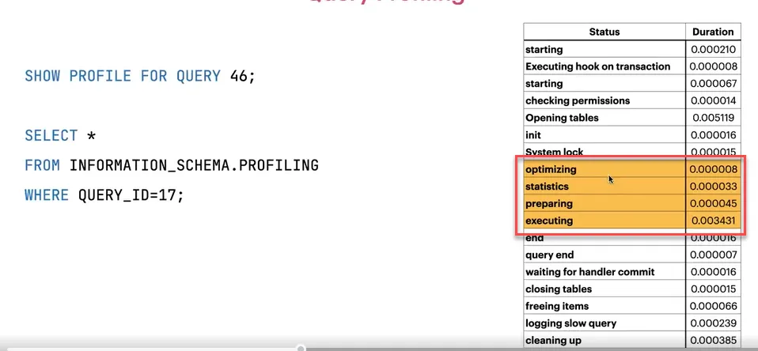

Source: [Database for Software Developers - ostad](https://ostad.app/course/database-for-developer)

optimizing, statistics, preparing, executing are most important step.

### EXPLAIN
This show as the plan how MySql will run the query

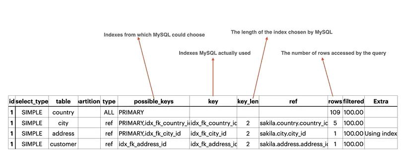

Source: [Database for Software Developers - ostad](https://ostad.app/course/database-for-developer)

```sql
EXPLAIN
SELECT first_name, last_name, city, country
FROM customer
INNER JOIN address USING(address_id)
INNER JOIN city USING(city_id)
INNER JOIN country USING(country_id);
```

**CHATGPT Exploration**

The EXPLAIN output you have provided gives insight into how MySQL executes the given SELECT query, which joins the **`customer`**, **`address`**, **`city`**, and **`country`** tables. Here is a summary that you can use for your notes in Notion:

- **SELECT Type**: All rows are **`SIMPLE`** indicating that this is a simple SELECT (not using subqueries or UNIONs).
- **Tables**: The query is performing a sequential process starting with the **`country`** table, then **`city`**, followed by **`address`**, and finally **`customer`**.
- **Partitions**: There is no partitioning involved in this query, as indicated by the partition type column.
- **Type**:
    - For the **`country`** table, the type is **`ALL`**, which means a full table scan is being done.
    - For the other tables (**`city`**, **`address`**, **`customer`**), the type is **`ref`**, which means the rows are retrieved using a non-unique key or a key that can have multiple rows (i.e., a non-unique index).
- **Possible Keys**: Lists the indexes that MySQL could use for the query.
    - The **`country`** table could use the **`PRIMARY`** key.
    - The **`city`** table has the **`PRIMARY`** key and **`idx_fk_country_id`** as possible indexes.
    - The **`address`** table could use the **`PRIMARY`** and **`idx_fk_city_id`** indexes.
    - The **`customer`** table could use **`idx_fk_address_id`**.
- **Key**: Indicates which index MySQL actually decided to use.
    - For the **`country`** table, no index is used (indicated by a null value in the **`key`** column).
    - For the **`city`**, **`address`**, and **`customer`** tables, MySQL has chosen **`idx_fk_country_id`**, **`idx_fk_city_id`**, and **`idx_fk_address_id`**, respectively.
- **Key_len**: Shows the length of the index that MySQL has chosen.
    - For the **`city`**, **`address`**, and **`customer`** tables, the index length is 2.
- **Ref**: Shows which column or a constant is used to find the row in the index.
    - For **`city`**, **`address`**, and **`customer`**, the respective foreign key columns are used to perform the join.
- **Rows**: Number of rows MySQL believes it must examine to execute the query.
    - 109 for **`country`**, 5 for **`city`**, 1 for **`address`** and **`customer`**.
- **Filtered**: Percentage of rows filtered by the table condition.
    - 100% for all tables, which means all rows are considered.
- **Extra**: Contains additional information about how MySQL resolves the query.
    - For **`address`**, **`Using index`** indicates that the data required is available in the index, and MySQL does not need to read the data from the table (i.e., an index-only scan).

This analysis shows that the query is efficient for the **`city`**, **`address`**, and **`customer`** tables, as it uses indexes to quickly find the relevant rows. However, for the **`country`** table, it's doing a full table scan, which is less efficient, especially if the table is large. To optimize, you might consider adding an index on the **`country_id`** field if it is a common operation to join on this column.

**EXPLAIN ANALYZE**

It actually runs the query and shows its actual cost and estimated cost.
```sql
EXPLAIN ANALYZE
SELECT ...

-> Nested loop inner join  (cost=643 rows=604) (actual time=0.377..10.6 rows=599 loops=1)
  -> Nested loop inner join  (cost=432 rows=604) (actual time=0.316..6.16 rows=603 loops=1)
    -> Nested loop inner join  (cost=221 rows=600) (actual time=0.279..3 rows=600 loops=1)
      -> Table scan on country  (cost=11.2 rows=109) (actual time=0.192..0.257 rows=109 loops=1)
      -> Index lookup on city using idx_fk_country_id (country_id=country.country_id) (cost=1.38 rows=5.5) (actual time=0.0139..0.024 rows=5.5 loops=109)
    -> Covering index lookup on address using idx_fk_city_id (city_id=city.city_id) (cost=0.25 rows=1.01) (actual time=0.0037..0.00484 rows=1 loops=600)
  -> Index lookup on customer using idx_fk_address_id (address_id=address.address_id) (cost=0.25 rows=1) (actual time=0.00572..0.0068 rows=0.993 loops=603)
```

**CHATGPT**

This **`EXPLAIN ANALYZE`** output provides detailed information about the execution plan for a SQL **`SELECT`** query involving multiple joins between the **`customer`**, **`address`**, **`city`**, and **`country`** tables.

- **Nested Loop Inner Joins**: The query uses nested loop joins, which means it iterates over each row in one table and, for each row, scans through another table to find matching rows.
- **Costs and Rows**: Estimated costs and the number of rows expected to be involved in each operation are provided before query execution. Actual times and rows are provided after execution, giving an insight into the query's performance.
- **Table Scan on Country**: A full table scan was performed on the **`country`** table, which is less efficient than an index scan but may be acceptable depending on the table size.
- **Index Lookups**: Indexes are used for joining **`city`**, **`address`**, and **`customer`** tables, which typically results in faster query performance.
    - The **`idx_fk_country_id`** index is used to retrieve rows from the **`city`** table based on the **`country_id`**.
    - The **`idx_fk_city_id`** index is a covering index for the **`address`** table, which means all needed data is available in the index itself, avoiding the need to access the table data.
    - The **`idx_fk_address_id`** index is used to find matching customers for each address.
- **Loops**: The number of iterations ("loops") performed indicates how many times the nested loop operation was executed.
- **Actual Time**: The actual time taken for each step is detailed in seconds, allowing for an assessment of which parts of the query are most time-consuming.

This output is useful for optimizing queries. For instance, the full table scan on **`country`** could be a target for optimization, perhaps by adding an appropriate index. The efficient use of index lookups in the other tables suggests good indexing strategies for those tables.


### Optimizing Query

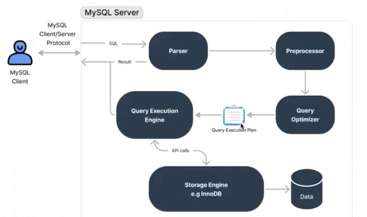

Source: [Database for Software Developers - ostad](https://ostad.app/course/database-for-developer)

**CHATGPT Exploration**
The image depicts the architecture of MySQL's query processing workflow. Here's a transcription of the process flow and components as shown in the diagram:

1. **MySQL Client**: The user interacts with the MySQL database through a client application.
2. **MySQL Client/Server Protocol**: The client communicates with the server using the MySQL client/server protocol.
3. **MySQL Server**: The server receives the SQL queries sent by the client.
4. **Parser**: The server parses the SQL query to understand its structure and components.
5. **Preprocessor**: After parsing, the preprocessor further processes the SQL query to resolve any syntactic and semantic issues.
6. **Query Optimizer**: The optimized query execution plan is developed by the query optimizer. It decides the most efficient way to execute the given SQL query.
7. **Query Execution Engine**: This engine executes the SQL query according to the execution plan.
8. **Storage Engine (e.g., InnoDB)**: The storage engine, such as InnoDB, is responsible for data storage and retrieval. It is where the actual data resides and is managed.
9. **Data**: This represents the actual data stored in the database.
10. **API calls**: The Query Execution Engine makes API calls to the Storage Engine.
11. **SQL**: The original SQL query flows from the client to the server and is processed through these components.
12. **Result**: The result from the executed query is sent back to the client.

This flowchart is a high-level overview of how a SQL query is processed by MySQL, from the moment it is sent by the client until the response is returned after accessing the data storage. It outlines the key components involved in the parsing, optimization, and execution of a SQL statement within the MySQL server environment.


- Take only required columns instead of *
- Limit the number of rows according to the use case. Use pagination.

```sql
SELECT * FROM customer;
SELECT id, first_name, last_name FROM customer;
```

- Avoid LIKE expression with leading wildcards

```sql
SELECT * FROM products where name LIKE %printer; -- Not recommended
SELECT * FROM products where name LIKE 'super"; -- Recommanded
```

- Use INNER JOIN and LEFT JOIN.
- Ensure the joining columns are indexed.
- Use EXPLAIN to verify the right indexes are being used.
- Choose the order of joining wisely - try to start with fewer rows.


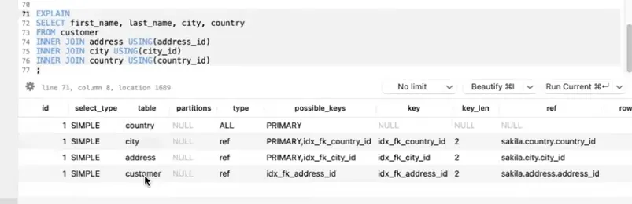

Source: [Database for Software Developers - ostad](https://ostad.app/course/database-for-developer)

In this example, MySQL does not join at a given sequence customer > address > city > country. MySqQL query optimizer starts with the first country as there are fewer records and the number of rows will be less if we starts with this.  In this database we have 599 customer and have 109 country.

`SHOW STATUS LIKE ‘last_query_cost’;` for this query is 642.952482

```sql
EXPLAIN 
SELECT first_name, last_name, city, country
FROM customer
INNER JOIN address USING(address_id)
INNER JOIN city USING(city_id)
INNER JOIN country USING(country_id);
```

We can force MySQL to use our defined sequence by straight-join. Here MySql have to scan 599 rows first.

SHOW STATUS LIKE ‘last_query_cost’; for this query is 690.099000


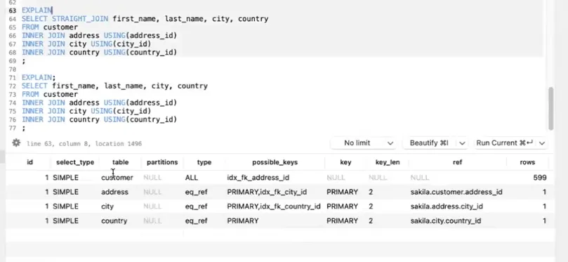

Source: [Database for Software Developers - ostad](https://ostad.app/course/database-for-developer)

```sql
EXPLAIN 
SELECT STRAIGHT_JOIN first_name, last_name, city, country
FROM customer
INNER JOIN address USING(address_id)
INNER JOIN city USING(city_id)
INNER JOIN country USING(country_id);
```

### GORUP BY and ORDER BY

- Try to use same table for grouping ordering
- Ordering and grouping ca use index
- Try to use existing index by changing order column(if possible)

### Optimize COUNT query

- Specify a column name or expression in the function -counts NOT NULL
- Specify no column name - count rows

```sql
-- Count only deleted users
SELECT COUNT(deleted_at) FROM users;

-- count all user rows
SELECT count (*) FROM users;
```

### Make use of indexes

- WHERE conditions should use index where possible
- GROUP BY columns should use index where possible
- ORDER BY columns should use index where possible
- Try using composite index for multiple conditions

### Make use of caching

- Use radis, Memcached or even filesystem
- Beware of serving stale information from cache.
- Invaidate cache keys wisely.

### Make use of pre-calcuated result

- Use materialized views for statistical data
- Use flat report with pre-populated data
- User supporting system - Redis, MongoDB


# References
- [Database for Software Developers - ostad](https://ostad.app/course/database-for-developer)


