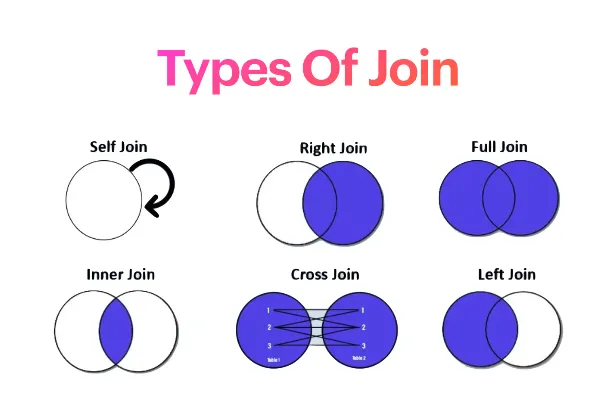

////TODO: Add more content
if the sale table has the foreign key of product id the while deleting the product

- We can keep a flag delete to soft delete.
- Can add `on delete set null`, `on delete cascade`


# Data Integrity

Data integrity is a concept and process that ensures the:

- Accuracy
- Completeness
- Consistency
- Validity

of an organization’s data.


## Causes of Data Integrity Compromise
### Can be Prevented Through Validation, Encryption, Access Control:
- Human error (malicious or unintentional)
- Transfer errors (unintended alteration of data)
- Bugs, viruses/malware, hacking, and other cyber threats

### Can be Prevented Through Backup and Duplication:
- Compromised hardware (e.g., device or disk crash)
- Physical compromise to the device


## **Types of Integrity**
### 1. Entity Integrity
- Ensures each table row has a unique and non-null primary key value.

Example:

| id  | name           | email                          | password      |
|-----|----------------|--------------------------------|---------------|
| 204 | Abdur Rahman   | arahman@gmail.com              | eyu2yg3i...   |
| 205 | Abul Kalam     | abulkalam234@gmail.com         | 3ewdyg3i...   |
| 206 | Abdur Rahman   | rahman.ctg@gmail.com           | 4ertgsv3i...  |
| 207 | Muhammad Musa  | md.musa.iiuc@gmail.com         |               |

**Rule**: `UNIQUE + NOT NULL ⇒ PRIMARY KEY`


### 2. Referential Integrity
- Ensures a value of one attribute (foreign key) refers to an existing value in another table.

Example:

**Users Table**:

| id  | name           | email                          | password      |
|-----|----------------|--------------------------------|---------------|
| 204 | Abdur Rahman   | arahman@gmail.com              | eyu2yg3i...   |
| 205 | Abul Kalam     | abulkalam234@gmail.com         | 3ewdyg3i...   |
| 206 | Abdur Rahman   | rahman.ctg@gmail.com           | 4ertgsv3i...  |
| 207 | Muhammad Musa  | md.musa.iiuc@gmail.com         | jfue63hw...   |

**Attendance Table**:

| id  | user_id | date       | checked_in               |
|-----|---------|------------|--------------------------|
| 625 | 205     | 2023-11-22 | 2023-11-22 07:05:49      |
| 626 | 207     | 2023-11-22 | 2023-11-22 07:06:56      |
| 627 | 809     | 2023-11-22 | 2023-11-22 07:06:57      |

- The database will ensure that it will not take any user_id that is not in the user's table.
- FOREIGN KEY accepts two values `null` or existing primary key of related table.

---

### 3. Domain Integrity
- Defines a set of values or restrictions on the values that are acceptable (by domain) to be stored in a column.

Examples:
- Driving license application age must be 16 or above.
- Assets = liabilities + owner’s equity in double-entry accounting.
- Total payment of an invoice cannot be negative.
- No past date can be entered as the expiry date.

**Achieved Through**: `FOREIGN KEY, ENUM, NOT NULL, CHECK`


### 4. User-Defined Integrity
- Defines values, restrictions, or formats acceptable by the user to be stored in a column.

Examples:
- Invoice numbers should be prefixed with "INVOO".
- Student registration number format: `YYYY{6-DIGIT-SEQ}`.
- In KYC solutions, the migrated field's value for new records is always `false`.

## **MySQL Constraints for Data Integrity**

### **PRIMARY KEY, CHECK, ENUM, FOREIGN KEY, NOT NULL, TRANSACTION, UNIQUE, DEFAULT**

### **1. The UNIQUE Constraint**
- Ensures every value in a column is different.
- A table can have multiple UNIQUE columns.

Example:
```sql
CREATE TABLE users (
  id INT AUTO_INCREMENT PRIMARY KEY,
  name VARCHAR(50) NOT NULL,
  email VARCHAR(50) NOT NULL,
  password CHAR(32) NOT NULL,
  UNIQUE (email)
);
```
- Constraint can have a name (helpful for faster debugging)
  - If there are multiple columns with a unique constraint then if fails unique constrain for a value without CONSTRAINT
    cannot be understood for with column this rule is violated. If we add this MySQL will by default show which column 
    violates this.

#### Named Constraints:
```sql
CREATE TABLE products (
    --all the defined columns...
     CONSTRAINT UNIQ_prod_code UNIQUE(code)
);
```

#### Combining Multiple Columns:
```sql
CREATE TABLE products (
    --all the defined columns...
    CONSTRAINT UNIQ_prod_code UNIQUE(code),
    CONSTRAINT UNIQ_active_sku UNIQUE (sku, deleted_at)
);
```

Can be defined after defining the table by `ALTER`
```sql
ALTER TABLE products ADD UNIQUE (sku);
ALTER TABLE products ADD CONSTRAINT UNIQ_sku UNIQUE (sku;
```

- Can be removed if needed (as removing an INDEX)
  - HERE UNIQ_sku is the index name of that column if we do not give a name while creating like "	UNIQUE (email)" the
    database automatically adds one index for a unique column
  
```shell
ALTER TABLE products DROP INDEX UNIQ_sku; 
--To get a list of indexes
SHOW INDEXES FROM products;
```


### **2. The CHECK Constraint**
- Validates a value using an expression.
- The expression must evaluate to TRUE or UNKNOWN.

Example:
```sql
CREATE TABLE manufacture_lots (
  id CHAR(10) PRIMARY KEY,
  product_id INT NOT NULL,
  manufacture_date DATETIME NOT NULL,
  expiry_date DATETIME,
  total_items INT,

  FOREIGN KEY (product_id) REFERENCES products(id),
  CHECK (manufacture_date > expiry_date)
);
```

#### Table-Level and Column-Level CHECK Constraints:
- Can be defined at the Table or Column level.
- Column level constraint can only use the current column.
- Can be used user-defined names.
- The database will generate a name if it does not give any name. i.e. {tbl}_chk_{seq}.

```sql
CREATE TABLE manufacture_lots (
  id CHAR(10) PRIMARY KEY,
  product_id INT NOT NULL,
  manufacture_date DATETIME NOT NULL,
  expiry_date DATETIME,
  total_items INT CONSTRAINT not_empty_lot CHECK (total_items > 0),

  FOREIGN KEY (product_id) REFERENCES products(id),
  CONSTRAINT future_manuf_date CHECK (manufacture_date > expiry_date)
);
```

#### Rules for CHECK Constraints:
- Condition expressions must be adhere to the following rules:
    - CHECK constraint will work only after version 8.
    - A column with AUTO_INCREMENT is not permitted.
    - Literal, deterministic built-in functions and operations are permitted.
        - Deterministic functions are those functions that give the same output for the same input.
        - Example of non-deterministic functions are CONNECTION_ID(), CURRENT_USER(), NOW().
    - Stored functions and stored procedures are not permitted.
    - Variables are not permitted.
        - System variables, user-defined variables, stored program local variables.
    - Sub-query is not permitted.
- Can be added after table definition using ALTER TABLE

#### Adding/Removing CHECK Constraints Using `ALTER TABLE`:
```sql
ALTER TABLE application_details
    ADD CHECK (age >= 16);

ALTER TABLE application_details
    ADD CONSTRAINT DRIVER_MIN_AGE CHECK (age >= 16);

ALTER TABLE manufacture_lots DROP CHECK future_manuf_date;

--Find all the CHECKs and their names
SHOW CREATE TABLE manufacture_lots;
```


# Joining Tables, Union, and Intersects
# JOIN



Source: [Database for Software Developers - ostad](https://ostad.app/course/database-for-developer)


## Adding Constraints After Table Creation

```sql
ALTER TABLE application_details
ADD CHECK (age >= 16);

ALTER TABLE application_details
ADD CONSTRAINT DRIVER_MIN_AGE CHECK (age >= 16);

ALTER TABLE manufacture_lots DROP CHECK future_manuf_date;

-- Find all the CHECKs and their names
SHOW CREATE TABLE manufacture_lots;
```


# SQL Joins and Table Relationships
## JOIN

### Key Points:
- Data types of joined columns must be the same to avoid performance issues like if one is `bigint` and another is 
  `tinylint` then there could be a performance issue.
- The most common join type is **INNER JOIN**, often referred to as just `JOIN`.

## Example Tables

### **orders**
| id  | tracking      | customer_id | total_payable |
|-----|---------------|-------------|---------------|
| 213 | 123wqutfiii   | 34          | 260.00        |
| 214 | 456wqutfiii   | 145         | 123000.00     |
| 215 | 789wqutfiii   | 89          | 30.00         |

### **customers**
| id  | name          |
|-----|---------------|
| 144 | Md. Hasan     |
| 145 | Abdul Hamid   |
| 146 | Mohammad Ali  |

### **order_items**
| id   | order_id | product_id | quantity |
|------|----------|------------|----------|
| 2034 | 213      | 2089       | 6        |
| 2035 | 214      | 232        | 1        |
| 2036 | 214      | 455        | 3        |
| 2037 | 215      | 298        | 1        |


## INNER JOIN

### Example Query:
```sql
SELECT o.id, o.tracking, c.name
FROM orders o
JOIN customers c ON o.customer_id = c.id
WHERE id = 214;
```

Result:

| id  | tracking      | name         |
|-----|---------------|--------------|
| 213 | 123wqutfiii   | Md. Hasan    |
| 214 | 456wqutfiii   | Abdul Hamid  |
| 215 | 789wqutfiii   | Mohammad Ali |

### Joining Multiple Tables:
```sql
SELECT o.id, o.tracking, c.name, oi.product_id, oi.quantity
FROM orders o
JOIN customers c ON o.customer_id = c.id --one to one
JOIN order_items oi ON oi.order_id = o.id --one to many
WHERE id = 214;
```

Result:
```shell
         orders          customers            order_items

| id  | tracking      | name         | product_id | quantity |
|-----|---------------|--------------|------------|----------|
| 213 | 123wqutfiii   | Md. Hasan    | 2089       | 6        |
| 214 | 456wqutfiii   | Abdul Hamid  | 232        | 1        |
| 214 | 456wqutfiii   | Abdul Hamid  | 455        | 3        |
| 215 | 789wqutfiii   | Mohammad Ali | 298        | 1        |

```
### Adding a Fourth Table:
```sql
SELECT o.id, o.tracking, c.name, oi.product_id, oi.quantity, p.name AS product_name, p.price
FROM orders o
JOIN customers c ON o.customer_id = c.id --one to one
JOIN order_items oi ON oi.order_id = o.id --one to many
JOIN products p ON oi.product_id = p.id --one to one
WHERE id = 214;
```

Result:
```shell
       orders          customers            order_items                      products  
| id  | tracking      | name         | product_id | quantity | product_name     | price      |
|-----|---------------|--------------|------------|----------|------------------|------------|
| 213 | 123wqutfiii   | Md. Hasan    | 2089       | 6        | 3AA battery      | 15.00      |
| 214 | 456wqutfiii   | Abdul Hamid  | 232        | 1        | Apple AirPods 2  | 300000.00  |
| 214 | 456wqutfiii   | Abdul Hamid  | 455        | 3        | Charging Cable   | 150.00     |
| 215 | 789wqutfiii   | Mohammad Ali | 298        | 1        | Phone stand 37A  | 80.00      |
```


## LEFT JOIN

### Employees Table

| **id** | **name**         | **designation** |
|--------|------------------|------------------|
| 1089   | Abu Kashem       | Officer          |
| 1090   | Ahmed Fafiq      | Officer          |
| 1091   | Mahbubul Aalam   | Manager          |
| 1092   | Md. Tarek        | Sr. Officer      |

### Addresses Table

| **id** | **emp_id** | **line_1**   | **line_2**   | **city**   | **state**   |
|--------|------------|--------------|--------------|------------|-------------|
| 2034   | 2049       | Loren Ipsum  | Loren Ipsum  | Dhaka      | Uttara      |
| 2035   | 1090       | Loren Ipsum  | Loren Ipsum  | Dhaka      | Motijhil    |
| 2036   | 1091       | Loren Ipsum  | Loren Ipsum  | Barisal    | B. Sadar    |
| 2037   | 1034       | Loren Ipsum  | Loren Ipsum  | Dhaka      | Gulshan     |


Without LEFT JOIN

```sql
SELECT e.name, e.designation, a.city, a.state
FROM employees e
JOIN addresses a ON a.employee_id = e.id;
```

### Result Table (Inner Join)
As for abu kashem, Md. Tarek not present on the address table inner join will omit those on the result table. Inner join 
took if it gets an exact match.

| **id** | **name**         | **designation** | **city**  | **state**    |
|--------|------------------|-----------------|-----------|--------------|
| 1090   | Ahmed Fafiq      | Officer         | Dhaka     | Motijhil     |
| 1091   | Mahbubul Aalam   | Manager         | Barisal   | B. Sadar     |


### Example Query with LEFT JOIN
```sql
SELECT e.name, e.designation, a.city, a.state
FROM employees e
LEFT JOIN addresses a ON a.emp_id = e.id;
```

Result:

After running this SQL all rows from the left table(employee) will preserved and if there is no record at the right 
table(address), it will add NULL.

| id   | name            | designation  | city   | state    |
|------|-----------------|--------------|--------|----------|
| 1089 | Abu Kashem      | Officer      | NULL   | NULL     |
| 1090 | Ahmed Fafiq     | Officer      | Dhaka  | Motijhil |
| 1091 | Mahbubul Aalam  | Manager      | Barisal| B. Sadar |
| 1092 | Md. Tarek       | Sr. Officer  | NULL   | NULL     |

---

## SELF JOIN
Main table with all data

| **id** | **name**           | **parent_id** | **parent_name** |
|--------|--------------------|---------------|-----------------|
| 1089   | A Product          | 35            | Cosmetics       |
| 1090   | Nail Polish        | 35            | Cosmetics       |
| 1091   | Mobile phone       | 34            | Electronics     |
| 1092   | Another Product    | NULL          | NULL            |
| 34     | Electronics        | NULL          | NULL            |
| 35     | Cosmetics          | NULL          | NULL            |
| 36     | Clothing           | NULL          | NULL            |
| 37     | Mans Clothing      | 36            | Clothing        |

Categories (c)

| **id** | **name**           | **parent_id** |
|--------|--------------------|---------------|
| 1089   | A Product          | 35            |
| 1090   | Nail Polish        | 35            |
| 1091   | Mobile phone       | 34            |
| 1092   | Another Product    | NULL          |

Categories (pc)

| **id** | **name**           | **parent_id** |
|--------|--------------------|---------------|
| 34     | Electronics        | NULL          |
| 35     | Cosmetics          | NULL          |
| 36     | Clothing           | NULL          |
| 37     | Mans Clothing      | 36            |

### Example Query:
```sql
SELECT c.id, c.name, pc.name AS parent_name
FROM categories c
LEFT JOIN categories pc ON c.parent_id = pc.id;
```

```sql
SELECT e.name, e.designation, presa.city, presa.state, perma.city, perma.state
FROM employees e
JOIN addresses perma ON perma.employee_id = e.id AND perma.type = "permanent"
JOIN addresses presa ON presa.employee_id = e.id AND perma.type = "present"
```

Result:

Employees Table

| **id** | **name**         | **designation** |
|--------|------------------|------------------|
| 1089   | Abu Kashem       | Officer          |
| 1090   | Ahmed Fafiq      | Officer          |
| 1091   | Mahbubul Aalam   | Manager          |
| 1092   | Md. Tarek        | Sr. Officer      |

Addresses Table

| **id** | **emp_id** | **line_1**   | **type**       | **city**   | **state**   |
|--------|------------|--------------|----------------|------------|-------------|
| 2034   | 2049       | Loren Ipsum  | permanent      | Dhaka      | Uttara      |
| 2035   | 1090       | Loren Ipsum  | present        | Dhaka      | Motijhil    |
| 2036   | 1091       | Loren Ipsum  | permanent      | Barisal    | B. Sadar    |
| 2037   | 1034       | Loren Ipsum  | permanent      | Dhaka      | Gulshan     |


Another example for self join to create tree of dependency

| **id** | **title**            | **description** | **parent_id** | **depth** | **created_by** | **updated_by** | **deleted_by** | **created_at**          | **updated_at**          | **deleted_at** |
|--------|----------------------|-----------------|---------------|-----------|----------------|----------------|----------------|-------------------------|-------------------------|----------------|
| 1      | Laravel              | NULL            | NULL          | 0         | 1              | 1              | NULL           | 2023-12-10 20:51:19    | 2023-12-10 20:51:19    | NULL           |
| 2      | Eloquent             | NULL            | NULL          | 1         | 2              | 1              | NULL           | 2023-12-10 20:52:16    | 2023-12-10 20:52:16    | NULL           |
| 3      | API Development      | NULL            | NULL          | 1         | 2              | 1              | NULL           | 2023-12-10 20:52:16    | 2023-12-10 20:52:16    | NULL           |
| 4      | PHP                  | NULL            | NULL          | 0         | 1              | 1              | NULL           | 2023-12-10 20:52:16    | 2023-12-10 20:52:16    | NULL           |
| 5      | Testing              | NULL            | 4             | 2         | 1              | 1              | NULL           | 2023-12-10 20:52:52    | 2023-12-10 20:52:52    | NULL           |
| 6      | Package Development  | NULL            | 4             | 2         | 1              | 1              | NULL           | 2023-12-10 20:52:52    | 2023-12-10 20:52:52    | NULL           |
| 7      | PHPUnit              | NULL            | 5             | 3         | 1              | 1              | NULL           | 2023-12-10 20:53:30    | 2023-12-10 20:53:30    | NULL           |
| 8      | Pest                 | NULL            | 5             | 3         | 1              | 1              | NULL           | 2023-12-10 20:53:30    | 2023-12-10 20:53:30    | NULL           |

## SQL Query

```sql
SELECT 
  c.title,
  pc.title AS parent,
  c.depth
FROM
  categories c
LEFT JOIN categories pc ON pc.id = c.parent_id;
```

## Output Table

| **id** | **name**             | **parent**      | **depth** |
|--------|----------------------|-----------------|-----------|
| 1      | Laravel              | NULL            | 1         |
| 2      | Eloquent             | Laravel         | 2         |
| 3      | API Development      | Laravel         | 2         |
| 4      | PHP                  | NULL            | 1         |
| 5      | Testing              | PHP             | 2         |
| 6      | Package Development  | PHP             | 2         |
| 7      | PHPUnit              | Testing         | 3         |
| 8      | Pest                 | Testing         | 3         |


## Guidelines for Performance Optimization

1. Always start the join with the largest table, followed by smaller tables.
2. Ensure data types match across joined columns.
3. Avoid joining columns with varying character sizes in `VARCHAR`.
4. In cases of high-volume foreign key dependencies (e.g., blog comments), consider alternatives like indexing and
   background jobs instead of foreign keys.


## When Not to Use Foreign Keys
- For scenarios requiring **sharding** or **partitioning**.
- To avoid long-running operations (e.g., cascading deletions for large datasets).
- Schema changes may result in extended locking when foreign keys are used.


If we delete blog posts then what will be about the comments? In this case, some company tells do not to use the foreign 
key in the blog post just do an index and run a background job to delete all those comments as there need to be the huge 
number of comment like 10 million if we make it a foreign key it will take huge time to complete in a one transaction.

If we need to alter the schema then if they use a foreign key it will lock the database for 1 hour to complete or long.


# Joining Two Tables with `VARCHAR` Columns of Different Sizes

## Scenario

When performing a join operation in SQL between two tables, the columns being compared (`ON` clause) may have different `VARCHAR` lengths (character sizes).

### Example Tables

#### Table 1:
| **id** | **name**         |
|--------|------------------|
| 1      | John             |
| 2      | Jane             |

#### Table 2:
| **emp_id** | **employee_name**   |
|------------|---------------------|
| 101        | John                |
| 102        | Jane                |

- `Table1.name` is defined as `VARCHAR(50)`
- `Table2.employee_name` is defined as `VARCHAR(100)`

### Example Query:
```sql
SELECT *
FROM Table1 t1
JOIN Table2 t2 ON t1.name = t2.employee_name;
```

---

## Implications

1. **Performance Issues**:
    - When the `VARCHAR` sizes differ (e.g., `VARCHAR(50)` vs. `VARCHAR(100)`), the database engine may need to cast or pad the smaller column to match the larger one during the join.
    - This additional processing can lead to performance degradation, especially with large datasets.

2. **Character Set and Collation**:
    - If the character sets or collations of the columns differ (e.g., `utf8mb4_general_ci` vs. `utf8mb4_unicode_ci`), the database may perform additional conversions, further impacting performance.

---

## Best Practices

To handle this situation efficiently:

1. **Standardize Column Definitions**:
    - Ensure both columns have the same `VARCHAR` size and character set:
   ```sql
   ALTER TABLE Table1 MODIFY COLUMN name VARCHAR(100);
   ```

2. **Use Explicit Casting**:
    - If modifying the schema is not possible, explicitly cast the columns to the same size during the join:
   ```sql
   SELECT *
   FROM Table1 t1
   JOIN Table2 t2 ON CAST(t1.name AS VARCHAR(100)) = t2.employee_name;
   ```

3. **Avoid Implicit Type Conversions**:
    - Ensure the data types, lengths, and character sets of the columns match to prevent unnecessary conversions during the join.

---

By following these practices, you can optimize performance and avoid unexpected issues when joining tables with `VARCHAR` columns of different sizes.


# References
- [Database for Software Developers - ostad](https://ostad.app/course/database-for-developer)
