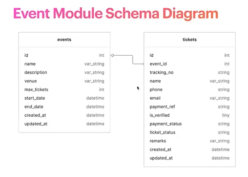

# Normalization

> Normalization is a process used to organize data efficiently in a database.

## Goals of Normalization
- Avoid Anomalies
- Reduce Redundancy

---

## Normal Forms

### First Normal Form (1NF)
- The table has a **primary key** (uniquely identifies the records).
- All attributes contain **atomic** (indivisible) values.

### Second Normal Form (2NF)
- The table is already in **1NF**.
- All non-key attributes are **fully functionally dependent** on the entire primary key.

### Third Normal Form (3NF)
- The table is already in **2NF**.
- All attributes are not only dependent on the primary key but also **non-transitively dependent**.

## Transitive Dependency

> If A depends on B and B depends on C, then A depends on C. This is a transitive dependency.

## Example: Bad Database Design

```sql
CREATE TABLE StudentCourses (
  student_id INT,
  student_name VARCHAR(100),
  course_code INT,
  course_name VARCHAR(100),
  instructor_name VARCHAR(50),
  instructor_phone CHAR(15),
  grade CHAR(2)
);
```

### Problematic Data Example

| **student_id** | **student_name** | **course_code** | **course_name** | **instructor_name** | **instructor_phone** | **grade** |
|----------------|------------------|-----------------|-----------------|---------------------|----------------------|-----------|
| 1              | Zayd             | 101             | Mathematics     | Ahmad               | 17222                | A         |
| 1              | Zayd             | 102             | Literature      | Jahid               | 17333                | B         |
| 2              | Anas             | 101             | Mathematics     | Ahmad               | 17222                | C         |
| 2              | Anas             | 103             | Physics         | Khairul             | 17444                | B         |

### Issues
- **Redundancy**
- **Update Anomalies**
- **Delete Anomalies**

---

## Step-by-Step Normalization

### 1. Make the Table 1NF
- Add a composite primary key (`student_id`, `course_code`).

```sql
CREATE TABLE StudentCourses (
  student_id INT,
  student_name VARCHAR(100),
  course_code INT,
  course_name VARCHAR(100),
  instructor_name VARCHAR(50),
  instructor_phone CHAR(15),
  grade CHAR(2),
  PRIMARY KEY (student_id, course_code)
);
```

---

### 2. Make the Table 2NF
- Move `student_name` and `course_name` to separate tables.

Here the primary key is the combination of `student_id` and `course_id`. `student_name` fully depends on `student_id`
but not on `course_code`, so it must be moved. Similarly, `course_name` is fully dependent on `course_code` but not on
`student_id`.

```sql
CREATE TABLE StudentCourses (
  student_id INT,
  course_code INT,
  instructor_name VARCHAR(50),
  instructor_phone CHAR(15),
  grade CHAR(2),
  PRIMARY KEY (student_id, course_code)
);

CREATE TABLE students (
  id INT PRIMARY KEY,
  name VARCHAR(100)
);

CREATE TABLE courses (
  code INT PRIMARY KEY,
  name VARCHAR(100)
);
```

#### Resulting Tables

**StudentCourses Table:**
| **student_id** | **course_code** | **instructor_name** | **instructor_phone** | **grade** |
|----------------|-----------------|---------------------|----------------------|-----------|
| 1              | 101             | Ahmad               | 17222                | A         |
| 1              | 102             | Jahid               | 17333                | B         |
| 2              | 101             | Ahmad               | 17222                | C         |
| 2              | 103             | Khairul             | 17444                | B         |

**Students Table:**
| **id** | **name** |
|--------|----------|
| 1      | Zayd     |
| 2      | Anas     |

**Courses Table:**
| **code** | **name**        |
|----------|-----------------|
| 101      | Mathematics     |
| 102      | Literature      |
| 103      | Physics         |


### 3. Make the Table 3NF
- Move `instructor_name` and `instructor_phone` to a separate table.

The instructor's phone number depends on non-primary key instructor name and the instructor's name depends on primary 
key student ID, and course code. Instructor phone number do not get changed if student ID or course code gets changed. 
It will be changed if the instructor's name gets changed. So instructor's phone does not directly depend on the primary
key(student ID, course code) it depends on the instructor's name which depends on the primary key(student ID, course 
code). So we have to take out the instructor's phone from this table along with the name. This way we can eliminate this
transitive dependency.

```sql
CREATE TABLE StudentCourses (
  student_id INT,
  course_code INT,
  instructor_id INT,
  grade CHAR(2),
  PRIMARY KEY (student_id, course_code)
);

CREATE TABLE students (
  id INT PRIMARY KEY,
  name VARCHAR(100)
);

CREATE TABLE instructors (
  id INT PRIMARY KEY,
  name VARCHAR(100),
  phone VARCHAR(100)
);

CREATE TABLE courses (
  code INT PRIMARY KEY,
  name VARCHAR(100)
);
```


### StudentCourses Table
| **student_id** | **course_code** | **instructor_id** | **grade** |
|----------------|-----------------|-------------------|-----------|
| 1              | 101             | 1                 | A         |
| 1              | 102             | 2                 | B         |
| 2              | 101             | 1                 | C         |
| 2              | 103             | 3                 | B         |

### Students Table
| **id** | **name** |
|--------|----------|
| 1      | Zayd     |
| 2      | Anas     |

### Instructors Table
| **id** | **name**  | **phone** |
|--------|-----------|-----------|
| 1      | Ahmad     | 17222     |
| 2      | Jahid     | 17333     |
| 3      | Khairul   | 17444     |

### Courses Table
| **code** | **name**        |
|----------|-----------------|
| 101      | Mathematics     |
| 102      | Literature      |
| 103      | Physics         |


# Data Retrieval

## What do we see in a shopping portal?
- List of products:
    - Latest Products
    - Featured Products
- Active Deals
- Products of user interest

## Operators of WHERE Clause

| **Operator** | **Description**            | **Example**            |
|--------------|----------------------------|------------------------|
| =            | Equal                      | name = 'Rahim'         |
| >            | Greater than               | age > 6                |
| <            | Less than                  | total < 300            |
| >=           | Greater than or equal      | marks >= 33            |
| <=           | Less than or equal         | total_cost <= 300      |
| <>           | Not equal (may also be !=) | status <> 'archived'   |
| BETWEEN      | Between a certain range    | Price BETWEEN 0 AND 99 |
| LIKE         | Search for a pattern       | name LIKE 'Power%'     |
| IN           | Specify multiple values    | id IN (2,3,4,5,6,7)    |


## Creating Database

```sql
CREATE DATABASE `dokan`;
USE `dokan`;

CREATE TABLE customers (
  id INT UNSIGNED AUTO_INCREMENT PRIMARY KEY,
  name VARCHAR(100) NOT NULL,
  email VARCHAR(100),
  phone CHAR(15),
  PASSWORD CHAR(32),
  created_at DATETIME DEFAULT CURRENT_TIMESTAMP
);

CREATE TABLE orders (
  id INT UNSIGNED AUTO_INCREMENT PRIMARY KEY,
  customer_id INT UNSIGNED NOT NULL,
  date DATETIME DEFAULT CURRENT_TIMESTAMP,
  total_amount DECIMAL (10, 2) NOT NULL,
  FOREIGN KEY (customer_id) REFERENCES customers (id)
);

CREATE TABLE categories (
  id INT UNSIGNED AUTO_INCREMENT PRIMARY KEY,
  name VARCHAR(50) NOT NULL,
  parent_id INT UNSIGNED,
  FOREIGN KEY (parent_id) REFERENCES categories (id)
);

CREATE TABLE products (
  id INT UNSIGNED AUTO_INCREMENT PRIMARY KEY,
  name VARCHAR(100) NOT NULL,
  description TEXT,
  category_id INT UNSIGNED,
  price DECIMAL (10, 2) UNSIGNED NOT NULL,
  stock_quantity INT NOT NULL DEFAULT 0,
  shipment_type ENUM ('physical', 'digital') DEFAULT 'physical',
  weight DECIMAL (5, 2) UNSIGNED,
  dimensions VARCHAR(50),
  image_url VARCHAR(2083),
  created_at DATETIME DEFAULT CURRENT_TIMESTAMP,
  updated_at DATETIME DEFAULT CURRENT_TIMESTAMP ON UPDATE CURRENT_TIMESTAMP,
  FOREIGN KEY (category_id) REFERENCES categories (id)
);

CREATE TABLE order_items (
  order_id INT UNSIGNED NOT NULL,
  product_id INT UNSIGNED NOT NULL,
  quantity INT NOT NULL,
  price DECIMAL (10, 2) UNSIGNED NOT NULL,
  PRIMARY KEY (order_id, product_id),
  FOREIGN KEY (order_id) REFERENCES orders (id),
  FOREIGN KEY (product_id) REFERENCES products (id)
);
```

<details>
<summary>Inserting Data</summary>

```sql
-- Make categories

INSERT INTO categories (name) VALUES ('Electronics');
INSERT INTO categories (name) VALUES ('Books');
INSERT INTO categories (name) VALUES ('Clothing');
INSERT INTO categories (name) VALUES ('Home & Kitchen');
INSERT INTO categories (name) VALUES ('Sports & Outdoors');
INSERT INTO categories (name) VALUES ('Beauty & Personal Care');
INSERT INTO categories (name) VALUES ('Toys & Games');
INSERT INTO categories (name) VALUES ('Grocery');
INSERT INTO categories (name) VALUES ('Automotive');
INSERT INTO categories (name) VALUES ('Garden & Outdoor');
INSERT INTO categories (name) VALUES ('Pet Supplies');
INSERT INTO categories (name) VALUES ('Health & Wellness');
INSERT INTO categories (name) VALUES ('Office Products');
INSERT INTO categories (name) VALUES ('Baby Products');
INSERT INTO categories (name) VALUES ('Tools & Home Improvement');
INSERT INTO categories (name) VALUES ('Music & Audio');
INSERT INTO categories (name) VALUES ('Movies & Television');
INSERT INTO categories (name) VALUES ('Video Games');
INSERT INTO categories (name) VALUES ('Arts & Crafts');
INSERT INTO categories (name) VALUES ('Travel & Luggage');


-- Make Products 
INSERT INTO products (id, name, description, category_id, price, stock_quantity, weight, dimensions, image_url, created_at, updated_at) VALUES (1, 'Power Phone', 'Lorem ipsum dolor sit amet, consectetur adipiscing elit.', 3, 545.91, 146, 5.01, '10x16x33', 'https://example.com/product/image/1.jpg', '2023-11-22 07:05:49', '2023-11-22 07:05:49');
INSERT INTO products (id, name, description, category_id, price, stock_quantity, weight, dimensions, image_url, created_at, updated_at) VALUES (2, 'Ultra Speaker', 'Lorem ipsum dolor sit amet, consectetur adipiscing elit.', 13, 672.33, 55, 0.64, '20x38x7', 'https://example.com/product/image/2.jpg', '2023-11-22 07:05:49', '2023-11-22 07:05:49');
INSERT INTO products (id, name, description, category_id, price, stock_quantity, weight, dimensions, image_url, created_at, updated_at) VALUES (3, 'Mega Laptop', 'Lorem ipsum dolor sit amet, consectetur adipiscing elit.', 11, 904.69, 121, 4.94, '24x49x17', 'https://example.com/product/image/3.jpg', '2023-11-22 07:05:49', '2023-11-22 07:05:49');
INSERT INTO products (id, name, description, category_id, price, stock_quantity, weight, dimensions, image_url, created_at, updated_at) VALUES (4, 'Smart Monitor', 'Lorem ipsum dolor sit amet, consectetur adipiscing elit.', 5, 338.47, 84, 6.37, '30x40x38', 'https://example.com/product/image/4.jpg', '2023-11-22 07:05:49', '2023-11-22 07:05:49');
INSERT INTO products (id, name, description, category_id, price, stock_quantity, weight, dimensions, image_url, created_at, updated_at) VALUES (5, 'Magic Watch', 'Lorem ipsum dolor sit amet, consectetur adipiscing elit.', 13, 543.99, 88, 4.49, '24x48x14', 'https://example.com/product/image/5.jpg', '2023-11-22 07:05:49', '2023-11-22 07:05:49');
INSERT INTO products (id, name, description, category_id, price, stock_quantity, weight, dimensions, image_url, created_at, updated_at) VALUES (6, 'Giga Laptop', 'Lorem ipsum dolor sit amet, consectetur adipiscing elit.', 14, 747.51, 30, 1.52, '32x31x7', 'https://example.com/product/image/6.jpg', '2023-11-22 07:05:49', '2023-11-22 07:05:49');
INSERT INTO products (id, name, description, category_id, price, stock_quantity, weight, dimensions, image_url, created_at, updated_at) VALUES (7, 'Eco Speaker', 'Lorem ipsum dolor sit amet, consectetur adipiscing elit.', 11, 612.53, 182, 2.54, '20x9x46', 'https://example.com/product/image/7.jpg', '2023-11-22 07:05:49', '2023-11-22 07:05:49');
INSERT INTO products (id, name, description, category_id, price, stock_quantity, weight, dimensions, image_url, created_at, updated_at) VALUES (8, 'Super Printer', 'Lorem ipsum dolor sit amet, consectetur adipiscing elit.', 11, 605.9, 145, 6.51, '11x24x5', 'https://example.com/product/image/8.jpg', '2023-11-22 07:05:49', '2023-11-22 07:05:49');
INSERT INTO products (id, name, description, category_id, price, stock_quantity, weight, dimensions, image_url, created_at, updated_at) VALUES (9, 'Mega Speaker', 'Lorem ipsum dolor sit amet, consectetur adipiscing elit.', 2, 555.74, 169, 7.25, '40x29x45', 'https://example.com/product/image/9.jpg', '2023-11-22 07:05:49', '2023-11-22 07:05:49');
INSERT INTO products (id, name, description, category_id, price, stock_quantity, weight, dimensions, image_url, created_at, updated_at) VALUES (10, 'Mega Camera', 'Lorem ipsum dolor sit amet, consectetur adipiscing elit.', 10, 91.78, 107, 2.88, '37x38x19', 'https://example.com/product/image/10.jpg', '2023-11-22 07:05:49', '2023-11-22 07:05:49');
INSERT INTO products (id, name, description, category_id, price, stock_quantity, weight, dimensions, image_url, created_at, updated_at) VALUES (11, 'Magic Watch', 'Lorem ipsum dolor sit amet, consectetur adipiscing elit.', 2, 453.24, 29, 3.68, '43x34x41', 'https://example.com/product/image/11.jpg', '2023-11-22 07:05:49', '2023-11-22 07:05:49');
INSERT INTO products (id, name, description, category_id, price, stock_quantity, weight, dimensions, image_url, created_at, updated_at) VALUES (12, 'Power Laptop', 'Lorem ipsum dolor sit amet, consectetur adipiscing elit.', 4, 896.68, 164, 2.23, '31x8x39', 'https://example.com/product/image/12.jpg', '2023-11-22 07:05:49', '2023-11-22 07:05:49');
INSERT INTO products (id, name, description, category_id, price, stock_quantity, weight, dimensions, image_url, created_at, updated_at) VALUES (13, 'Smart Speaker', 'Lorem ipsum dolor sit amet, consectetur adipiscing elit.', 15, 916.13, 19, 5.11, '32x17x46', 'https://example.com/product/image/13.jpg', '2023-11-22 07:05:49', '2023-11-22 07:05:49');
INSERT INTO products (id, name, description, category_id, price, stock_quantity, weight, dimensions, image_url, created_at, updated_at) VALUES (14, 'Ultra Printer', 'Lorem ipsum dolor sit amet, consectetur adipiscing elit.', 15, 180.03, 33, 5.02, '8x44x29', 'https://example.com/product/image/14.jpg', '2023-11-22 07:05:49', '2023-11-22 07:05:49');
INSERT INTO products (id, name, description, category_id, price, stock_quantity, weight, dimensions, image_url, created_at, updated_at) VALUES (15, 'Power Monitor', 'Lorem ipsum dolor sit amet, consectetur adipiscing elit.', 2, 107.68, 147, 2.74, '37x15x23', 'https://example.com/product/image/15.jpg', '2023-11-22 07:05:49', '2023-11-22 07:05:49');
INSERT INTO products (id, name, description, category_id, price, stock_quantity, weight, dimensions, image_url, created_at, updated_at) VALUES (16, 'Super Printer', 'Lorem ipsum dolor sit amet, consectetur adipiscing elit.', 12, 973.22, 26, 2.06, '12x44x41', 'https://example.com/product/image/16.jpg', '2023-11-22 07:05:49', '2023-11-22 07:05:49');
INSERT INTO products (id, name, description, category_id, price, stock_quantity, weight, dimensions, image_url, created_at, updated_at) VALUES (17, 'Super Speaker', 'Lorem ipsum dolor sit amet, consectetur adipiscing elit.', 13, 281.9, 125, 8.35, '21x39x6', 'https://example.com/product/image/17.jpg', '2023-11-22 07:05:49', '2023-11-22 07:05:49');
INSERT INTO products (id, name, description, category_id, price, stock_quantity, weight, dimensions, image_url, created_at, updated_at) VALUES (18, 'Ultra Speaker', 'Lorem ipsum dolor sit amet, consectetur adipiscing elit.', 2, 490.82, 85, 4.2, '18x44x22', 'https://example.com/product/image/18.jpg', '2023-11-22 07:05:49', '2023-11-22 07:05:49');
INSERT INTO products (id, name, description, category_id, price, stock_quantity, weight, dimensions, image_url, created_at, updated_at) VALUES (19, 'Super Camera', 'Lorem ipsum dolor sit amet, consectetur adipiscing elit.', 11, 206.38, 98, 5.49, '38x29x12', 'https://example.com/product/image/19.jpg', '2023-11-22 07:05:49', '2023-11-22 07:05:49');
INSERT INTO products (id, name, description, category_id, price, stock_quantity, weight, dimensions, image_url, created_at, updated_at) VALUES (20, 'Eco Watch', 'Lorem ipsum dolor sit amet, consectetur adipiscing elit.', 10, 158.72, 30, 7.24, '35x15x9', 'https://example.com/product/image/20.jpg', '2023-11-22 07:05:49', '2023-11-22 07:05:49');
INSERT INTO products (id, name, description, category_id, price, stock_quantity, weight, dimensions, image_url, created_at, updated_at) VALUES (21, 'Hyper Phone', 'Lorem ipsum dolor sit amet, consectetur adipiscing elit.', 6, 115.42, 61, 4.51, '43x26x14', 'https://example.com/product/image/21.jpg', '2023-11-22 07:05:49', '2023-11-22 07:05:49');
INSERT INTO products (id, name, description, category_id, price, stock_quantity, weight, dimensions, image_url, created_at, updated_at) VALUES (22, 'Smart Phone', 'Lorem ipsum dolor sit amet, consectetur adipiscing elit.', 2, 196.92, 193, 5.58, '19x17x18', 'https://example.com/product/image/22.jpg', '2023-11-22 07:05:49', '2023-11-22 07:05:49');
INSERT INTO products (id, name, description, category_id, price, stock_quantity, weight, dimensions, image_url, created_at, updated_at) VALUES (23, 'Hyper Speaker', 'Lorem ipsum dolor sit amet, consectetur adipiscing elit.', 9, 468.56, 166, 5.89, '22x42x23', 'https://example.com/product/image/23.jpg', '2023-11-22 07:05:49', '2023-11-22 07:05:49');
INSERT INTO products (id, name, description, category_id, price, stock_quantity, weight, dimensions, image_url, created_at, updated_at) VALUES (24, 'Smart Phone', 'Lorem ipsum dolor sit amet, consectetur adipiscing elit.', 10, 508.74, 50, 0.55, '12x11x32', 'https://example.com/product/image/24.jpg', '2023-11-22 07:05:49', '2023-11-22 07:05:49');
INSERT INTO products (id, name, description, category_id, price, stock_quantity, weight, dimensions, image_url, created_at, updated_at) VALUES (25, 'Eco Speaker', 'Lorem ipsum dolor sit amet, consectetur adipiscing elit.', 1, 868.2, 138, 6.82, '33x35x28', 'https://example.com/product/image/25.jpg', '2023-11-22 07:05:49', '2023-11-22 07:05:49');
INSERT INTO products (id, name, description, category_id, price, stock_quantity, weight, dimensions, image_url, created_at, updated_at) VALUES (26, 'Mega Mouse', 'Lorem ipsum dolor sit amet, consectetur adipiscing elit.', 5, 343.04, 87, 2.4, '46x18x40', 'https://example.com/product/image/26.jpg', '2023-11-22 07:05:49', '2023-11-22 07:05:49');
INSERT INTO products (id, name, description, category_id, price, stock_quantity, weight, dimensions, image_url, created_at, updated_at) VALUES (27, 'Smart Headphone', 'Lorem ipsum dolor sit amet, consectetur adipiscing elit.', 7, 989.35, 189, 5.64, '19x48x47', 'https://example.com/product/image/27.jpg', '2023-11-22 07:05:49', '2023-11-22 07:05:49');
INSERT INTO products (id, name, description, category_id, price, stock_quantity, weight, dimensions, image_url, created_at, updated_at) VALUES (28, 'Eco Mouse', 'Lorem ipsum dolor sit amet, consectetur adipiscing elit.', 3, 961.5, 108, 8.36, '37x20x9', 'https://example.com/product/image/28.jpg', '2023-11-22 07:05:49', '2023-11-22 07:05:49');
INSERT INTO products (id, name, description, category_id, price, stock_quantity, weight, dimensions, image_url, created_at, updated_at) VALUES (29, 'Ultra Watch', 'Lorem ipsum dolor sit amet, consectetur adipiscing elit.', 8, 978.89, 147, 3.56, '21x19x35', 'https://example.com/product/image/29.jpg', '2023-11-22 07:05:49', '2023-11-22 07:05:49');
INSERT INTO products (id, name, description, category_id, price, stock_quantity, weight, dimensions, image_url, created_at, updated_at) VALUES (30, 'Super Watch', 'Lorem ipsum dolor sit amet, consectetur adipiscing elit.', 1, 880.75, 51, 9.55, '32x18x14', 'https://example.com/product/image/30.jpg', '2023-11-22 07:05:49', '2023-11-22 07:05:49');
INSERT INTO products (id, name, description, category_id, price, stock_quantity, weight, dimensions, image_url, created_at, updated_at) VALUES (31, 'Hyper Keyboard', 'Lorem ipsum dolor sit amet, consectetur adipiscing elit.', 2, 267.66, 17, 9.43, '49x29x29', 'https://example.com/product/image/31.jpg', '2023-11-22 07:05:49', '2023-11-22 07:05:49');
INSERT INTO products (id, name, description, category_id, price, stock_quantity, weight, dimensions, image_url, created_at, updated_at) VALUES (32, 'Giga Laptop', 'Lorem ipsum dolor sit amet, consectetur adipiscing elit.', 9, 785.19, 149, 4.84, '12x49x30', 'https://example.com/product/image/32.jpg', '2023-11-22 07:05:49', '2023-11-22 07:05:49');
INSERT INTO products (id, name, description, category_id, price, stock_quantity, weight, dimensions, image_url, created_at, updated_at) VALUES (33, 'Mighty Printer', 'Lorem ipsum dolor sit amet, consectetur adipiscing elit.', 2, 185.78, 27, 3.36, '41x16x33', 'https://example.com/product/image/33.jpg', '2023-11-22 07:05:49', '2023-11-22 07:05:49');
INSERT INTO products (id, name, description, category_id, price, stock_quantity, weight, dimensions, image_url, created_at, updated_at) VALUES (34, 'Hyper Camera', 'Lorem ipsum dolor sit amet, consectetur adipiscing elit.', 4, 520.21, 45, 6.61, '8x33x25', 'https://example.com/product/image/34.jpg', '2023-11-22 07:05:49', '2023-11-22 07:05:49');
INSERT INTO products (id, name, description, category_id, price, stock_quantity, weight, dimensions, image_url, created_at, updated_at) VALUES (35, 'Hyper Monitor', 'Lorem ipsum dolor sit amet, consectetur adipiscing elit.', 13, 932.12, 112, 7.31, '37x10x38', 'https://example.com/product/image/35.jpg', '2023-11-22 07:05:49', '2023-11-22 07:05:49');
INSERT INTO products (id, name, description, category_id, price, stock_quantity, weight, dimensions, image_url, created_at, updated_at) VALUES (36, 'Hyper Laptop', 'Lorem ipsum dolor sit amet, consectetur adipiscing elit.', 6, 887.77, 136, 9.75, '34x35x32', 'https://example.com/product/image/36.jpg', '2023-11-22 07:05:49', '2023-11-22 07:05:49');
INSERT INTO products (id, name, description, category_id, price, stock_quantity, weight, dimensions, image_url, created_at, updated_at) VALUES (37, 'Hyper Camera', 'Lorem ipsum dolor sit amet, consectetur adipiscing elit.', 3, 733.44, 89, 2.6, '42x20x28', 'https://example.com/product/image/37.jpg', '2023-11-22 07:05:49', '2023-11-22 07:05:49');
INSERT INTO products (id, name, description, category_id, price, stock_quantity, weight, dimensions, image_url, created_at, updated_at) VALUES (38, 'Smart Printer', 'Lorem ipsum dolor sit amet, consectetur adipiscing elit.', 2, 247.4, 147, 8.29, '46x13x32', 'https://example.com/product/image/38.jpg', '2023-11-22 07:05:49', '2023-11-22 07:05:49');
INSERT INTO products (id, name, description, category_id, price, stock_quantity, weight, dimensions, image_url, created_at, updated_at) VALUES (39, 'Mighty Mouse', 'Lorem ipsum dolor sit amet, consectetur adipiscing elit.', 15, 678.45, 62, 2.0, '10x32x20', 'https://example.com/product/image/39.jpg', '2023-11-22 07:05:49', '2023-11-22 07:05:49');
INSERT INTO products (id, name, description, category_id, price, stock_quantity, weight, dimensions, image_url, created_at, updated_at) VALUES (40, 'Hyper Headphone', 'Lorem ipsum dolor sit amet, consectetur adipiscing elit.', 2, 514.19, 144, 4.53, '40x11x13', 'https://example.com/product/image/40.jpg', '2023-11-22 07:05:49', '2023-11-22 07:05:49');
INSERT INTO products (id, name, description, category_id, price, stock_quantity, weight, dimensions, image_url, created_at, updated_at) VALUES (41, 'Smart Keyboard', 'Lorem ipsum dolor sit amet, consectetur adipiscing elit.', 15, 806.35, 118, 5.59, '9x38x47', 'https://example.com/product/image/41.jpg', '2023-11-22 07:05:49', '2023-11-22 07:05:49');
INSERT INTO products (id, name, description, category_id, price, stock_quantity, weight, dimensions, image_url, created_at, updated_at) VALUES (42, 'Smart Speaker', 'Lorem ipsum dolor sit amet, consectetur adipiscing elit.', 7, 469.55, 31, 5.67, '43x44x38', 'https://example.com/product/image/42.jpg', '2023-11-22 07:05:49', '2023-11-22 07:05:49');
INSERT INTO products (id, name, description, category_id, price, stock_quantity, weight, dimensions, image_url, created_at, updated_at) VALUES (43, 'Mighty Camera', 'Lorem ipsum dolor sit amet, consectetur adipiscing elit.', 6, 926.41, 112, 0.96, '22x14x14', 'https://example.com/product/image/43.jpg', '2023-11-22 07:05:49', '2023-11-22 07:05:49');
INSERT INTO products (id, name, description, category_id, price, stock_quantity, weight, dimensions, image_url, created_at, updated_at) VALUES (44, 'Smart Keyboard', 'Lorem ipsum dolor sit amet, consectetur adipiscing elit.', 12, 679.9, 87, 3.41, '19x18x38', 'https://example.com/product/image/44.jpg', '2023-11-22 07:05:49', '2023-11-22 07:05:49');
INSERT INTO products (id, name, description, category_id, price, stock_quantity, weight, dimensions, image_url, created_at, updated_at) VALUES (45, 'Power Keyboard', 'Lorem ipsum dolor sit amet, consectetur adipiscing elit.', 11, 89.04, 164, 9.16, '5x27x22', 'https://example.com/product/image/45.jpg', '2023-11-22 07:05:49', '2023-11-22 07:05:49');
INSERT INTO products (id, name, description, category_id, price, stock_quantity, weight, dimensions, image_url, created_at, updated_at) VALUES (46, 'Mega Mouse', 'Lorem ipsum dolor sit amet, consectetur adipiscing elit.', 6, 301.18, 116, 5.71, '20x28x42', 'https://example.com/product/image/46.jpg', '2023-11-22 07:05:49', '2023-11-22 07:05:49');
INSERT INTO products (id, name, description, category_id, price, stock_quantity, weight, dimensions, image_url, created_at, updated_at) VALUES (47, 'Magic Laptop', 'Lorem ipsum dolor sit amet, consectetur adipiscing elit.', 15, 675.45, 51, 5.91, '21x45x30', 'https://example.com/product/image/47.jpg', '2023-11-22 07:05:49', '2023-11-22 07:05:49');
INSERT INTO products (id, name, description, category_id, price, stock_quantity, weight, dimensions, image_url, created_at, updated_at) VALUES (48, 'Ultra Camera', 'Lorem ipsum dolor sit amet, consectetur adipiscing elit.', 3, 829.66, 168, 9.95, '34x8x47', 'https://example.com/product/image/48.jpg', '2023-11-22 07:05:49', '2023-11-22 07:05:49');
INSERT INTO products (id, name, description, category_id, price, stock_quantity, weight, dimensions, image_url, created_at, updated_at) VALUES (49, 'Mighty Camera', 'Lorem ipsum dolor sit amet, consectetur adipiscing elit.', 11, 336.22, 175, 4.31, '37x27x26', 'https://example.com/product/image/49.jpg', '2023-11-22 07:05:49', '2023-11-22 07:05:49');
INSERT INTO products (id, name, description, category_id, price, stock_quantity, weight, dimensions, image_url, created_at, updated_at) VALUES (50, 'Mega Camera', 'Lorem ipsum dolor sit amet, consectetur adipiscing elit.', 13, 624.4, 84, 5.92, '7x17x12', 'https://example.com/product/image/50.jpg', '2023-11-22 07:05:49', '2023-11-22 07:05:49');
INSERT INTO products (id, name, description, category_id, price, stock_quantity, weight, dimensions, image_url, created_at, updated_at) VALUES (51, 'Smart Phone', 'Lorem ipsum dolor sit amet, consectetur adipiscing elit.', 2, 390.99, 191, 9.27, '17x38x39', 'https://example.com/product/image/51.jpg', '2023-11-22 07:05:49', '2023-11-22 07:05:49');
INSERT INTO products (id, name, description, category_id, price, stock_quantity, weight, dimensions, image_url, created_at, updated_at) VALUES (52, 'Hyper Watch', 'Lorem ipsum dolor sit amet, consectetur adipiscing elit.', 13, 407.81, 108, 9.55, '31x27x38', 'https://example.com/product/image/52.jpg', '2023-11-22 07:05:49', '2023-11-22 07:05:49');
INSERT INTO products (id, name, description, category_id, price, stock_quantity, weight, dimensions, image_url, created_at, updated_at) VALUES (53, 'Magic Speaker', 'Lorem ipsum dolor sit amet, consectetur adipiscing elit.', 14, 635.17, 71, 5.44, '42x11x25', 'https://example.com/product/image/53.jpg', '2023-11-22 07:05:49', '2023-11-22 07:05:49');
INSERT INTO products (id, name, description, category_id, price, stock_quantity, weight, dimensions, image_url, created_at, updated_at) VALUES (54, 'Eco Camera', 'Lorem ipsum dolor sit amet, consectetur adipiscing elit.', 15, 348.19, 26, 9.71, '40x46x11', 'https://example.com/product/image/54.jpg', '2023-11-22 07:05:49', '2023-11-22 07:05:49');
INSERT INTO products (id, name, description, category_id, price, stock_quantity, weight, dimensions, image_url, created_at, updated_at) VALUES (55, 'Smart Speaker', 'Lorem ipsum dolor sit amet, consectetur adipiscing elit.', 10, 928.19, 122, 2.76, '44x46x46', 'https://example.com/product/image/55.jpg', '2023-11-22 07:05:49', '2023-11-22 07:05:49');
INSERT INTO products (id, name, description, category_id, price, stock_quantity, weight, dimensions, image_url, created_at, updated_at) VALUES (56, 'Power Phone', 'Lorem ipsum dolor sit amet, consectetur adipiscing elit.', 12, 455.14, 181, 8.53, '34x25x48', 'https://example.com/product/image/56.jpg', '2023-11-22 07:05:49', '2023-11-22 07:05:49');
INSERT INTO products (id, name, description, category_id, price, stock_quantity, weight, dimensions, image_url, created_at, updated_at) VALUES (57, 'Hyper Printer', 'Lorem ipsum dolor sit amet, consectetur adipiscing elit.', 14, 196.4, 32, 8.83, '9x35x21', 'https://example.com/product/image/57.jpg', '2023-11-22 07:05:49', '2023-11-22 07:05:49');
INSERT INTO products (id, name, description, category_id, price, stock_quantity, weight, dimensions, image_url, created_at, updated_at) VALUES (58, 'Hyper Monitor', 'Lorem ipsum dolor sit amet, consectetur adipiscing elit.', 13, 390.05, 116, 1.51, '7x5x8', 'https://example.com/product/image/58.jpg', '2023-11-22 07:05:49', '2023-11-22 07:05:49');
INSERT INTO products (id, name, description, category_id, price, stock_quantity, weight, dimensions, image_url, created_at, updated_at) VALUES (59, 'Eco Laptop', 'Lorem ipsum dolor sit amet, consectetur adipiscing elit.', 13, 498.36, 35, 5.58, '6x41x29', 'https://example.com/product/image/59.jpg', '2023-11-22 07:05:49', '2023-11-22 07:05:49');
INSERT INTO products (id, name, description, category_id, price, stock_quantity, weight, dimensions, image_url, created_at, updated_at) VALUES (60, 'Giga Mouse', 'Lorem ipsum dolor sit amet, consectetur adipiscing elit.', 14, 565.26, 55, 3.07, '42x14x45', 'https://example.com/product/image/60.jpg', '2023-11-22 07:05:49', '2023-11-22 07:05:49');
INSERT INTO products (id, name, description, category_id, price, stock_quantity, weight, dimensions, image_url, created_at, updated_at) VALUES (61, 'Ultra Camera', 'Lorem ipsum dolor sit amet, consectetur adipiscing elit.', 14, 345.45, 113, 8.38, '6x16x30', 'https://example.com/product/image/61.jpg', '2023-11-22 07:05:49', '2023-11-22 07:05:49');
INSERT INTO products (id, name, description, category_id, price, stock_quantity, weight, dimensions, image_url, created_at, updated_at) VALUES (62, 'Mega Monitor', 'Lorem ipsum dolor sit amet, consectetur adipiscing elit.', 1, 794.75, 20, 4.15, '46x17x10', 'https://example.com/product/image/62.jpg', '2023-11-22 07:05:49', '2023-11-22 07:05:49');
INSERT INTO products (id, name, description, category_id, price, stock_quantity, weight, dimensions, image_url, created_at, updated_at) VALUES (63, 'Mighty Printer', 'Lorem ipsum dolor sit amet, consectetur adipiscing elit.', 7, 269.29, 90, 0.52, '23x5x31', 'https://example.com/product/image/63.jpg', '2023-11-22 07:05:49', '2023-11-22 07:05:49');
INSERT INTO products (id, name, description, category_id, price, stock_quantity, weight, dimensions, image_url, created_at, updated_at) VALUES (64, 'Power Phone', 'Lorem ipsum dolor sit amet, consectetur adipiscing elit.', 14, 723.84, 191, 1.72, '12x41x37', 'https://example.com/product/image/64.jpg', '2023-11-22 07:05:49', '2023-11-22 07:05:49');
INSERT INTO products (id, name, description, category_id, price, stock_quantity, weight, dimensions, image_url, created_at, updated_at) VALUES (65, 'Mighty Monitor', 'Lorem ipsum dolor sit amet, consectetur adipiscing elit.', 10, 740.73, 19, 9.25, '41x44x29', 'https://example.com/product/image/65.jpg', '2023-11-22 07:05:49', '2023-11-22 07:05:49');
INSERT INTO products (id, name, description, category_id, price, stock_quantity, weight, dimensions, image_url, created_at, updated_at) VALUES (66, 'Mighty Speaker', 'Lorem ipsum dolor sit amet, consectetur adipiscing elit.', 8, 498.53, 33, 2.9, '40x28x43', 'https://example.com/product/image/66.jpg', '2023-11-22 07:05:49', '2023-11-22 07:05:49');
INSERT INTO products (id, name, description, category_id, price, stock_quantity, weight, dimensions, image_url, created_at, updated_at) VALUES (67, 'Super Camera', 'Lorem ipsum dolor sit amet, consectetur adipiscing elit.', 12, 424.94, 34, 4.29, '6x28x8', 'https://example.com/product/image/67.jpg', '2023-11-22 07:05:49', '2023-11-22 07:05:49');
INSERT INTO products (id, name, description, category_id, price, stock_quantity, weight, dimensions, image_url, created_at, updated_at) VALUES (68, 'Mega Monitor', 'Lorem ipsum dolor sit amet, consectetur adipiscing elit.', 8, 449.2, 51, 3.79, '24x7x30', 'https://example.com/product/image/68.jpg', '2023-11-22 07:05:49', '2023-11-22 07:05:49');
INSERT INTO products (id, name, description, category_id, price, stock_quantity, weight, dimensions, image_url, created_at, updated_at) VALUES (69, 'Mighty Camera', 'Lorem ipsum dolor sit amet, consectetur adipiscing elit.', 1, 732.28, 96, 6.05, '15x13x6', 'https://example.com/product/image/69.jpg', '2023-11-22 07:05:49', '2023-11-22 07:05:49');
INSERT INTO products (id, name, description, category_id, price, stock_quantity, weight, dimensions, image_url, created_at, updated_at) VALUES (70, 'Power Monitor', 'Lorem ipsum dolor sit amet, consectetur adipiscing elit.', 9, 779.37, 13, 8.73, '30x19x45', 'https://example.com/product/image/70.jpg', '2023-11-22 07:05:49', '2023-11-22 07:05:49');
INSERT INTO products (id, name, description, category_id, price, stock_quantity, weight, dimensions, image_url, created_at, updated_at) VALUES (71, 'Ultra Keyboard', 'Lorem ipsum dolor sit amet, consectetur adipiscing elit.', 5, 252.88, 110, 5.13, '45x24x45', 'https://example.com/product/image/71.jpg', '2023-11-22 07:05:49', '2023-11-22 07:05:49');
INSERT INTO products (id, name, description, category_id, price, stock_quantity, weight, dimensions, image_url, created_at, updated_at) VALUES (72, 'Giga Keyboard', 'Lorem ipsum dolor sit amet, consectetur adipiscing elit.', 12, 828.91, 80, 0.6, '48x44x48', 'https://example.com/product/image/72.jpg', '2023-11-22 07:05:49', '2023-11-22 07:05:49');
INSERT INTO products (id, name, description, category_id, price, stock_quantity, weight, dimensions, image_url, created_at, updated_at) VALUES (73, 'Smart Watch', 'Lorem ipsum dolor sit amet, consectetur adipiscing elit.', 9, 558.25, 160, 5.32, '35x11x26', 'https://example.com/product/image/73.jpg', '2023-11-22 07:05:49', '2023-11-22 07:05:49');
INSERT INTO products (id, name, description, category_id, price, stock_quantity, weight, dimensions, image_url, created_at, updated_at) VALUES (74, 'Magic Headphone', 'Lorem ipsum dolor sit amet, consectetur adipiscing elit.', 8, 380.91, 161, 9.61, '35x23x41', 'https://example.com/product/image/74.jpg', '2023-11-22 07:05:49', '2023-11-22 07:05:49');
INSERT INTO products (id, name, description, category_id, price, stock_quantity, weight, dimensions, image_url, created_at, updated_at) VALUES (75, 'Power Phone', 'Lorem ipsum dolor sit amet, consectetur adipiscing elit.', 13, 145.78, 65, 7.1, '16x10x26', 'https://example.com/product/image/75.jpg', '2023-11-22 07:05:49', '2023-11-22 07:05:49');
INSERT INTO products (id, name, description, category_id, price, stock_quantity, weight, dimensions, image_url, created_at, updated_at) VALUES (76, 'Mega Watch', 'Lorem ipsum dolor sit amet, consectetur adipiscing elit.', 13, 114.07, 81, 1.62, '36x47x7', 'https://example.com/product/image/76.jpg', '2023-11-22 07:05:49', '2023-11-22 07:05:49');
INSERT INTO products (id, name, description, category_id, price, stock_quantity, weight, dimensions, image_url, created_at, updated_at) VALUES (77, 'Mega Headphone', 'Lorem ipsum dolor sit amet, consectetur adipiscing elit.', 7, 879.45, 101, 7.96, '30x29x35', 'https://example.com/product/image/77.jpg', '2023-11-22 07:05:49', '2023-11-22 07:05:49');
INSERT INTO products (id, name, description, category_id, price, stock_quantity, weight, dimensions, image_url, created_at, updated_at) VALUES (78, 'Hyper Monitor', 'Lorem ipsum dolor sit amet, consectetur adipiscing elit.', 9, 790.17, 63, 5.51, '20x39x34', 'https://example.com/product/image/78.jpg', '2023-11-22 07:05:49', '2023-11-22 07:05:49');
INSERT INTO products (id, name, description, category_id, price, stock_quantity, weight, dimensions, image_url, created_at, updated_at) VALUES (79, 'Eco Headphone', 'Lorem ipsum dolor sit amet, consectetur adipiscing elit.', 14, 875.26, 150, 6.32, '16x18x24', 'https://example.com/product/image/79.jpg', '2023-11-22 07:05:49', '2023-11-22 07:05:49');
INSERT INTO products (id, name, description, category_id, price, stock_quantity, weight, dimensions, image_url, created_at, updated_at) VALUES (80, 'Mega Camera', 'Lorem ipsum dolor sit amet, consectetur adipiscing elit.', 10, 694.38, 142, 3.89, '32x35x14', 'https://example.com/product/image/80.jpg', '2023-11-22 07:05:49', '2023-11-22 07:05:49');
INSERT INTO products (id, name, description, category_id, price, stock_quantity, weight, dimensions, image_url, created_at, updated_at) VALUES (81, 'Eco Keyboard', 'Lorem ipsum dolor sit amet, consectetur adipiscing elit.', 6, 711.1, 68, 6.89, '34x38x19', 'https://example.com/product/image/81.jpg', '2023-11-22 07:05:49', '2023-11-22 07:05:49');
INSERT INTO products (id, name, description, category_id, price, stock_quantity, weight, dimensions, image_url, created_at, updated_at) VALUES (82, 'Mighty Camera', 'Lorem ipsum dolor sit amet, consectetur adipiscing elit.', 9, 910.39, 181, 9.47, '36x37x44', 'https://example.com/product/image/82.jpg', '2023-11-22 07:05:49', '2023-11-22 07:05:49');
INSERT INTO products (id, name, description, category_id, price, stock_quantity, weight, dimensions, image_url, created_at, updated_at) VALUES (83, 'Super Speaker', 'Lorem ipsum dolor sit amet, consectetur adipiscing elit.', 4, 429.84, 16, 5.47, '29x39x19', 'https://example.com/product/image/83.jpg', '2023-11-22 07:05:49', '2023-11-22 07:05:49');
INSERT INTO products (id, name, description, category_id, price, stock_quantity, weight, dimensions, image_url, created_at, updated_at) VALUES (84, 'Mighty Keyboard', 'Lorem ipsum dolor sit amet, consectetur adipiscing elit.', 7, 735.73, 166, 2.99, '24x35x49', 'https://example.com/product/image/84.jpg', '2023-11-22 07:05:49', '2023-11-22 07:05:49');
INSERT INTO products (id, name, description, category_id, price, stock_quantity, weight, dimensions, image_url, created_at, updated_at) VALUES (85, 'Magic Speaker', 'Lorem ipsum dolor sit amet, consectetur adipiscing elit.', 4, 332.95, 133, 8.82, '50x31x20', 'https://example.com/product/image/85.jpg', '2023-11-22 07:05:49', '2023-11-22 07:05:49');
INSERT INTO products (id, name, description, category_id, price, stock_quantity, weight, dimensions, image_url, created_at, updated_at) VALUES (86, 'Super Monitor', 'Lorem ipsum dolor sit amet, consectetur adipiscing elit.', 9, 383.84, 192, 2.47, '13x41x36', 'https://example.com/product/image/86.jpg', '2023-11-22 07:05:49', '2023-11-22 07:05:49');
INSERT INTO products (id, name, description, category_id, price, stock_quantity, weight, dimensions, image_url, created_at, updated_at) VALUES (87, 'Super Watch', 'Lorem ipsum dolor sit amet, consectetur adipiscing elit.', 13, 753.3, 43, 8.83, '46x34x32', 'https://example.com/product/image/87.jpg', '2023-11-22 07:05:49', '2023-11-22 07:05:49');
INSERT INTO products (id, name, description, category_id, price, stock_quantity, weight, dimensions, image_url, created_at, updated_at) VALUES (88, 'Ultra Monitor', 'Lorem ipsum dolor sit amet, consectetur adipiscing elit.', 2, 506.28, 46, 4.49, '22x25x47', 'https://example.com/product/image/88.jpg', '2023-11-22 07:05:49', '2023-11-22 07:05:49');
INSERT INTO products (id, name, description, category_id, price, stock_quantity, weight, dimensions, image_url, created_at, updated_at) VALUES (89, 'Smart Mouse', 'Lorem ipsum dolor sit amet, consectetur adipiscing elit.', 1, 470.65, 163, 2.4, '19x36x20', 'https://example.com/product/image/89.jpg', '2023-11-22 07:05:49', '2023-11-22 07:05:49');
INSERT INTO products (id, name, description, category_id, price, stock_quantity, weight, dimensions, image_url, created_at, updated_at) VALUES (90, 'Smart Printer', 'Lorem ipsum dolor sit amet, consectetur adipiscing elit.', 4, 557.71, 31, 1.8, '11x21x24', 'https://example.com/product/image/90.jpg', '2023-11-22 07:05:49', '2023-11-22 07:05:49');
INSERT INTO products (id, name, description, category_id, price, stock_quantity, weight, dimensions, image_url, created_at, updated_at) VALUES (91, 'Mighty Phone', 'Lorem ipsum dolor sit amet, consectetur adipiscing elit.', 5, 213.67, 190, 1.14, '50x17x8', 'https://example.com/product/image/91.jpg', '2023-11-22 07:05:49', '2023-11-22 07:05:49');
INSERT INTO products (id, name, description, category_id, price, stock_quantity, weight, dimensions, image_url, created_at, updated_at) VALUES (92, 'Power Watch', 'Lorem ipsum dolor sit amet, consectetur adipiscing elit.', 8, 606.67, 85, 7.4, '28x26x6', 'https://example.com/product/image/92.jpg', '2023-11-22 07:05:49', '2023-11-22 07:05:49');
INSERT INTO products (id, name, description, category_id, price, stock_quantity, weight, dimensions, image_url, created_at, updated_at) VALUES (93, 'Giga Headphone', 'Lorem ipsum dolor sit amet, consectetur adipiscing elit.', 4, 330.7, 137, 7.44, '7x30x15', 'https://example.com/product/image/93.jpg', '2023-11-22 07:05:49', '2023-11-22 07:05:49');
INSERT INTO products (id, name, description, category_id, price, stock_quantity, weight, dimensions, image_url, created_at, updated_at) VALUES (94, 'Magic Camera', 'Lorem ipsum dolor sit amet, consectetur adipiscing elit.', 10, 580.46, 26, 0.95, '31x7x45', 'https://example.com/product/image/94.jpg', '2023-11-22 07:05:49', '2023-11-22 07:05:49');
INSERT INTO products (id, name, description, category_id, price, stock_quantity, weight, dimensions, image_url, created_at, updated_at) VALUES (95, 'Mega Phone', 'Lorem ipsum dolor sit amet, consectetur adipiscing elit.', 10, 872.01, 109, 7.35, '23x41x40', 'https://example.com/product/image/95.jpg', '2023-11-22 07:05:49', '2023-11-22 07:05:49');
INSERT INTO products (id, name, description, category_id, price, stock_quantity, weight, dimensions, image_url, created_at, updated_at) VALUES (96, 'Magic Watch', 'Lorem ipsum dolor sit amet, consectetur adipiscing elit.', 12, 534.79, 24, 3.87, '6x49x24', 'https://example.com/product/image/96.jpg', '2023-11-22 07:05:49', '2023-11-22 07:05:49');
INSERT INTO products (id, name, description, category_id, price, stock_quantity, weight, dimensions, image_url, created_at, updated_at) VALUES (97, 'Mega Headphone', 'Lorem ipsum dolor sit amet, consectetur adipiscing elit.', 3, 682.03, 40, 1.82, '18x27x32', 'https://example.com/product/image/97.jpg', '2023-11-22 07:05:49', '2023-11-22 07:05:49');
INSERT INTO products (id, name, description, category_id, price, stock_quantity, weight, dimensions, image_url, created_at, updated_at) VALUES (98, 'Magic Printer', 'Lorem ipsum dolor sit amet, consectetur adipiscing elit.', 2, 340.03, 170, 7.87, '25x20x13', 'https://example.com/product/image/98.jpg', '2023-11-22 07:05:49', '2023-11-22 07:05:49');
INSERT INTO products (id, name, description, category_id, price, stock_quantity, weight, dimensions, image_url, created_at, updated_at) VALUES (99, 'Super Keyboard', 'Lorem ipsum dolor sit amet, consectetur adipiscing elit.', 4, 832.19, 170, 9.1, '6x32x36', 'https://example.com/product/image/99.jpg', '2023-11-22 07:05:49', '2023-11-22 07:05:49');
INSERT INTO products (id, name, description, category_id, price, stock_quantity, weight, dimensions, image_url, created_at, updated_at) VALUES (100, 'Mighty Laptop', 'Lorem ipsum dolor sit amet, consectetur adipiscing elit.', 7, 800.7, 73, 0.6, '41x30x5', 'https://example.com/product/image/100.jpg', '2023-11-22 07:05:49', '2023-11-22 07:05:49');
```
</details>

## Combining Multiple Conditions

| **Operator** | **Description**             | **Example**                                                       |
|--------------|-----------------------------|-------------------------------------------------------------------|
| AND          | All conditions must match   | price > 300 AND shipment_type = 'physical'                        |
| OR           | Any condition is sufficient | shipment_type = 'digital' OR stock_quantity > 0                   |
| NOT          | Take unmatched records      | id NOT IN (3,5,6,7,9)                                             |
| Brackets ()  | Group conditions            | price > 400 AND (shipment_type = 'digital' OR stock_quantity > 0) |

**Note:** In MySQL, the `AND` operator takes precedence over `OR`.

Example for grouping conditions correctly:

For example, if we want records whose price must be > 400 then either ‘digital’ or in stock. <br/>
If we write the Query like this `WHERE price > 400 AND shipment_type = ‘digital’ OR stock_quantity > 0;` <br/>
it will be (price > 400 and shipment type = ‘digital’ ) or stock_quantity > 0 which we do not want. So the appropriate 
SQL will be  <br/>
`WHERE price > 400 AND (shipment_type = ‘digital’ OR stock_quantity > 0);`


## WHERE Clause Examples

### Basic Conditions

```sql
SELECT id, name, price, stock_quantity
FROM products
WHERE stock_quantity > 0;

SELECT id, name, price, stock_quantity
FROM products
WHERE name = 'Power Monitor';
```

### Comparisons with `>, <, >=, ≤`

```sql
SELECT id, name, price, stock_quantity
FROM products
WHERE price >= 300;
```

### BETWEEN

```sql
SELECT id, name, stock_quantity
FROM products
WHERE price BETWEEN 1 AND 99;
```

### LIKE

```sql
-- name starts with Power and anything can be after that
SELECT id, name, stock_quantity
FROM products
WHERE name LIKE 'Power%';

-- Product name ends with phone
SELECT id, name, stock_quantity
FROM products
WHERE name LIKE '%Phone';

-- Products has word Phone and anything can be at before and after
SELECT id, name, stock_quantity
FROM products
WHERE name LIKE '%Phone%';
```

### IN and NOT

```sql
select id, name, price, stock_quantity
from products
where id in (2,3,4,5,6,7);

-- Taking unmatched records with not
-- Not end with Power
select id, name, price, stock_quantity
from products
where name not like 'Power%';


-- Make new column for testing multiple conditions
alter table products
    add column shipment_type ENUM('physical', 'digital') default 'physical'
after stock_quantity;

update products set shipment_type = 'digital' where id % 3 = 0;
```

### Joining conditions with OR
```sql
select id, name, price, stock_quantity, image_url, shipment_type
from products
where price > 300
	or shipment_type = 'digital'
    or name like 'Ultra%';
```
Joining conditions and or residence fixed with brackets
```sql
select id, name, price, stock_quantity, image_url, shipment_type
from products
where price > 400
	and
    (shipment_type = 'digital' or stock_quantity > 0);
```

### SORTING
- At first sort, it sort as normal sorting, at the second stage sorting it sort the groups created by first sort.
```sql
select id, name, price, stock_quantity, created_at, shipment_type
from products
where price > 900
order by created_at desc;
    
select id, name, price, stock_quantity, created_at, shipment_type
from products
where price > 900
order by shipment_type, price desc;
```
Slice of data with limit offset
```sql
select id, name, price, stock_quantity, shipment_type
from products
where stock_quantity > 0 and price > 900
order by created_at desc, price
limit 3;  
    
select id, name, price, stock_quantity, shipment_type
from products
where stock_quantity > 0 and price > 900
order by created_at desc, price
limit 3 offset 6;
```


# Example Scenario: Tech Event Registration
## Event Details

**Total Seats**: 200  
**Payment Method**: MFS (bKash/Nogod/...)  
**Payment Verification**: Manual by Admin  
**Rush Handling**: Some queries can be run directly from the database without UI.

### TECH ROUND 2023
**The Latest in Business Growth Technology**  
The year's biggest business technology conference is back for the 6th time!

- Discover new technologies for growing your business.
- Meet industry leaders and make lasting business connections! Register your team today!

**3-Day Registration Fee**: $500.00 per attendee  
**Dates**: April 6 to April 9, 2023  
**Timing**: 9:00 am to 7:00 pm daily  
**Venue**: The Elliot House Hotel, 216 Gladwell Boulevard, Crested Butte, Colorado

**Register Online At**: [eventlite.com](http://eventlite.com)

## Event Module Schema Diagram



Source: [Event Module Schema Diagram](https://www.pinterest.com/pin/717268678174013013/)

## Tables and Relationships

### `events` Table

| **Field**     | **Type**   |
|---------------|------------|
| id            | int        |
| name          | var_string |
| description   | var_string |
| venue         | var_string |
| max_tickets   | int        |
| start_date    | datetime   |
| end_date      | datetime   |
| created_at    | datetime   |
| updated_at    | datetime   |

---

### `tickets` Table

| **Field**        | **Type**   |
|------------------|------------|
| id               | int        |
| event_id         | int        |
| tracking_no      | string     |
| name             | var_string |
| phone            | string     |
| email            | var_string |
| payment_ref      | string     |
| is_verified      | tiny       |
| payment_status   | string     |
| ticket_status    | string     |
| remarks          | var_string |
| created_at       | datetime   |
| updated_at       | datetime   |

**Relationships**: `tickets.event_id` → `events.id`


## SQL Queries

### Create Events Table
```sql
CREATE DATABASE eventhub;
USE eventhub;

CREATE TABLE events (
  id INT UNSIGNED AUTO_INCREMENT PRIMARY KEY,
  `name` VARCHAR(50) NOT NULL,
  description VARCHAR(250),
  venue VARCHAR(50),	
  max_tickets INT,
  start_date DATETIME,
  end_date DATETIME,
  created_at DATETIME DEFAULT CURRENT_TIMESTAMP,
  updated_at DATETIME ON UPDATE CURRENT_TIMESTAMP
);
```

### Create Tickets Table
```sql
CREATE TABLE tickets (
  id INT UNSIGNED AUTO_INCREMENT PRIMARY KEY,
  event_id INT UNSIGNED NOT NULL,
  tracking_no CHAR(8) NOT NULL,	
  `name` VARCHAR(50) NOT NULL,
  phone CHAR(15) NOT NULL,
  email VARCHAR(50),
  payment_ref CHAR(10),
  is_verified BOOLEAN DEFAULT FALSE,
  payment_status ENUM('pending', 'partial', 'received', 'refunded', 'invalid') DEFAULT 'pending',
  ticket_status ENUM('booked', 'confirmed', 'cancelled') DEFAULT 'booked',
  remarks VARCHAR(250),
  created_at DATETIME DEFAULT CURRENT_TIMESTAMP,
  updated_at DATETIME ON UPDATE CURRENT_TIMESTAMP,
  FOREIGN KEY (event_id) REFERENCES events (id),
  UNIQUE INDEX unq_payment_ref (payment_ref),
  UNIQUE INDEX unq_tracking_no (tracking_no)
);
```

### Insert Event
```sql
INSERT INTO events (name, venue, max_tickets, start_date)
VALUES ('Tech talk 2023', 'online', 200, '2023-12-05 15:00:00');
```

### Insert Ticket
```sql
INSERT INTO tickets (event_id, `name`, phone, email, payment_ref, tracking_no)
VALUES (1, 'Abdur Rahim', '01712345111', 'rahim@example.com', 'WEXBY425', UPPER(LEFT(UUID(), 6)));
```

### Update Ticket
```sql
UPDATE tickets 
SET is_verified = true,
    payment_status = 'received',
    ticket_status = 'confirmed'
WHERE id = 1;
```


# SQL Notes: Create New Record and Handle Special Cases

## Creating New Records

### What Can Go Wrong?
- Fields to ignore:
  1. Configured for generated values (e.g., `AUTO_INCREMENT`).
  2. **Nullable** fields (those without `NOT NULL`).
  3. Fields with a **default value**.

## Quoting Names in SQL

- Use backticks (\`) around database, table, or column names.
- Required when:
  - Names(database/table/column names) contain whitespace characters.
  - Names match SQL keywords or reserved words.

### Examples of Quoting Names

| **Action**        | **Command**                                                    | **Validity**  | **Reason**                          |
|-------------------|----------------------------------------------------------------|---------------|-------------------------------------|
| Create Database   | `CREATE DATABASE store room;`                                  | ❌             | Space in the name.                  |
| Create Database   | `CREATE DATABASE 'store room';`                                | ✅             | Correctly quoted.                   |
| Create Table      | `CREATE TABLE student profile (id INT);`                       | ❌             | Space in the name.                  |
| Create Table      | `CREATE TABLE 'student profile' (id INT);`                     | ✅             | Correctly quoted.                   |
| Reserved Word     | `CREATE TABLE ANALYZE (id INT);`                               | ❌             | Reserved word. Will fail.           |
| Insert Reserved   | `INSERT INTO 'ANALYZE' ('CHARACTER') VALUES('Rahul Amin');`    | ✅             | Correctly quoted reserved word.     |

---

## Handling Update/Insert Failures

### Things to Check if an update/insert fails:
- **Syntax**:
  - Check for a comma after each field and index.
  - Ensure there is no comma after the last one.
  - Verify all brackets are closed properly.
- **Valid Table and Column Names**: Quote if necessary.
- **Privileges**: Verify sufficient permissions.
- **Matching Data Types**: Ensure values match expected data types, lengths, and ranges.
- **Constraints and Triggers**: Check for duplicates or other violations.
- **Storage**: Confirm sufficient space.


## Handling Special Characters
### String Literals

> Strings and dates need to be quoted.

- Use single quotes (`'`) for strings and dates.
- Double quotes (`"`) are allowed when `ANSI_QUOTES` mode is disabled.
- - Multiple strings side by side will be concatenated to a single string.
- MySql `QUOTE()` function can be used to quote strings.

#### Quotation in Strings
- **In a string quoted with a single quote`(')`**:
  - Double quotes require no special treatment.
  - Single quotes are escaped using:
    - Two single quotes (`''`) or a backslash (`\'`) (recommended).
      

- **In a string quoted with a double quote`(")`**:
  - Single quotes require no special treatment.
  - Double quotes are escaped using:
    - Two double quotes (`""`) or a backslash (`\"`).
      

#### Escaping Other Characters
| **Escape Character Sequence**  | **Character Represented**  |
|--------------------------------|----------------------------|
| `\'`                           | Single quote (`'`)         |
| `\"`                           | Double quote (`"`)         |
| `\b`                           | Backspace                  |
| `\n`                           | Newline                    |
| `\r`                           | Carriage return            |
| `\t`                           | Tab                        |
| `\\`                           | Backslash (`\`)            |
| `\%`                           | Percent (`%`)              |
| `\_`                           | Underscore (`_`)           |

#### Examples

```sql
-- String Literals

-- Can be used single or double quote
SELECT 'A String with single Quote';
SELECT "A String with double Quote";

-- Quoted strings placed next to each other are concatenated to a single string
SELECT 'A String' ' ' "Another string"  " " 'More strings...';

SELECT QUOTE("A String with % \\ / single(') Quote");


-- Quotations in string
SELECT 'hello', '"hello"', '""hello""', 'hel''lo', '\'hello';
SELECT "hello", "'hello'", "''hello''", "hel""lo", "\"hello";


CREATE DATABASE store room; --Will fail
CREATE DATABASE `store room`; --Will success
DROP DATABASE `store room`;

```

---

## SQL Database Modes: Strict vs Non-Strict

| **Condition**           | **Strict Mode**         | **Non-Strict Mode**         |
|-------------------------|-------------------------|-----------------------------|
| Exceeded String Length  | Error                   | Warning, Truncated          |
| Exceeded Numeric Length | Error                   | Warning, Rounded            |

```sql
CREATE TABLE data_test (id TINYINT NOT NULL PRIMARY KEY, title CHAR(5));
INSERT INTO data_test VALUES(1, 'ANIS'); -- At Not Strict Mode => 1 ANIS 
INSERT INTO data_test VALUES(5, 'ANIS UDDIN AHMAD');-- At Not Strict Mode => 2 ANIS 
INSERT INTO data_test VALUES(500, 'ANIS'); -- At Not Strict Mode => 127 ANIS 
INSERT INTO data_test VALUES(3, 5000); -- At Not Strict Mode => 3 5000

-- Check SQL Modes
SELECT @@GLOBAL.sql_mode;
SELECT @@SESSION.sql_mode;
SHOW VARIABLES LIKE '%sql_mode%';

-- SET SQL Modes
SET sql_mode = ''; -- Disable all modes
SET sql_mode = @@GLOBAL.sql_mode;
SET sql_mode = 'ONLY_FULL_GROUP_BY,STRICT_ALL_TABLES,NO_ZERO_IN_DATE,NO_ZERO_DATE,ERROR_FOR_DIVISION_BY_ZERO,NO_ENGINE_SUBSTITUTION';
```

---

## Investigating Errors and Warnings
STRICT_ALL_TABLES, STRICT_TRANS_TABLES

Others SQL
```sql
-- Inestigating Errors and Wornings
SHOW VARIABLES LIKE 'max_error_count';
SELECT @@warning_count;
SHOW WARNINGS;

SELECT @@error_count;
SHOW ERRORS;
```

# References
- [Database for Software Developers - ostad](https://ostad.app/course/database-for-developer)
