# Relational Schema

> A Relational Schema is the blueprint or structure of a relational database. It defines the organization of data in
> tables and the relationships between them

An example of relational schema between tables `customers`, `orders`, `orders_items`, and `items` is shown below:

```shell
+---------------------+          +---------------------+
|      customers      |          |       orders        |
+---------------------+          +---------------------+
| customer_id (PK)    |----      | order_id (PK)       |----
| customer_phone      |   |      | order_date          |   |
| customer_email      |   |----->| customer_id (FK)    |   | 
+---------------------+          +---------------------+   v
                           ----------------<---------------|
                           |                                
                           |
                           |
+---------------------+    |         +---------------------+
|    orders_items     |    |         |       items         |
+---------------------+    v         +---------------------+
| order_id (FK)       |<----    |--->| item_id (PK)        |
| item_id (FK)        |----------    | item_name           |
| item_quantity       |              | item_price          |
+---------------------+              +---------------------+
```


## **Entities and Relationships**

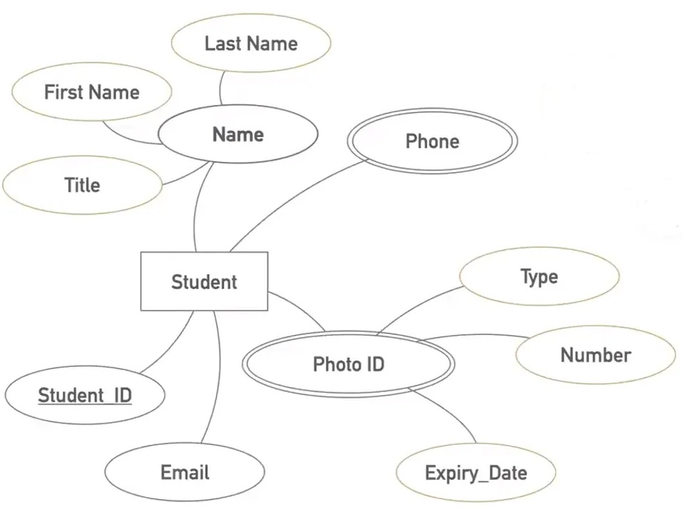

Source: [Database for Software Developers - ostad](https://ostad.app/course/database-for-developer)

### **Student**
- **Attributes:**
    - Student ID
    - Name (Composite: First Name, Last Name, Title)
    - Email
    - Phone (Multivalued)
    - Photo ID (Complex: Type, Number, Expiry Date)


## **Tables in Relational Schema**
```shell
+----------------+---------------+          +----------------+---------------+          +----------------+---------------+
| student_phone_numbers          |          |   students                     |          |   student_photo_ids            |
+----------------+---------------+          +----------------+---------------+          +----------------+---------------+
| student_id     | integer (FK)  |<---------| student_id     | integer (PK)  |--------->| student_id     | integer (FK)  |
| phone_number   | varchar       |          | email          | text          |          | id_number      | varchar       |
+----------------+---------------+          | first_name     | text          |          | id_type        | text          |
                                            | last_name      | text          |          | expiry_date    | date          |
                                            | title          | text          |          +----------------+---------------+
                                            +----------------+---------------+

```

## **Key Concepts**
### **In ER Diagram vs. Schema Diagram**
| In ER Diagram          | In Schema Diagram        |
|------------------------|--------------------------|
| Entity                 | Table                    |
| Attribute              | Field                    |
| Multivalued Attribute  | Table with foreign key   |
| Composite Attribute    | Field for components     |
| Complex Attribute      | Table with foreign key   |


## **Foreign Keys**
- The `student_id` in both `student_phone_numbers` and `student_photo_ids` serves as a foreign key referencing the
  `students` table.

## Data Example 
```sql
CREATE TABLE students (
    student_id SERIAL PRIMARY KEY,
    email TEXT,
    first_name TEXT,
    last_name TEXT,
    title TEXT
);

CREATE TABLE student_phone_numbers (
    student_id INTEGER REFERENCES students(student_id),
    phone_number VARCHAR
);

CREATE TABLE student_photo_ids (
    student_id INTEGER REFERENCES students(student_id),
    id_type TEXT,
    id_number VARCHAR,
    expiry_date DATE
);
```

```shell
+------------+--------------------+------------+-----------+-------+          +------------+----------------+          +------------+-----------+--------------+-------------+
| student_id | email              | first_name | last_name | title |          | student_id | phone_number   |          | student_id | id_type   | id_number    | expiry_date |
+------------+--------------------+------------+-----------+-------+          +------------+----------------+          +------------+-----------+--------------+-------------+
| 1003       | rahman@company.com | Abdur      | Rahman    | Mr.   |          | 1003       | 88018000444    |          | 1006       | NID       | 151617181888 | 04-12-2024  |
| 1006       | sattar@company.com | Abdus      | Sattar    | Mr.   |          | 1006       | 88017000333    |          | 1006       | Passport  | AXB084333    | 04-12-2024  |
| 1007       | gafur@company.com  | Abdul      | Gafur     | Mr.   |          | 1007       | 88017000555    |          | 1007       | Passport  | AXB084444    | 04-03-2025  |
|            |                    |            |           |       |          | 1007       | 88017000666    |          |            |           |              |             |
+------------+--------------------+------------+-----------+-------+          +------------+----------------+          +------------+-----------+--------------+-------------+
```


# Auto-increment vs UUID: Choosing the Right Unique Key

### **Auto-increment Keys**
- **Advantages**:
    - **Simplicity**: Auto-increment keys are straightforward to implement and use.
    - **Performance**: They are smaller in size (e.g., `INT` or `BIGINT`) and are more efficient to index and query than
      UUIDs.
    - **Sequential**: Being sequential, they result in better index performance as new records are added to the
      database.
- **Challenges with Multiple Master Databases**:
    - In a multi-master setup (e.g., with 4 master servers), auto-increment values can **conflict** because each server 
      generates its own sequential keys independently.
    - Conflict resolution mechanisms (like offset ranges, server-specific increments) can be used, but they add 
      complexity.

### **UUID (Universally Unique Identifier)**
- **Advantages**:
    - **Globally Unique**: UUIDs ensure uniqueness across multiple database servers without any coordination.
    - **Scalability**: Ideal for distributed systems with multiple masters or nodes.
    - **Decentralization**: UUID generation does not rely on a centralized database mechanism (e.g., can be generated by
      the application).
- **Challenges**:
    - **Size and Performance**: UUIDs are typically 16 bytes (128 bits) compared to 4-8 bytes for `INT` or `BIGINT`,
      making them larger to store and slower to index.
    - **Index Fragmentation**: UUIDs are not sequential by nature, leading to fragmentation and poor index performance 
      (though sequential UUIDs mitigate this issue).


### **When to Use Auto-increment vs UUID**
- **Auto-increment**:
    - Use when you have a **single-master database** or a setup where conflicting IDs can be easily avoided (e.g., 
      partitioned increments).
    - Better suited for small, high-performance applications where sequential keys matter.
- **UUID**:
    - Use in **multi-master database systems** where uniqueness across multiple servers is critical.
    - Ideal for distributed systems, applications with global scale, or cases where IDs need to be generated 
      independently.


### **Recommendation**
If you have **4 master database servers**, UUIDs would indeed be preferable because:
- Auto-increment keys can conflict, and resolving conflicts can be challenging.
- UUIDs eliminate the risk of conflicts, ensuring data consistency across the system.

However, to address performance issues with UUIDs:
- Use **sequential UUIDs** (e.g., UUIDv1 or UUIDv6) to improve index performance.
- Ensure the UUID implementation is optimized in your database and application.


# Relationships and Relational Schema

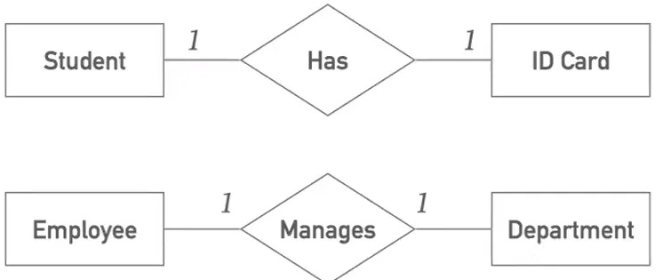

Source: [Database for Software Developers - ostad](https://ostad.app/course/database-for-developer)

## **1. One-to-One Relationships**
### Example 1: Student and ID Card
- **Relationship**: A `Student` *Has* one `ID Card`, and one `ID Card` belongs to one `Student`.
- **Type**: Dedicated relationship.
- **Cardinality**: 1:1 (One-to-One).

---

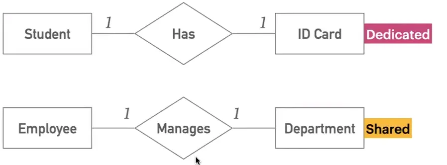

Source: [Database for Software Developers - ostad](https://ostad.app/course/database-for-developer)

## **2. Shared vs Dedicated Relationships**
### Example 2: Employee and Department
- **Manages Relationship**:
    - An `Employee` *Manages* one `Department`, and a `Department` is *Managed* by one `Employee`.
    - **Type**: Shared relationship.
    - **Cardinality**: 1:1 (One-to-One).

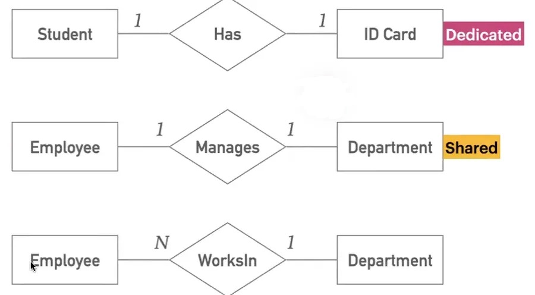

Source: [Database for Software Developers - ostad](https://ostad.app/course/database-for-developer)

### Example 3: Employee Works In Department
- **WorksIn Relationship**:
    - Multiple `Employees` can *Work In* one `Department`.
    - **Cardinality**: N:1 (Many-to-One).

As at below student and id card has 1 to 1 relationship and dedicated at the first we thought id card can be another entity but it can placed inside the student entity.

And we do not bring ID number from ID Card as it could same as student id.

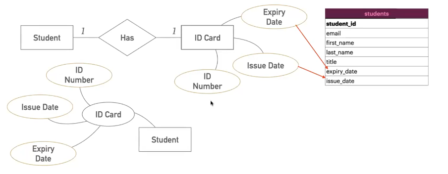   

Source: [Database for Software Developers - ostad](https://ostad.app/course/database-for-developer)

## **3. ER Diagram Representation**


### Student and ID Card
- **Attributes of ID Card**:
    - `ID Number`
    - `Issue Date`
    - `Expiry Date`
- The `Student` entity includes:
    - `Student_ID` (Primary Key)
    - `First Name`
    - `Last Name`
    - `Title`
    - `Issue Date`
    - `Expiry Date`

---

## **Schema Example for Student and ID Card**
| **Table: students**      |
|--------------------------|
| student_id (PK)          |
| email                    |
| first_name               |
| last_name                |
| title                    |
| issue_date               |
| expiry_date              |


### ONE TO ONE

For this one-to-one relationship (At below) can place department id in employees or can place employee id ad
departments. Both will work but we should put foreign key at the attribute where it has total participation in this case
department.

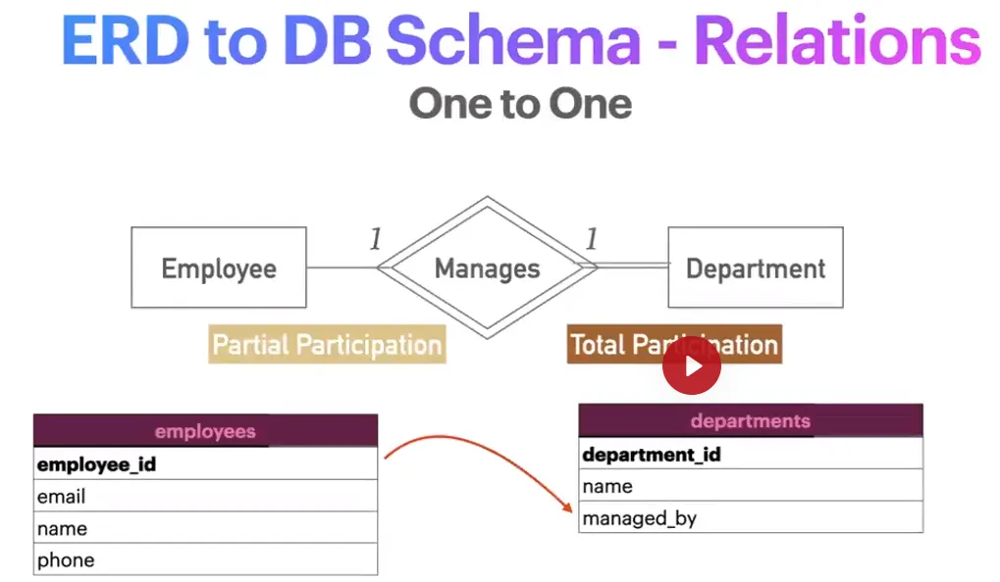

Source: [Database for Software Developers - ostad](https://ostad.app/course/database-for-developer)

### MANY TO ONE

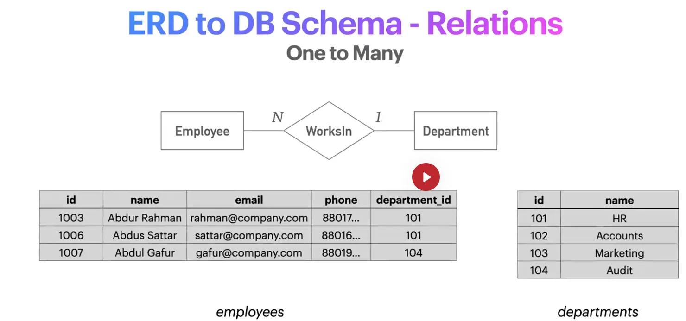

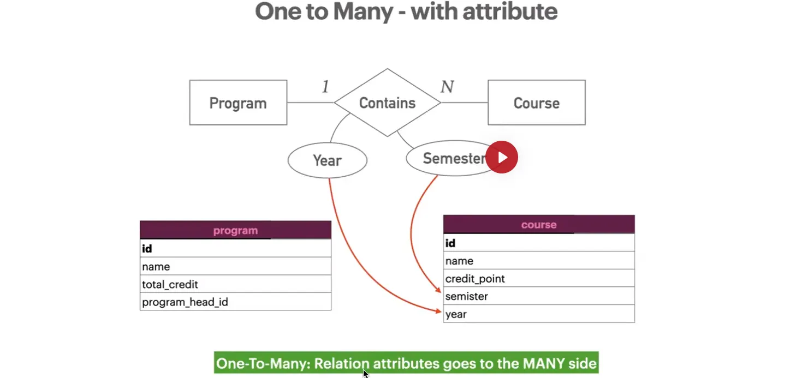

Source: [Database for Software Developers - ostad](https://ostad.app/course/database-for-developer)

### MANY TO MANY

For many-to-many relation attributes will go at the relation table(join table) and for one-to-many relation attributes 
will go at the many table/side.

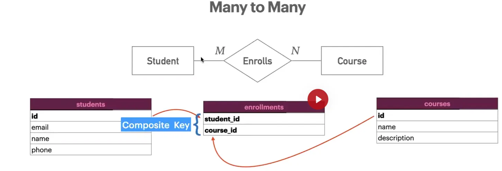

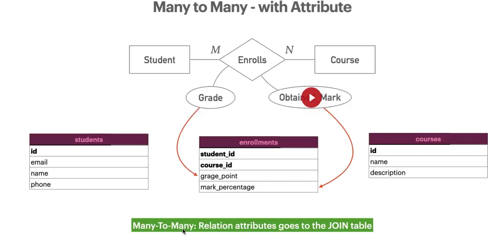

Source: [Database for Software Developers - ostad](https://ostad.app/course/database-for-developer)


## Example of converting ER table into schema

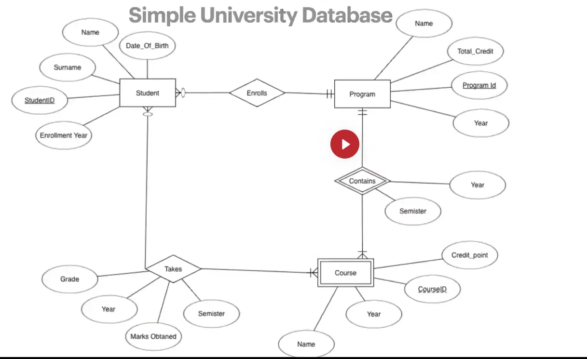

////TODO: HAVE TO CHECK THIS IMAGE


# Notes on Database Design and Concepts

## Table Naming Convention
- Always use **plural** names for database tables.

## Performance: `CHAR` vs `VARCHAR`
- **CHAR**:
    - Faster indexing because the system allocates a fixed length for the field (e.g., `CHAR(10)` always reserves memory
      for 10 characters, even if only 5 are used).
- **VARCHAR**:
    - Saves memory by allocating space only for the actual number of characters used (e.g., `VARCHAR(25)` takes memory 
      for 5 characters if only 5 are used).

## Pivot Table
- A pivot table is used to reorganize and summarize data.

## Associative Table
- Preserves the relationship data between two tables.
    - Example: The `student_courses` table acts as an associative table linking the `students` and `courses` tables by 
      storing their relational data.

## Materialized View
- A materialized view stores the results of a query for faster data retrieval.


# Database Connection and Schema Notes

## Host Information
- **Host Name/IP Address**: `223.65.78.109/db.my-domain.com`
- **Port**: Must identify the specific port used by the database.

## Commands for Managing Databases

### Common SQL Command (Not for Microsoft SQL Server)
```sql
SHOW DATABASES;
```

### Commands for Microsoft SQL Server Management Studio
- The `SHOW DATABASES` command does not work. Instead, use:
```sql
SELECT * 
FROM sys.databases;

SELECT name
FROM sys.databases;
```

## Example: Creating a Table
```sql
CREATE TABLE customers (
    id INT UNSIGNED AUTO_INCREMENT PRIMARY KEY,
    name VARCHAR(100) NOT NULL,
    email VARCHAR(100),
    phone CHAR(15),
    password CHAR(32),
    created_at DATETIME DEFAULT CURRENT_TIMESTAMP
);
```

---

## Schema Fine-Tuning Guidelines

### Ground Rules
1. **Smaller is better**: Use the smallest possible data type for efficiency.
2. **Closest native solution is better**: Opt for database-native features where possible.
3. **Reflect the reality**: Ensure the schema matches the real-world data requirements.
4. **Compact is faster and more efficient**: Design the schema to minimize storage and optimize performance.


# Data Types in SQL

## Categories of Data Types
### Texts
- **CHAR**, **VARCHAR**, **TEXT**, **BLOB**, **BINARY**, **ENUM**

### Numeric
- **INTEGER**, **FLOAT**, **DOUBLE**, **DECIMAL**, **BIT**, **BOOL**

### Date/Time
- **DATE**, **DATETIME**, **TIMESTAMP**, **TIME**, **YEAR**


## Data Types - INT

### Storage and Range
| **TYPE**     | **Storage (Bytes)** | **Min Signed**                     | **Max Signed**                       | **Max Unsigned**                      |
|--------------|---------------------|------------------------------------|--------------------------------------|---------------------------------------|
| TINYINT      | 1                   | -128                               | 127                                  | 255                                   |
| SMALLINT     | 2                   | -32,768                            | 32,767                               | 65,535                                |
| MEDIUMINT    | 3                   | -8,388,608                         | 8,388,607                            | 16,777,215                            |
| INT          | 4                   | -2,147,483,648                     | 2,147,483,647                        | 4,294,967,295                         |
| BIGINT       | 8                   | -2^63 (-9,223,372,036,854,775,808) | 2^63 - 1 (9,223,372,036,854,775,807) | 2^64 - 1 (18,446,744,073,709,551,615) |


### Binary Representation
- **Example: TINYINT**
    - `00000000` = 0
    - `11111111` = 255
    - `-1111111` = -128 (Signed: -1 to -128)
    - `+1111111` = 127 (Signed: 0 to 127)


### Example: INT with ZEROFILL
```sql
CREATE TABLE int_length (
    id INT AUTO_INCREMENT PRIMARY KEY,
    test_int INT ZEROFILL,       -- 999 => 00000000999
    test_int_6 INT(6) ZEROFILL,  -- 999 => 000999
    test_int_2 INT(2) ZEROFILL   -- 999 => 999
);
```
- All `test_int`, `test_int_6`, and `test_int_2` use the same storage space.
- **Key Points**:
    - The length in `INT(number)` specifies the **minimum display length**.
    - Only effective when combined with **ZEROFILL**.
    - **No impact on storage length**.

## Data Types - DECIMAL and Floating Points

### DECIMAL
- **Fixed precision floating-point numbers**.

### NUMERIC
- Alias for **DECIMAL**.

### FLOAT
- Floating-point numbers with **approximate values**.

### DOUBLE
- Same as **FLOAT**, but with **double the size** and higher precision.

---

### Example: DECIMAL
```sql
price DECIMAL(10, 2)
```
- **10**: Total number of digits (including digits after the decimal point).
- **2**: Number of digits after the decimal point.


### Understanding `DECIMAL(4,2)` in SQL

The `DECIMAL(4,2)` data type specifies:
- A total of **4 digits**, with **2 digits reserved for fractional values** (after the decimal point).
- This means:
    - The maximum value is **99.99**.
    - The minimum value is **-99.99**.

#### Which Values are Valid?
#### Given Examples:
1. **11.02** → ✅ Valid (fits within 4 digits and 2 decimal places)
2. **128.43** → ❌ Invalid (exceeds 4 digits)
3. **4611.02** → ❌ Invalid (exceeds 4 digits)
4. **8.00** → ✅ Valid (fits within 4 digits and 2 decimal places)

#### Conclusion:
- **Valid values:** `11.02` and `8.00`
- **Invalid values:** `128.43` and `4611.02`


## Data Types - String
### String Data Types


Source: [Database for Software Developers - ostad](https://ostad.app/course/database-for-developer)

#### CHAR
- **CHAR**: Fixed-length string.
#### VARCHAR
- **VARCHAR**: Variable-length string.


### Example: Creating a Table with String Data Types
```sql
CREATE TABLE customers (
  id INT UNSIGNED AUTO_INCREMENT PRIMARY KEY,
  name VARCHAR(100) NOT NULL CHARSET utf8mb4 COLLATE utf8mb4_0900_ai_ci,
  email VARCHAR(100) CHARSET utf8mb4 COLLATE utf8mb4_0900_ai_ci,
  phone CHAR(15) CHARSET utf8mb4 COLLATE utf8mb4_0900_ai_ci,
  password CHAR(32) CHARSET utf8mb4 COLLATE utf8mb4_0900_ai_ci,
  created_at DATETIME DEFAULT CURRENT_TIMESTAMP
);
```


### Character Set and Collation
- **`CHARSET`**:
    - A defined set of characters acceptable for a column.
    - Full list available in: `information_schema.CHARACTER_SETS`
- **`COLLATE`**:
    - A set of rules determining how strings are compared or sorted.
    - Full list available in: `information_schema.COLLATIONS`
  
### Default Settings for MySQL 8:
- **`CHARSET utf8mb4`**:
    - Supports Unicode characters.
    - Requires up to 4 bytes per multibyte character.
- **`COLLATE utf8mb4_0900_ai_ci`**:
    - Default collation for `utf8mb4` in MySQL 8.


## Text Data Types and Their Ranges

| **Type**       | **Maximum Characters**  |
|----------------|-------------------------|
| **TINYTEXT**   | 255 Characters          |
| **TEXT**       | 65,535 Characters       |
| **MEDIUMTEXT** | 16 MB                   |
| **LONGTEXT**   | 4 GB                    |


## Data Types - ENUMS

### Example
```sql
CREATE TABLE shipment (
  id INT UNSIGNED AUTO_INCREMENT PRIMARY KEY,
  type ENUM('digital', 'local', 'overseas') NOT NULL,
  status ENUM('pending', 'assigned', 'picked', 'shipped', 'confirmed'),
  ... more columns...
);
```

### Advantages
✔ Only valid values are accepted.  
✔ Uses minimal storage space.  
✔ Human-friendly and self-explanatory.

### Challenges
- Reflecting changes in business logic.
- Portability issues.
- Ordering is based on the underlying integer index, not alphanumeric order.


## Data Types - Date and Time
### Available Types

| **Type**     | **Range**                                                    | **Purpose**                             |
|--------------|--------------------------------------------------------------|-----------------------------------------|
| DATE         | 1000 to 9999                                                 | Stores a Date (Year, Month, Date)       |
| TIME         | 10-day range expressed in hours, minutes, and seconds        | Stores a Time (Hours, Minutes, Seconds) |
| DATETIME     | '1000-01-01 00:00:00' to '9999-12-31 23:59:59'               | Stores Date and Time (without timezone) |
| TIMESTAMP    | '1970-01-01 00:00:01.000000' to '2038-01-19 03:14:07.999999' | Stores Date and Time (with timezone)    |
| YEAR         | 1901 to 2155                                                 | Only a Year value                       |


### DATETIME vs TIMESTAMP

| **Type**        | **DATETIME**                                         | **TIMESTAMP**                                                |
|-----------------|------------------------------------------------------|--------------------------------------------------------------|
| **Range**       | '1000-01-01 00:00:00' to '9999-12-31 23:59:59'       | '1970-01-01 00:00:01.000000' to '2038-01-19 03:14:07.999999' |
| **TIMEZONE**    | No                                                   | Yes                                                          |
| **Storage**     | 8 Bytes                                              | 4 Bytes                                                      |
| **Performance** | Comparatively slower                                 | Comparatively faster                                         |


## Updating Tables

### ALTER TABLE Syntax
```sql
ALTER TABLE table_name
alter_operation column_name [options];
```

### Examples
- **Add Column**:
```sql
ALTER TABLE products
ADD COLUMN sku CHAR(8);
```

- **Modify Column**:
```sql
ALTER TABLE products
MODIFY COLUMN image_url VARCHAR(1000);
```

- **Drop Column**:
```sql
ALTER TABLE products
DROP COLUMN weight;
```

---

## Dropping Tables and Databases

- **Truncate Table**:
  ```sql
  TRUNCATE TABLE table_name;
  ```
  Clears all data but keeps the table.

- **Drop Table**:
  ```sql
  DROP TABLE table_name;
  ```
  Removes the table completely.

- **Drop Database**:
  ```sql
  DROP DATABASE database_name;
  ```
  Removes the entire database.

---

## Example Workflow

```sql
/* show databases; */
/* create database dokan; */
/* use `dokan`; */

/* show tables; */

/*
create table products (
	id int unsigned auto_increment primary key,
    name varchar(100) not null,
    description text,
    price decimal (10, 2) not null,
    stock_quantity int not null default 0,
    weight decimal (5, 2) unsigned,
    image_url varchar(10), 
    created_at datetime default current_timestamp,
    updated_at datetime default current_timestamp on update 
		current_timestamp
);
*/

/* describe table products; */
/* describe products; */


/* show create table products; */
/*
OUTPUT
CREATE TABLE `products` (
  `id` int unsigned NOT NULL AUTO_INCREMENT,
  `name` varchar(100) NOT NULL,
  `description` text,
  `price` decimal(10,2) NOT NULL,
  `stock_quantity` int NOT NULL DEFAULT '0',
  `weight` decimal(5,2) unsigned DEFAULT NULL,
  `image_url` varchar(10) DEFAULT NULL,
  `created_at` datetime DEFAULT CURRENT_TIMESTAMP,
  `updated_at` datetime DEFAULT CURRENT_TIMESTAMP ON UPDATE CURRENT_TIMESTAMP,
  PRIMARY KEY (`id`)
) ENGINE=InnoDB DEFAULT CHARSET=utf8mb4 COLLATE=utf8mb4_0900_ai_ci
*/

alter table products
  add column sku char(8);

alter table products
drop column weight;

alter table products
  modify column image_url varchar(100) not null;

drop database `dokan`;
```


# References
- [Database for Software Developers - ostad](https://ostad.app/course/database-for-developer)
