# Production Challenges

### Class One

## Basic MySQL Security | Migration Tools | Monitoring Tools

### Basic MySQL Security

**Preventing Unauthorized Data Access**

⇒ VPS, cloud server, aws, does application in the single machine with application or in different machine

## Handling MySQL Users

- Use Strong usernames and password
    - No user without a strong password should exit.
- Limit user privileges
    - Every permission a user has should be precisely planned.
- Remove all anonymous accounts
    - Known users are always comparatively an easy target of attackers.

## The root User

- Do not run MySQL with root user
    - Use specific, newly-created user accounts with the necessary permissions to run every service.
- Update root password
    - Root password MUST be a strong one, and different for every server.
    - SQL code

        ```sql
        -- For MySQL 5.7.6 and later:
        ALTER USER 'root'@'localhost' INDENTIFY BY 'MyNewPass';
        -- For MySQL 5.7.5 and earlier:
        SET PASSWORD FOR 'root'@'localhost' = PASSWORD('MyNewPass');
        ```

- Obfuscate the root account
    - You can rename root user to prevent various attacks that assume there is someone named ‘root’.
    - SQL code

    ```sql
    USE mysql
    UPDATE user SET user='superadmin' WHERE user='root'
    FLUSH PRIVILEGES;
    ```


### Database Related Concerns

- Drop the test database
    - It comes with all default installations. And a known object for MySQL servers.
- Disable database listing
    - Start the database with —skip-show-database option. Or..
    - And skip-show-database to the [mysqld] section of the MySQL configuration file at /etc/my.cnf
- LOAD DATA LOCAL INFILE
    - Allows users to read local
    - SQL code

        ```sql
        [mysqld]
        skip-show-database
        local-infile = 0
        ```

- Disable Remote Logins
    - Reducing the information-gathering capabilities of remote attackers.
- Set proper file permissions
    - Make sure that `my.cnf` is only root writeable
    - `/usr/local/mysql/data` is properly secured with the appropriate permissions.

- Encrypt data on disk
    - MySQL supports transparent data encryption(TDE) using the InnoDB storage engine, which encrypts data files and log files.
    - SQL

        ```sql
        [mysqld]
        innodb_encrypt_tables = ON
        innodb_encrypt_log = ON
        ```
       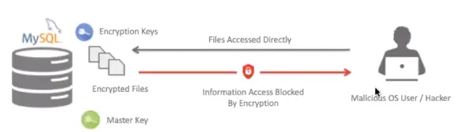

       Source: [Database for Software Developers - ostad](https://ostad.app/course/database-for-developer)


### Network Security

- Use a firewall
    - Fine-grained control over port access. Prevent network/port scanning tools to list your server information.
- Alter which hosts have access to MySQL
    - MySQL instance should be configured to only allow access to permitted hosts.
- Change default port mapping
    - Everyone knows 3306. Change it to add an extra layer of preventing reachability.
    - SQL

    ```sql
    [mysql]
    bind-address = 192.168.0.14
    port = 33007
    ```
    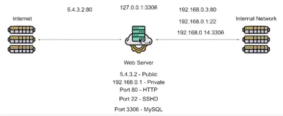

   Source: [Database for Software Developers - ostad](https://ostad.app/course/database-for-developer)


- Encrypt data in transit
    - Use SSL/TLS to encrypt data transmitted between your MySQL server and client.
    - SQL

    ```sql
    [mysqld]
    ssl_ca = /path/to/ca-cert.pem
    ssl_cert = /path/to/server-cert.pem
    ssl_key = /path/to/server-key.pem
    ```

  If the database is only accessible on the local machine then we can connect with the remote PC using ssh tunnel the access it like the local machine

  ⇒ If we have to connect data that is only accessible in [localhost](http://localhost) and we have to access it through another server then

  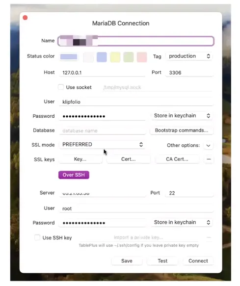
  
  Source: [Database for Software Developers - ostad](https://ostad.app/course/database-for-developer)

### MySQL Secure Installation

`sudo sysql_seccure_information`

- Set a password for root accounts.
- Remove root accounts that are accessible from outside the local host.
- Remove anonymous user accounts.
- Remove the test database, which by default can be accessible by anonymous users.

### Auditing MySQL Security

```sql
git clone https://github.com/meob/MySAT.git dbaudit
cd dbaudit
mysql --user=root -pXXX --skip-column-names -f < mysat.sql > MySAT.htm
```

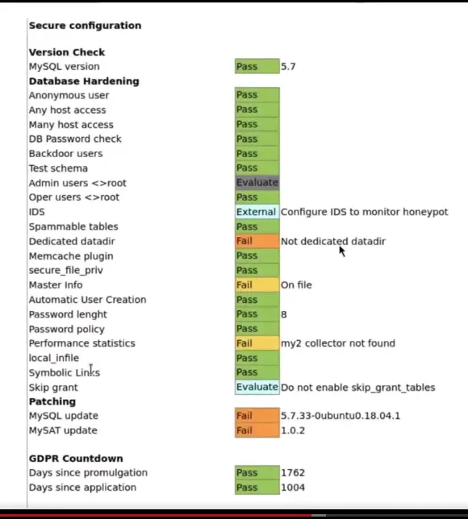

Source: [Database for Software Developers - ostad](https://ostad.app/course/database-for-developer)

### Application Level Security

- DDos Attack
    - Use rate limiting. And proxy layers like CloudFlear.
- SQL injection
    - Use prepared statement and data binding techniques.
- Proper Input Filtering
    - Never trust a user's input. Always verify and sanitize.
- Allowing API to manipulate state
    - Use declarative API endpoints. The third party should not know the database values of the state.

# Class two

## **Road to High Availability(HA)**

- First Step
    - Combined App + DB Server ⇒ Application and database in the same machine. Single Point of Failure(SPF).
      
      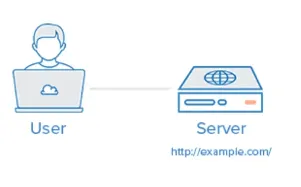
     
      Source: [Database for Software Developers - ostad](https://ostad.app/course/database-for-developer)
      

- Second Step
    - Keep the Application and Database server on different machines and protect the database server inside the private network or on the same network.
    - We can give the required hardware depending on the use and can give a hard disk to the application server and SSD to the database for faster reading and writing.

      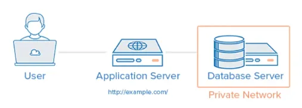

      Source: [Database for Software Developers - ostad](https://ostad.app/course/database-for-developer)

- Master-Slave Replication
    - To make redundancy one is primary and another replica so if any hard disk cashes or dies we can get the backup using any hard-disk.
    - Write will be in master read at master. If somehow the master get down then we have to manually have to fix this.
    
    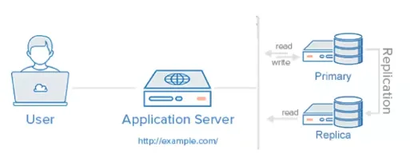

    Source: [Database for Software Developers - ostad](https://ostad.app/course/database-for-developer)

- MySQL InnoDB Cluster
    - We need a minimum of three to create to do this. MySQL route sits between the application and the database replica and defines which cluster will server the data and if the master does down then which slave will be master..
    - We can also add a backup cluster. So if for any reason the main cluster goes down data will be served from the backup cluster.

    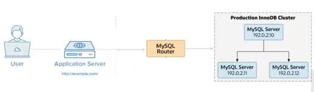

    Source: [Database for Software Developers - ostad](https://ostad.app/course/database-for-developer)****

- ⇒ If one data center goes down then we have to serve from another data server and have to maintain the same data between them. Availability zone AWS.

# Production Challenges

- The database is not responsive.
- Too many connections
- High network latency ⇒ when they work with Islamic banks  for network latency its was taking 2 or 3 seconds
- DNS resolve delay
- InnoDB Buffer Pool Size Too Low
- MySQL configuration is suboptimal
- Low disk space
- Non-SSD disks
- Low I/O capacity
- Operating System not tuned
- ⇒ managed databases do not give full control to configure such as buffer pool

# Your Production Challenges

- Max collection in database error
- Backup(incremental backup,

- Fetch-intensive application of an student

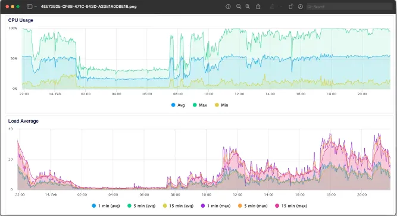
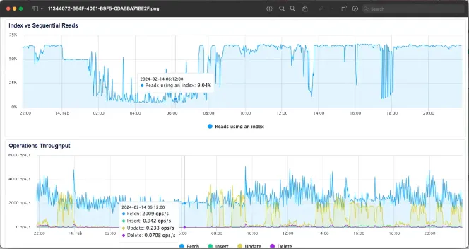
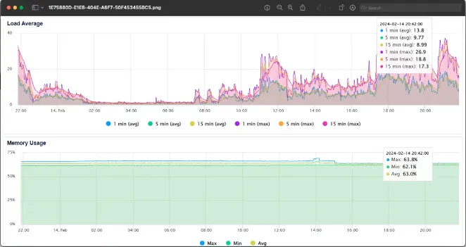

Source: [Database for Software Developers - ostad](https://ostad.app/course/database-for-developer)

# Payment Gateway Best Practice and & Prod Experience

> A student of this course share his challenges
>

⇒ n + 1 query problem

As we use ORM then in any query if we call any property in a loop then this ORM could fetch that property at each time. Such as the loop of 50 then it will query in database 50 times which is inefficient and will result in a high database query as shown below.

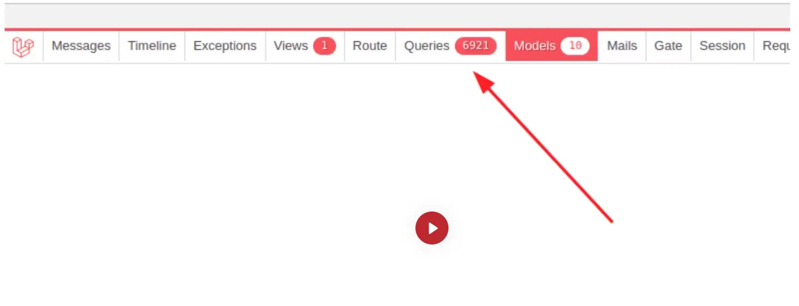

Source: [Database for Software Developers - ostad](https://ostad.app/course/database-for-developer)

DevOps or while auditing for a payment gateway will take a log file and if they see a test user there it is a bad thing.

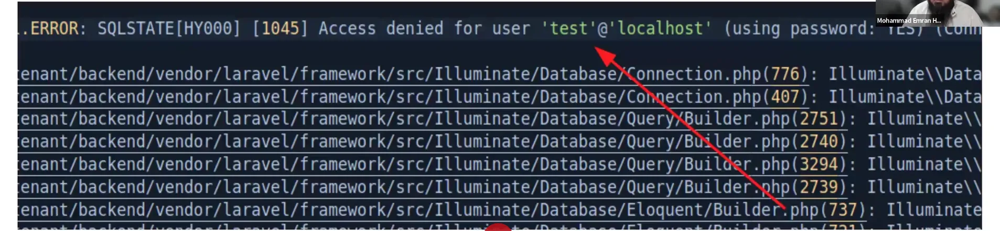

Source: [Database for Software Developers - ostad](https://ostad.app/course/database-for-developer)

Using query logs they identify which query is executed many times. In a file, they try to get the number of queries/duplicate queries in a single request cycle.

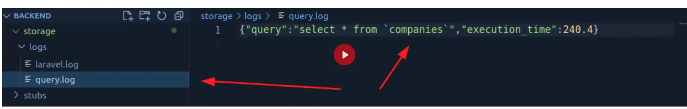

Source: [Database for Software Developers - ostad](https://ostad.app/course/database-for-developer)

Have to hide database username

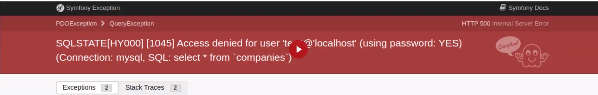

Source: [Database for Software Developers - ostad](https://ostad.app/course/database-for-developer)

### Think before saving data into database

- Strictly prohibited to save as plain text
- ⇒ Those companies have a license of a payment gateway they only can store those or we can store those using masking(see second Allowed to save)
    - CC No, CVV, Expiry
    - SSN, NID
    - Client Secret
- Allowed to save
    - CC no using masking format(4*********3698, ********6325)
    - SSN (Last 4 digits), NID
    - Client Secret(as encrypted)
- Wallet modify
    - Track before updating the wallet
    - ⇒ They do not give direct access to the data they give a third application which is their internal application by that application we may get an xls file by which we can match data in our database with theirs if needed.
    - ⇒ (Not understand properly)Lock the database before update or we can use another table for this.
    - Track after updating
    - Wait between two update
    - ⇒ should give delay between two same transactions as in our country after a transaction we have to wait 5 min to transfer to the same account. They face a problem where using the mouse clicks twice while using clicking one time.
    - use proper decimal value(e.g. $10.00, $500.32)
        - ⇒ The student’s application increased the decimal point and it resulted in a dispute of 10K to 12K dollars.
        - ⇒ Instructor emran vai says if we use float we may loose precision his recommend is using int like as for bdt with 100 poisa equal 1taka and 100 peny equals 1 dollar we will multiple with 100 then will store the value with the currency then while we will need the value we have to divide by 100 to get the actual value at runtime. Such as we will put 1000 and will put USD at the currency column for dollar. So we have to multiple and divide that number here 100. So they use currency object and they make there own class and use the object inside the application to reduce the possible error. They class take care of multiplying and dividing.(have to study more)
        - ⇒ we can use [gihub.com/brick/money](http://gihub.com/brick/money) which is for PHP one student share they have to take permission to install a package if by written a class the requirement get fulfilled then no need to use that package also while auditing issue arriges that package get depricated. Emran vai says to see open issues last merged of issue or commit and who are using that package before installing the package. Is the maintainer fixed the open issue or merging the pull request regularly. Also start last closed issue/pull request.
    - It must follow ACID transaction rules
    - ⇒ in try-catch like we call payment gateway for payment it success and get an error code down it as it will roll back and wipe the data from the database the payment was successful in the context of payment gateway but in our application.
    - ⇒ We can place the payment request curl before try and catch and then again verify that the payment is successful or not then move to the try-catch block.
    - ⇒ emran vai, sometimes there can be a production issue with the payment gateway then we can put that on a queue and try for max 3 times and then abandon the transaction. But it will not work if in that case gateway inject there page and after success redirect to the application success url.
    - Using API must confirm the payment status
    - ⇒ Recommended to verify by an API call if the payment is successful before inserting success at the database for any fault to the payment gateway they return success the first time
- Unwanted aggregation
    - Monthly commission report(SUM)
    - ⇒ We can use a table after every transaction we will update that table for the report by doing this we do not have to run heavy queries at the end of every month to generate the report.
- Performance optimization
    - Use proper indexing
    - Use DB Cluster(Read/Write)
    - Unwanted query running(e.g. DB queue)
    - Utilize server memory property(Take advantage using orchestration tool) e.g. Docker, K8s
    - Use Cache/In memory DB for master tables.
    - For the list try to use pagination.
- Audit
    - Try to use write comment for column
    - Test by injection into database.
- DOB
    - ⇒ get should use the date of birth do not directly use age in the database.
    - ⇒ for some cases as instructor emran vai says they build a software for medical purposes the patient do not know their date of birth and they say their age by guessing for those exceptional cases we can directly store age.
- Deployment
    - ⇒ The should be database deployed first and then the application.
    - All time queries will be one flow
    - Try to use the default value for every business column
    - Run query before code deployment
    - Use release notes including query
    - Make sure zero downtime
    - ⇒ They have a load balancer, they have multiple database clusters connected to the load balancer, then they turn off one server so the load balancer does not send requests to that server then they deploy the database, and application on that server, and the database cluster, and after deployment complete we turn on that server and turn off another server and deploy on that server and turn on that server after deployment completed. Eventually deploy in all of those server at zero downtime.
    - Inject data according to business logic.

# Reference
- [Database for Software Developers - ostad](https://ostad.app/course/database-for-developer)
