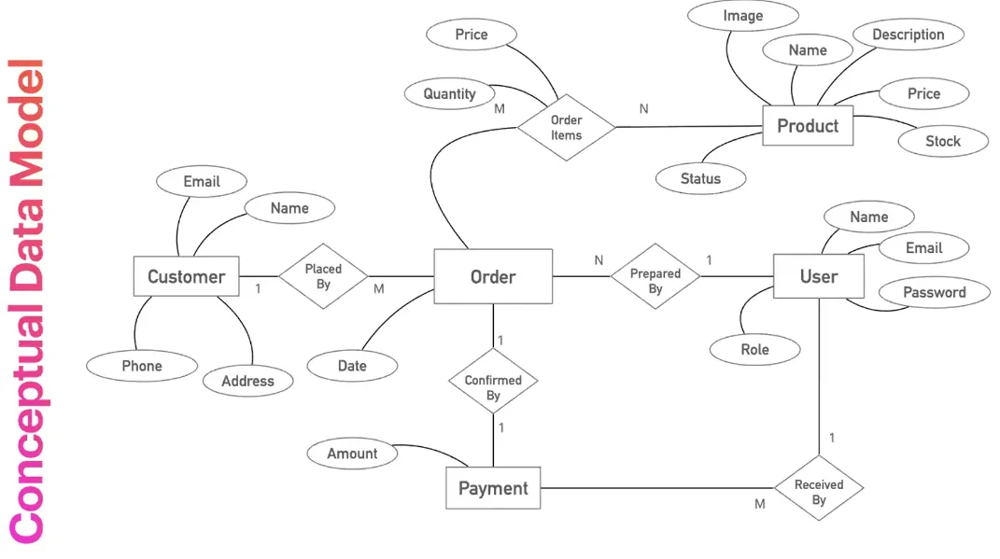
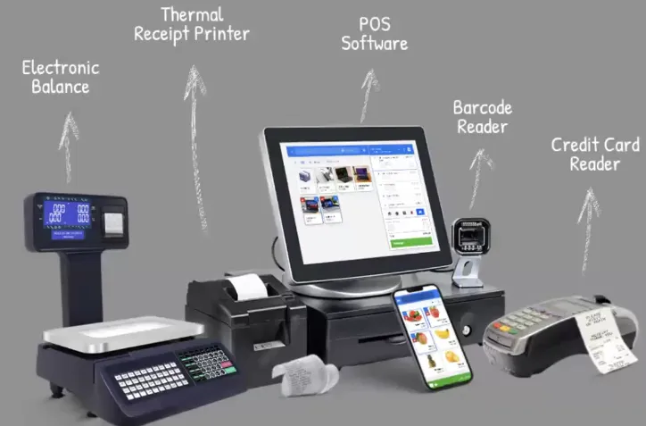
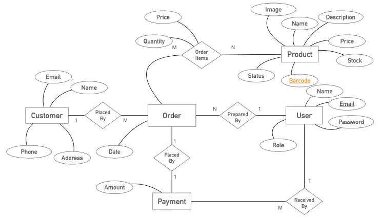
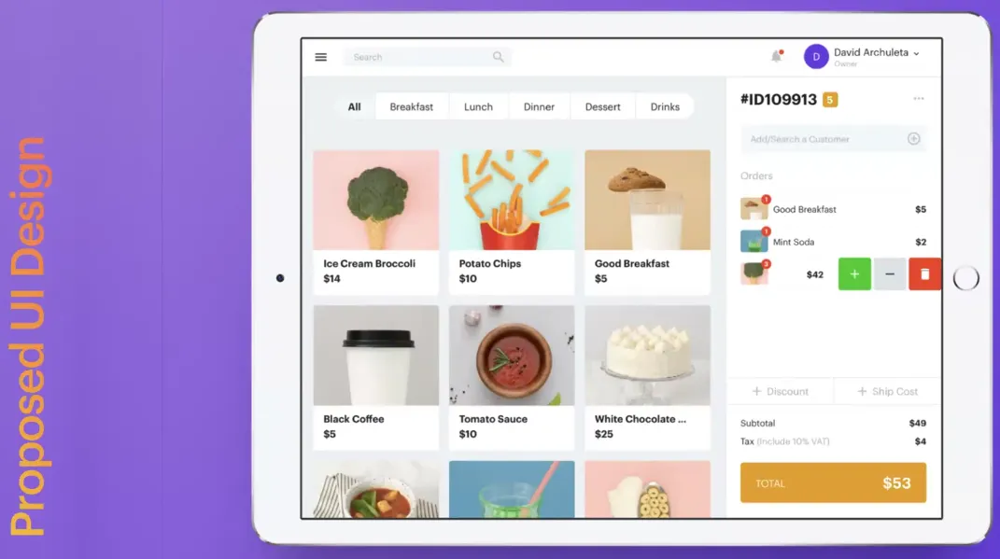
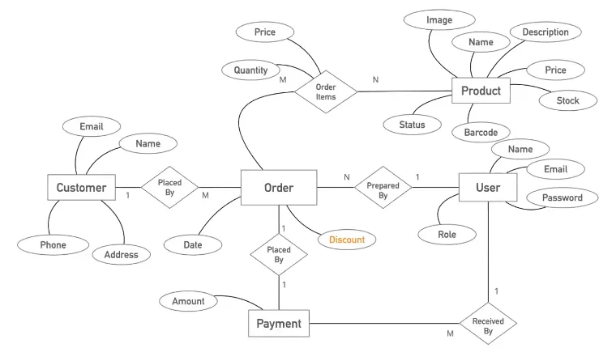
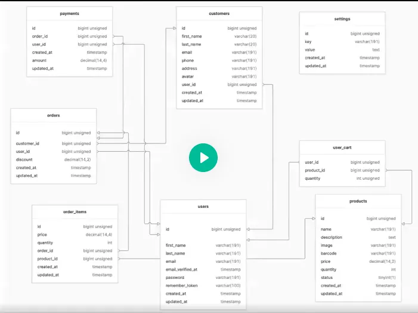
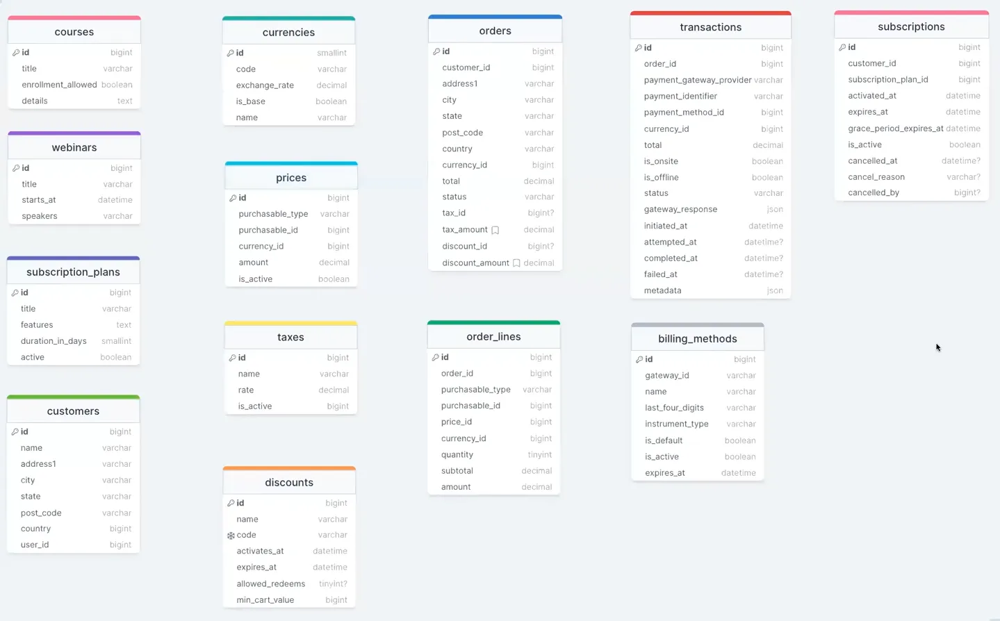

# Real-life Project

# Class one

# Point Of Scale(POS)

## How does it get started?

### Requirement

- Order/Sales Management
    - Support for processing orders, Adding multiple items, handling transactions, generating receipts, etc.
- Inventory Control
    - Real-time tracking of stock levels, reordering, and management of product information (SKU, price, quantity)
        - Transition history
        - SKU(stock-keeping unit) can be called an identification number. have to see how define it
- Customer Management
    - Storing customer information, purchase history, etc. to enhance customer service and support loyalty programs
- Reporting and Analytics
    - Comprehensive reporting tools for sales, inventory, and customer data analysis to inform business decisions
- Staff Management
    - Managing sales users, and admins and tracking their activities.

## Conceptual Data Model



Source: [Database for Software Developers - ostad](https://ostad.app/course/database-for-developer)

Previously requirement for a barcode was not present after the store visit we understand that we need a barcode.




Source: [Database for Software Developers - ostad](https://ostad.app/course/database-for-developer)

After the UI design is completed, we need to change the data model also shipping cost is not valid as the customer will purchase the product physically. We need to add discounts and categories and also search by title or barcode







Source: [Database for Software Developers - ostad](https://ostad.app/course/database-for-developer)

## Create schema

```sql
-- Create Database
CREATE DATABASE test_database;
USE test_database;

-- Create a user to access from application
CREATE USER 'app_user'@'localhost' IDENTIFIED BY 'test_password';
GRANT ALL PRIVILEGES ON simple_pos TO 'app_user'@'localhost';

-- Create tables
CREATE TABLE `products` (
  `id` bigint UNSIGNED NOT NULL AUTO_INCREMENT,
  `name` varchar(191) NOT NULL,
  `description` text,
  `image` varchar(191) DEFAULT NULL,
  `barcode` varchar(191) NOT NULL,
  `price` decimal(14,2) NOT NULL,
  `quantity` int NOT NULL DEFAULT 1,
  `status` tinyint(1) NOT NULL DEFAULT '1',
  `created_at` timestamp NULL DEFAULT NULL,
  `updated_at` timestamp NULL DEFAULT NULL,
  PRIMARY KEY (`id`),
  UNIQUE KEY `products_barcode_unique` (`barcode`)
) ENGINE=InnoDB DEFAULT CHARSET=utf8mb4 COLLATE=utf8
```

### Queries to build cart

```sql
-- Add item to user cart
insert into `user_cart` (`product_id`, `quantity`, `user_id`)
values (1, 1, 1);

-- Update item quantity of user cart
update `user_cart`
set `quantity` = '10'
where `user_id` = 1 and `product_id` = 1;

-- Search items by name
select count(*) as aggregate from `products`
where `name` LIKE '%COL%';

-- Search items by barcode
select * from `products`
where `barcode` = '1011234' limit 1;

```

### From cart to order

```sql
-- Make an order for the user and customer
insert into `orders` (`customer_id`, `user_id`, `updated_at`, `created_at`)
values ('1', '1', '2024-02-28 13:35:58', '2024-02-28 13:35:58');

-- Collect user_cart items with product information
select `products`.*, 
       `user_cart`.`user_id` as `pivot_user_id`,
       `user_cart`.`product_id` as `pivot_product_id`,
       `user_cart`.`quantity` as `pivot_quantity`
from `products`
inner join `user_cart` on `products`.`id` = `user_cart`.`product_id`
where `user_cart`.`user_id` = 1;

-- Associate each items with the order we created
insert into `order_items` (`price`, `quantity`, `product_id`, `order_id`, `updated_at`, `created_at`)
values (550, 10, 1, 2, '2024-02-28 13:35:58', '2024-02-28 13:35:58');

-- Update item's available stock
update `products` set `quantity` = 19, `updated_at` = '2024-02-28 13:35:58'
where `id` = 1;

-- Preserve payment information
insert into `payments` (`amount`, `user_id`, `order_id`, `updated_at`, `created_at`)
values ('1660.00', 1, 2, '2024-02-28 13:35:58', '2024-02-28 13:35:58');

-- Clean up user cart
delete from `user_cart` where `user_cart`.`user_id` = 1;
```

### Challenges

After the trial of the product, some challenges have code

- How to keep a cart aside temporarily?
    - Suppose a customer does not have enough money with him he goes to collect money in that case we have to save that cart temporarily and start the process next customer.
        - Also, have to maintain stock of a product suppose we have one piece of a product and a previous customer (who goes to collect money) take that product, in that case we can not sell that product to another customer.
            - For POS like Super store it will not problem for e-commerce this problem will not arise.
            - We need reservation system for reserve the stock without selling it.
    - Some time for e-commerce we can do over sold
        - Suppose we have 10 quantity in stocks but we will delivery it tomorrow and vendor will give more 30 quantity tomorrow so we will able to sold total 40 quantity today. As we also start processing order tomorrow.
        - For e-commerce we need feature for oversold for certain amount.
- How to manage stock when we have multiple checkout desks?
    - Sometime at UI showing we have 4 copy of a product but in the real we have only 2 left. If two stuff from two counter add 2 quantity of that product in their cart then while they goes to inventory to collect the product will see there have only 2 left.
        - To solve this we have to do a api call while adding to cart to check the available stock. Then we have to move product in reserve stock if adding cart is successful.
- User add product at cart but he left the job in that case those product will be in reserved state we need the admin privilege to make those available forcefully.

# Class Two

# Building Blocks of a SaaS

**What is SasS?**

Software as a service is a software licensing and delivery model in which software is licensed on a **subscription basis** and is **centrally hosted**.

**Purchasable**

- Course
- Course Bundle
- Webinar
- Subscription Plan

**Ordering**

- Order
- Order line/Order items
    - Discount

**Payment**

- Currency
- Currency Exchange Rate
- Invoice
- Invoice Line/Invoice Item
- Transaction
- Payment Method
- Tax
- Price

**Subscription**

- Subscription

drawsql.app



Source: [Database for Software Developers - ostad](https://ostad.app/course/database-for-developer)


# References
- [Database for Software Developers - ostad](https://ostad.app/course/database-for-developer)
