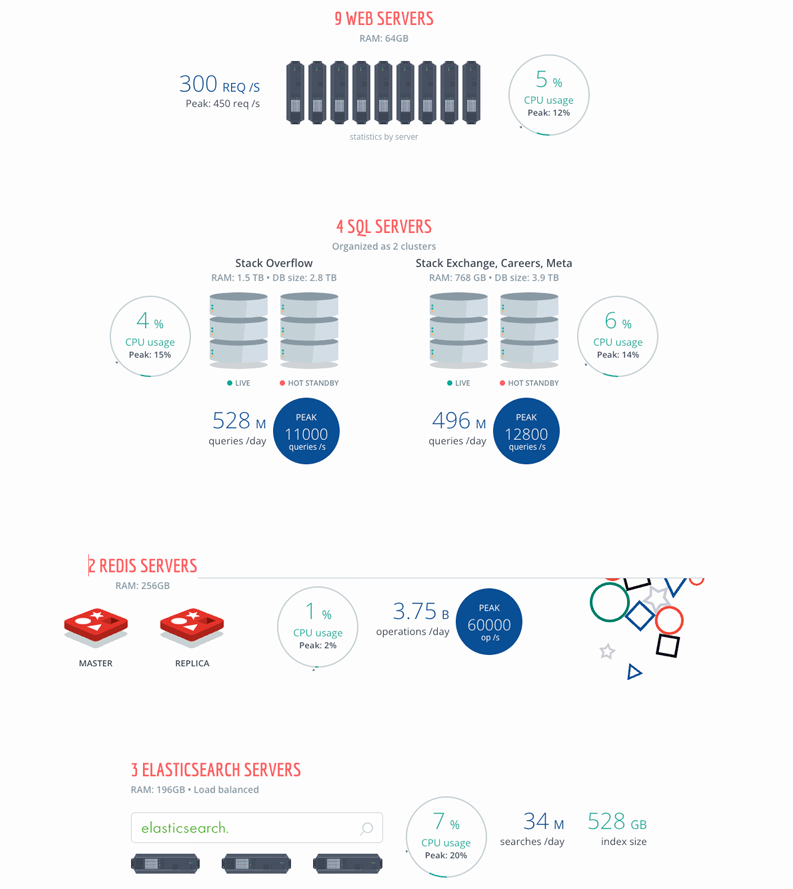
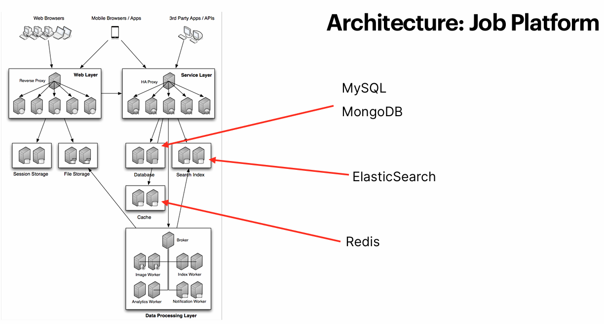
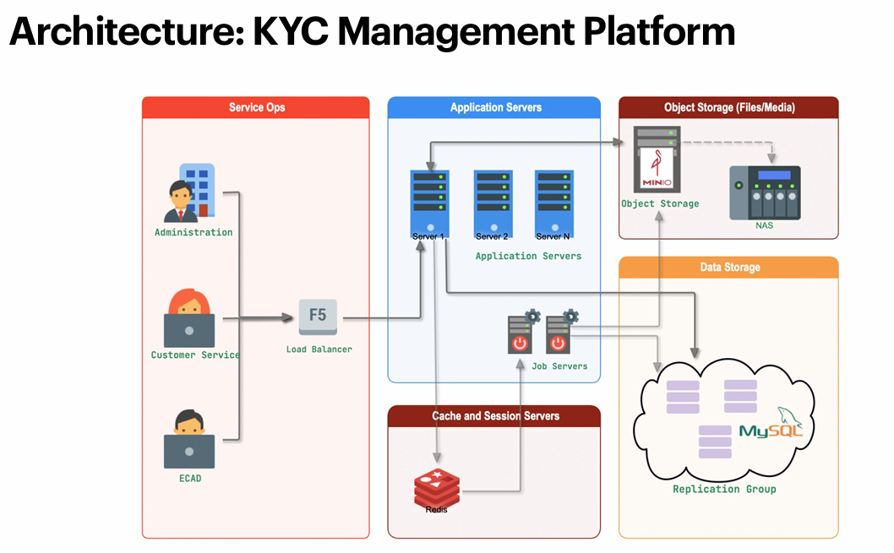

## Stackoverflow

## Job Platform

## KYC Management Platform

## Will add
- Suppose if master get down and at that time on insert operation get failed and will take time to become one node as 
  master as how to handle this situation and prevent data loss and keep ACID property and fault tolerance.
- 
