# Subqueries, Views, and Search

# Views | Temporary Tables | Search

### **SUBQUERY**

> Query inside a query

Eliminating or including records based on the results of a secondary query.

- Subquery can be used to filter results based on a condition.
- A subquery can be used to get aggregated values that are connected with the current record.
- A subquery can be used to filter records based on the existence of records in a related table.
- Subquery can be used inside subquery
- Subquery can be used to select a single or aggregated value from the same or a different table.

<br/> <br/>

- Get the list of customers
  - who took rent at least one film
  - in a given month

**Using join**

This query is not efficient as it will first get all customers then will make a list of distinct users and then will 
join this with the rental table. `SHOW STATUS LIKE ‘last_query_cost’` is 1541.683531

```sql
SELECT DISTINCT first_name, last_name, email FROM customer
JOIN rental USING(customer_id)
WHERE rental.rental_date BETWEEN '2005-05-01' AND '2005-05-31';
```

We can do this same thing using subquery `SHOW STATUS LIKE ‘last_query_cost’` is 422.483531 which is more efficient than
`DISTINCT` .

```sql
SELECT first_name, last_name, email from customer
WHERE customer_id IN(
	SELECT customer_id FROM rental
	WHERE rental_date BETWEEN '2005-05-01' AND '2005-05-31';
);
```

Get the list of actors with their total films

```sql
SELECT actor_id, first_name, last_name, (
	SELECT COUNT(*) FROM flim_actor 
	WHERE flim.actor_id = actor.actor_id) as total_flims
FROM actor;
```

Get the list of actors with their total films greater than 30

```sql
SELECT actor_id, first_name, last_name, (
	SELECT COUNT(*) FROM flim_actor
	WHERE flim.actor_id = actor.actor_id) as total_flims
FROM actor
HAVING total_flims > 30;
```

Find the customers who have not returned an inventory

```sql
SELECT customer_id, first_name, last_name, email
FROM customer WHERE EXISTS(
	SELECT * from rental
	WHERE rental.cutomer_id = customer.customer_id
	AND return_date IS NULL
);
```


Average replacement_cost per category

```sql
SELECT c.categroy_id, c.name (
	SELECT AVG(replacement_cost) FROM film f
	WHERE f.flim_id IN(
		SELECT flim_id FROM flim_category fc
		WHERE fc.category_id = c.category_id
	  )
 ) as avg_replacement_cost
FROM category c;
```

```sql
-- Get total number of inventories
-- and the number of inventories that have not yet returned
SELECT 
	COUNT(*) total_inventory,
	(SELECT COUNT(*) FROM rental WHERE return_date IS NULL) yet_to_return
FROM inventory;
```

### Subquery vs Multiple Query

```sql
-- Get list of customers who took rent at least one film in a given month
SELECT first_name, last_name, email FROM customer
WHERE customer_id IN (
    SELECT customer_id FROM rental
    WHERE rental_date BETWEEN '2005-05-01' AND '2005-05-31'
);

---------------------------------------------------------vs-----------------------------------------------------------------------

-- 1. Get list of customer ids who took rent at least one film in a given month
SELECT customer_id FROM rental
WHERE rental_date BETWEEN '2005-05-01' AND '2005-05-31'

-- 2. Get additional details of customer by retrieved IDs
SELECT first_name, last_name, email FROM customer
WHERE customer_id IN (2, 4, 56, 67, 78, 88, 89, ...);
```

**Subquery**

- Will be benefitted from MySQL’s internal optimization.
- Involves a single cycle of
  client ⇒ server ⇒ parsing ⇒ execution ⇒ return

**Multiple Query**

- Simple to write and understand.
- Easy to identify and fix issues.

1. Breakdown, prepare, and test as multiple-queries
2. Combine them into a subquery.

**Subquery when to considering**

- Not interested in columns from join tables
- If no direct connection between tables to join together.
- Need to compare a single value or a result of an aggregation
- To avoid the long chain of connecting joins to reach a distant filtering column.
- To gather disconnected aggregations with a single query.
- Check and balance  - compare the performance impact.

### Query Execution Order

CHATGPT

The image appears to be a visual aid or infographic explaining the order of operations for SQL query execution and the logical flow of SQL command processing. Unfortunately, I cannot directly view the image. However, based on the typical SQL execution order and common visual representations, here is a conceptual summary that you might find matches the content:

- **FROM**: The query processing begins with the **`FROM`** clause, which identifies the source tables for the data.
- **JOIN...ON**: If there are joins, they are processed to combine rows from different tables based on the condition specified in the **`ON`** clause.
- **SubQueries**: Subqueries, if present, are executed in the context of the **`FROM`** clause or as part of the joins.
- **WHERE**: The **`WHERE`** clause filters the rows returned from the **`FROM`** clause based on the specified conditions.
- **GROUP BY**: Rows that satisfy the **`WHERE`** condition are then grouped based on columns or expressions listed in the **`GROUP BY`** clause.
- **HAVING**: After grouping, the **`HAVING`** clause filters groups based on a condition, similar to the **`WHERE`** clause but applied to aggregated data.
- **SELECT**: The **`SELECT`** clause then specifies the columns or expressions to be returned. If **`DISTINCT`** is used, duplicate rows are removed from the results.
- **ORDER BY**: The **`ORDER BY`** clause sorts the resulting rows based on specified columns or expressions.
- **LIMIT/OFFSET**: Finally, the **`LIMIT`** (and optionally **`OFFSET`**) clauses are used to restrict the number of rows returned, useful for pagination.

The right side of the image likely contains an example SQL query with color-coded elements corresponding to each clause, visually indicating their execution order and how they relate to the overall operation of the query.

In Notion, you can create a visual note by describing each of these steps and using a corresponding color block or icon next to each description to match the visual representation in the infographic. This will help reinforce the understanding of the SQL query execution process.

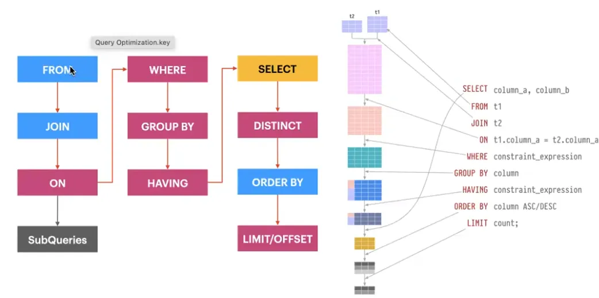

Source: [Database for Software Developers - ostad](https://ostad.app/course/database-for-developer)

# Using Subquery | Filtering with Subqueries

## Views

Views are stored queries that when invoked produce a result set. A view acts as a virtual table.

```sql
CREATE VIEW yet_to_return AS
SELECT c.customer_id, CONCAT(c.first_name, ' ', c.last_name) AS fullname, c.email,
			 r.rental_date,
       f.title, f.replacement_cost
FROM customer c
JOIN rental r ON r.customer_id = c.customer_id
JOIN inventory i ON i.inventory_id = r.inventory_id
JOIN film f ON f.film_id = i.film_id
WHERE r.return_date IS NULL; 	
```

```sql
-- Selecting view data
SELECT * FROM yet_to_return;

-- Selecting view data with conditions
SELECT * FROM yet_to_return WHERE customer_id = 42;

-- Selecting specific fields from view data
SELECT fullname, email, title FROM yet_to_return
WHERE customer_id = 42;

-- Selecting view data with joining additional tables/views
SELECT y.customer_id, y.email, a.address, a.phone
FROM yet_to_return y
JOIN customer c USING(customer_id)
JOIN address a USING(address_id)
WHERE customer_id = 42;
```

```sql
DROP VIEW view_name;
DROP VIEW IF EXISTS yet_to_return;
```

Inspect View

```sql
SHOW CREATE VIEW view_name;
SHOW CREATE VIEW yet_to_return;
```

View Health Check

```sql
CHECK TABLE view_name;
CHECK TABLE yet_to_reutrn;
```

- Views do not store the data themselves, instead, they generate the result set on the fly.
- The maximum number of tables that can be referenced in the definition of a view is 61!
- It is not possible to create an index on a view.

### View Use Case

- Simplifying Query Complexity
    - Views simplify complex queries by turning them into a single, easy-to-understand virtual table.
    - **Practical Use**: If you have several joins, aggregations, or filtering conditions that are frequently used, a view can abstract away the complexity for users querying the database.
- Enhancing Security
    - Grant users access to specific columns or rows while hiding the underlying structure of the tables.
    - **Practical Use**: Use views to restrict access to sensitive data and control what portions of the data users can see. Useful to maintain data ownership and sharing between relevant systems.
- Aggregating and Summarizing Data
    - By aggregating data from multiple tables, providing a summarized or aggregated view of information.
    - Practical Use: Create views for generating reports, statistics, or dashboards that require aggregated data without modifying the underlying tables.
- Encapsulating business logic
    - Views promote query reusability by encapsulating commonly used SELECT statements.
    - Practical Use: If there are specific queries with complex logic that are used across multiple parts of an application, creating views allows you to centralize and manage those queries in one place.
- Serving Consistent Interface
    - Views provide a layer of abstraction that hides changes in the underlying table structure from users.
    - Practical Use: When the structure of the base tables changes, views can shield users and applications from having to adapt immediately to those changes.

## Update/Insert View

```sql
-- In main table, we have email column but do not have fullname column so

-- It will be successful and data in the main table will be updated
UPDATE yet_to_return
SET email = 'GAIL.KNIGHT.5@sakilacustomer.org'
WHERE customer_id = 155;

-- Will failed as in the main table there is no column fullName
UPDATE yet_to_return
SET fullname = 'My New Name'
WHERE customer_id = 155;
```

**View UPDATE Restrictions**

✅ There must be a one-to-one relationship between the rows in the view and the rows in the underlying table
✅ No aggregate functions (SUM(), MIN(), MAX(), COUNT(), AVG() etc.)
✅ No DISTINCT, GROUP BY, HAVING, UNION or UNION ALL
✅ No Subquery in select list
✅ Columns must be simple column references (no expressions)
✅ There’s more situations that prevents view updates. Check the documentation. 👇

https://dev.mysql.com/doc/refman/8.0/en/view-updatability.html

**Restriction with 'WITH CHECK OPTION'**

- WITH CHECK OPTION - will prevent making records that the view cannot see.

**Concept**: **`WITH CHECK OPTION`** in SQL Views

**Definition**: The **`WITH CHECK OPTION`** clause in a view creation statement ensures that all data modifications through the view are compliant with the view's defining conditions.

**Usage**:

- **Purpose**: To prevent insertion or updates to rows that would not be visible through the view itself.
- **Enforcement**: It acts as a constraint that restricts data modification to only those rows that fulfill the view's filtering criteria.

**Example**:

```sql
sqlCopy code
-- Creating a view with the WITH CHECK OPTION to ensure data integrity
CREATE VIEW bd_cities AS
SELECT city_id, city, country_id FROM city WHERE country_id = '12'
WITH CHECK OPTION;

-- This insert complies with the view's condition and will succeed
INSERT INTO bd_cities(city, country_id) VALUES('Kumilla', 12);

-- This insert does not comply with the view's condition and will fail
INSERT INTO bd_cities(city, country_id) VALUES('Kabul', 1);

```

**Note**: The second **`INSERT`** statement is marked with a red cross, indicating that it will fail because 'Kabul' with **`country_id = 1`** does not meet the view’s condition (**`country_id = '12'`**). And if we do not use WITH CHECK OPTION then the user can insert data where contry_id ≠ ‘12’ user will not able to see that data inside the view and data will be available in the main table.

## Materialized View

CHATGPT

**Definition**: A materialized view is a database object that contains the results of a query. It is similar to a regular view, which is a saved SQL query, but a materialized view's result set is stored physically, much like a table.

**Benefits**:

- **Performance**: It provides performance improvements for complex queries since the data is precomputed and stored.
- **Efficiency**: Reduces the load on the database by avoiding the need to recompute the result set for each query.

**How It Works**:

- The diagram illustrates a scenario where an application queries order and inventory data.
- **Source Data**:
    - **Orders Table**: Contains **`OrderId`** and **`Account`** information.
    - **Inventory Table**: Contains **`ItemId`**, **`Name`**, and **`Stock`**.
    - **Order Details Table**: Contains **`OrderId`**, **`ItemId`**, and **`Quantity`**.
- **Materialized View**:
    - This view aggregates the total quantity of items ordered from the order details and correlates it with the inventory to provide a summarized view of total items ordered, as shown in the third table with columns **`ItemId`**, **`Name`**, and **`Total`**.
    - It is read-only and contains aggregated data, such as the total number of shirts and pants ordered.

**Practical Note**: When the application requires frequent access to a summary of items ordered, instead of running complex JOINs and aggregations every time, it can quickly retrieve this information from the materialized view, which is updated periodically or on demand, thus serving as a fast, read-only snapshot of the data.

**Example**:

- If you need to frequently report on the total quantity of items sold, a materialized view would be created to store this aggregated data, reducing the need for complex and repetitive queries on the base tables.

**Implementation in Notion**:

- Create a section or page titled "Database Optimization" or "Materialized Views".
- Use the definition and explanation provided to describe the concept.
- Illustrate the workflow with a flowchart or diagram similar to the one in the screenshot, detailing the source tables and the resulting materialized view structure.
- Highlight the benefits and practical applications of materialized views in database management and reporting.

Remember, the actual implementation of materialized views will depend on the database system in use, as the syntax and capabilities can vary.

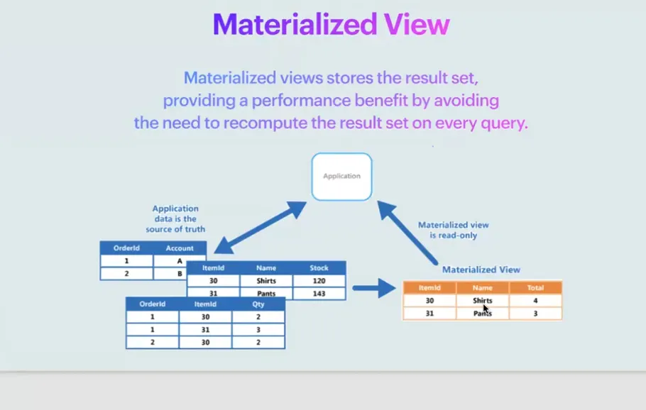

Source: [Database for Software Developers - ostad](https://ostad.app/course/database-for-developer)

✅ It's actually a base table - stores the generated results
✅ As do not make the result on the fly
✅ Need to refresh data manually or periodically
✅ Provides significant performance boost by avoiding re-computation
✅ Can have its own indexes

**Strategies for refreshing data**

1. Cron Job
2. Trigger
3. Event Scheduler

We can make table from view

```sql
CREATE TABLE materiazlie_table_to_return
SELECT * FROM yet_to_return;
```

Create a store procedure to update the material table

```sql
DROP EVENT hourly_refresh;
DELIMITER //

CREATE PROCEDURE RefreshYetToReturn()
BEGIN
    CREATE TABLE IF NOT EXISTS mt_yet_to_return SELECT * FROM yet_to_return;
    TRUNCATE TABLE mt_yet_to_return;
    INSERT INTO mt_yet_to_return SELECT * FROM yet_to_return;
END //

```

This code snippet is setting up a procedure to refresh a materialized table (**`mt_yet_to_return`**) which appears to be a cache or a snapshot of the **`yet_to_return`** view or table. It ensures that the materialized table exists, clears it, and then repopulates it with the current data. Please note that **`DELIMITER //`** and **`END //`** are used to define custom delimiters for the stored procedure, which is necessary for procedures that contain statements like **`BEGIN`** and **`END`**.

Create a schedule to update

```sql
CALL RefreshYetToReturn();

CREATE EVENT IF NOT EXISTS 5_min_refresh_yet_to_return
ON SCHEDULE EVERY 5 MINUTE
DO
    CALL RefreshYetToReturn();

```

This SQL code snippet is used to set up a scheduled event that calls the **`RefreshYetToReturn`** stored procedure every 5 minutes. This event is a way to automatically refresh the materialized view or table at regular intervals.

### **SQL Query with LIKE Operator**

**SQL Query Structure**:

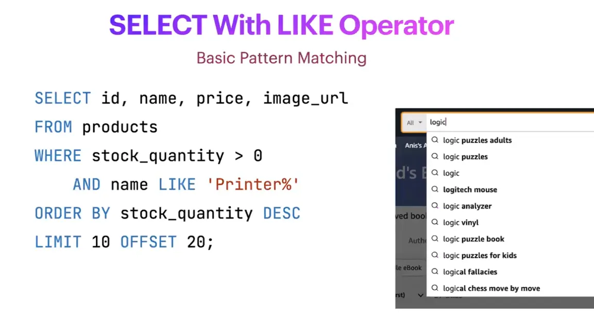

Source: [Database for Software Developers - ostad](https://ostad.app/course/database-for-developer)

```sql
SELECT id, name, price, image_url
FROM products
WHERE stock_quantity > 0
  AND name LIKE 'Printer%'
ORDER BY stock_quantity DESC
LIMIT 10 OFFSET 20;
```

**Explanation**:

- **SELECT Clause**: Specifies the columns to be returned from the query (**`id`**, **`name`**, **`price`**, **`image_url`**).
- **FROM Clause**: Indicates the table from which to retrieve the data (**`products`**).
- **WHERE Clause**: Sets the conditions for the selection:
    - **`stock_quantity > 0`**: Only select items that are in stock.
    - **`name LIKE 'Printer%'`**: Select items where the name starts with "Printer".
- **ORDER BY Clause**: Orders the results by **`stock_quantity`** in descending order (from highest to lowest).
- **LIMIT Clause**: Restricts the results to 10 records.
- **OFFSET Clause**: Starts the results from the 21st record (since the offset is 20, it skips the first 20 records).

### **SQL Query with IN Operator**

**SQL Query Structure**:

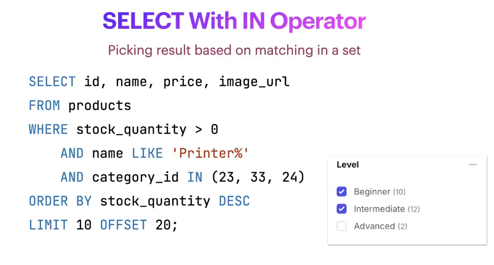

Source: [Database for Software Developers - ostad](https://ostad.app/course/database-for-developer)

```sql
sqlCopy code
SELECT id, name, price, image_url
FROM products
WHERE stock_quantity > 0
  AND name LIKE 'Printer%'
  AND category_id IN (23, 33, 24)
ORDER BY stock_quantity DESC
LIMIT 10 OFFSET 20;

```

**Explanation**:

- **SELECT Clause**: Specifies the columns to be returned from the query (**`id`**, **`name`**, **`price`**, **`image_url`**).
- **FROM Clause**: Indicates the table from which to retrieve the data (**`products`**).
- **WHERE Clause**: Sets the conditions for the selection:
    - **`stock_quantity > 0`**: Only select items that are in stock.
    - **`name LIKE 'Printer%'`**: Select items where the name starts with "Printer".
    - **`category_id IN (23, 33, 24)`**: Select items that belong to one of the specified categories.
- **ORDER BY Clause**: Orders the results by **`stock_quantity`** in descending order.
- **LIMIT and OFFSET Clauses**: Paginate the results to show 10 records starting from the 21st record.

### **SQL Query with BETWEEN Operator**

**SQL Query Structure**:

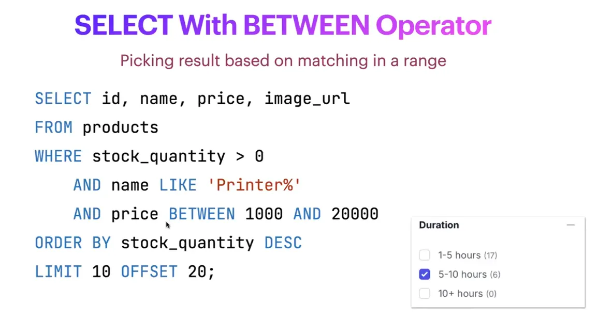

Source: [Database for Software Developers - ostad](https://ostad.app/course/database-for-developer)

```sql
sqlCopy code
SELECT id, name, price, image_url
FROM products
WHERE stock_quantity > 0
  AND name LIKE 'Printer%'
  AND price BETWEEN 1000 AND 20000
ORDER BY stock_quantity DESC
LIMIT 10 OFFSET 20;

```

**Explanation**:

- **SELECT Clause**: Specifies the columns to be returned from the query (**`id`**, **`name`**, **`price`**, **`image_url`**).
- **FROM Clause**: Indicates the table from which to retrieve the data (**`products`**).
- **WHERE Clause**: Sets the conditions for the selection:
    - **`stock_quantity > 0`**: Only select items that are in stock.
    - **`name LIKE 'Printer%'`**: Select items where the name starts with "Printer".
    - **`price BETWEEN 1000 AND 20000`**: Select items with a price ranging from 1000 to 20000.
- **ORDER BY Clause**: Orders the results by **`stock_quantity`** in descending order.
- **LIMIT and OFFSET Clauses**: Paginate the results to show 10 records starting from the 21st record.

**SELECT with Regular Expression**

Okey to matching pattern in limited dataset.

**SELECT with NULL or NOT NULL**

`WHERE rental.return_date IS NULL;`

`WHERE deleted_at IS NOT NULL;`

### **SQL Query with JOIN**

**SQL Query Structure**:

```sql
sqlCopy code
SELECT first_name, last_name, email FROM customer
JOIN rental ON customer.customer_id = rental.customer_id
WHERE rental_date BETWEEN '2005-05-01' AND '2005-05-31'
ORDER BY rental_date;
```

**Explanation**:

- **SELECT Clause**: Specifies the columns to be returned (**`first_name`**, **`last_name`**, **`email`**) from the **`customer`** table.
- **JOIN Clause**: Joins the **`customer`** table with the **`rental`** table based on a common column, **`customer_id`**.
- **WHERE Clause**: Filters the results to include only rentals that occurred between May 1, 2005, and May 31, 2005.
- **ORDER BY Clause**: Orders the results by the date of the rental.

### **SQL Query with Aggregation and HAVING Clause**

**SQL Query Structure**:

```sql
sqlCopy code
SELECT customer_id, GROUP_CONCAT(check_number), SUM(amount) total
FROM payments
WHERE YEAR(payment_date) = '2004'
GROUP BY customer_id
HAVING total > 10000;

```

**Explanation**:

- **SELECT Clause**: Retrieves the **`customer_id`**, a list of **`check_number`** concatenated into a single string for each customer, and the sum of **`amount`** paid by each customer, aliased as **`total`**.
- **FROM Clause**: Specifies the **`payments`** table as the data source.
- **WHERE Clause**: Filters the payments to only include those from the year 2004.
- **GROUP BY Clause**: Groups the results by **`customer_id`** to aggregate payments per customer.
- **HAVING Clause**: Filters the groups to only include those where the total payments exceed 10,000.

### **SQL Query with UNION**

**SQL Query Structure**:

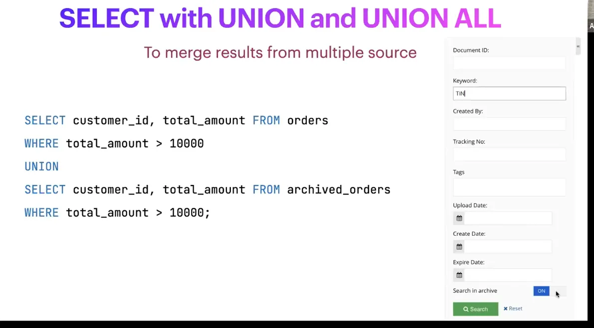

Source: [Database for Software Developers - ostad](https://ostad.app/course/database-for-developer)

```sql
SELECT customer_id, total_amount FROM orders
WHERE total_amount > 10000

UNION

SELECT customer_id, total_amount FROM archived_orders
WHERE total_amount > 10000;

```

**Explanation**:

- The query uses the **`UNION`** operator to combine the results of two **`SELECT`** statements.
- Both queries retrieve **`customer_id`** and **`total_amount`** from **`orders`** and **`archived_orders`** tables respectively.
- The **`WHERE`** clause filters the results to only include orders where the **`total_amount`** is greater than 10,000.
- The **`UNION`** operator eliminates duplicate records between the two queries, providing a unique list of orders across both tables that meet the condition.

## Indexing for Search

- Utilize composite indexes
- Composite index can be utilized for one or multiple columns
- Align the fields sequence in conditions with index-defining order.
- Keep the range searching fields at the end of index order
- Use FULLTEXT search for large text columns.

### FULLTEXT Search

It enhances the search experience by providing more intelligent and relevant results in text-heavy datasets.

**Natural Language Processing**

Understand the meaning and context of words, enabling more accurate and relevant search results.

**Indexed for human centric searching**

Text can be in any order, where LIKE and REGEXP will not be useful.

**Partial Matches and Relevance**

Supports partial matches and assigns relevance scores to results, allowing for flexible and fuzzy matching.

**Different Mode for tuning search approach**

Offers a Boolean mode that allows users to use operators such as AND, OR and NOT for more advance search queries.

```sql
ALTER TABLE film AND FULLTEXT INDEX ft_search_film(title, description);
```

Default mode is natural language mode.

Natural language full-text search interprets the search string as a free text(in the human language) and no special operators are required. Order in keywords does not matter.

```sql
SELECT flim_id, title, description, relase_year, length, rating
FROM flim
WHERE MATCH(title, description) AGAINST('keywords' IN NATURAL LANGUAGE MODE);
```

<br/> <br/> <br/> <br/>

Adding index

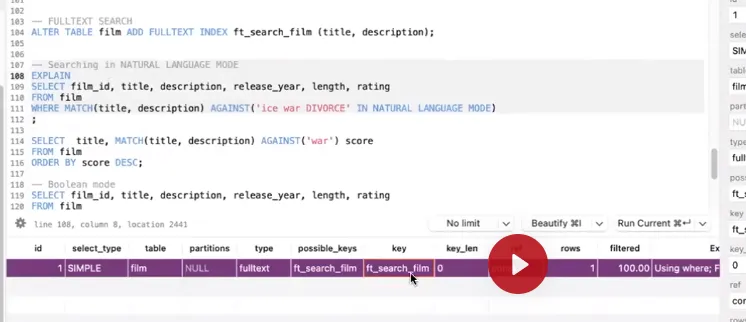

Source: [Database for Software Developers - ostad](https://ostad.app/course/database-for-developer)

`ALTER TABLE flim ADD FULLTEXT INDEX ft_search_film(title, description)`

If we run the EXPALIN

```sql
EXPLAIN
SELECT film_id, title, description, release_year, length, rating
FROM film
WHERE MATCH(title, description) AGAINST('ice war DIVORCE' IN NATURAL LANGUAGE MODEL);
```

We can see MySQL is using ft_search_film key.

```sql
EXPLAIN
SELECT film_id, title, description, release_year, length, rating
FROM film
WHERE MATCH(title, description) AGAINST('ice war DIVORCE' IN NATURAL LANGUAGE MODEL)
AND rating = 'G'; -- For this last line will not be full text search
```

Ordering of the output in WHERE clause like `WHERE MATCH(title, description) AGAINST('ice war DIVORCE' IN NATURAL LANGUAGE MODEL)` and will determinded by score. Bigger score will be top and less score record will be after that. Score will be increase as many as keyword matches. We can see the score if we put MATCH at the select. 0 means do not matched.

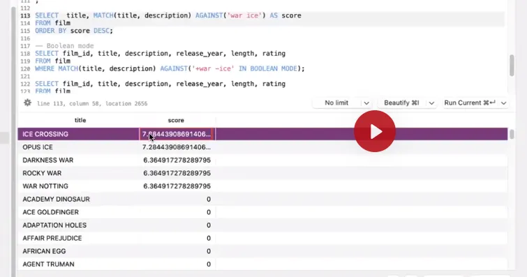

Source: [Database for Software Developers - ostad](https://ostad.app/course/database-for-developer)

```sql
SELECT title, MATCH(title, description) AGAINST('war ice') AS score
FROM film
ORDER BY score DESC;
```

Output of this script is at right

### The BOOLEAN Mode

A boolean search interprets the search string using rules of a special query language. Does not sort autometically. Case insencetive those keyword at AGAINEST

```sql
SELECT film_id, title, description, release_year, length, rating
FROM film
WHERE MATCH(title, description) AGAINST('+good -bad' IN BOOLEAN MODE);
```

Must have war and can not have ice.

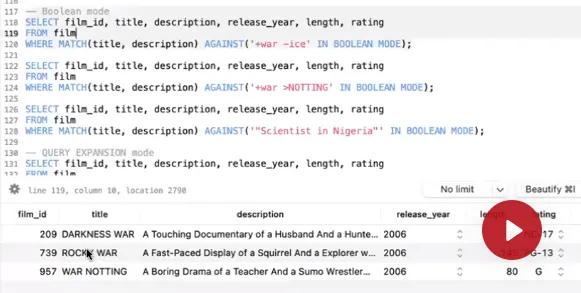

Source: [Database for Software Developers - ostad](https://ostad.app/course/database-for-developer)

```sql
SELECT film_id, title, description, release_year, length, rating
FROM film
WHERE MATCH(title, description) AGAINST('+war -ice' IN BOOLEAN MODE);
```

Increase prority/score of a word

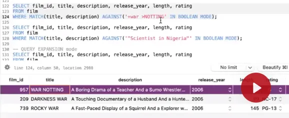

Source: [Database for Software Developers - ostad](https://ostad.app/course/database-for-developer)

```sql
SELECT film_id, title, description, release_year, length, rating
FROM film
WHERE MATCH(title, description) AGAINST('+war >NOTING' IN BOOLEAN MODE);
```


Search exact keyword(ordering, total no of words)

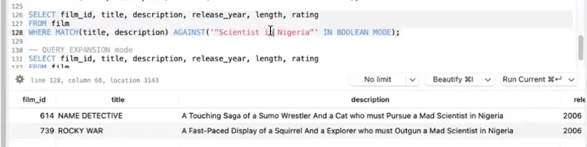

Source: [Database for Software Developers - ostad](https://ostad.app/course/database-for-developer)

```sql
SELECT film_id, title, description, release_year, length, rating
FROM film
WHERE MATCH(title, description) AGAINST('"Scientist in Nigria"' IN BOOLEAN MODE);
```

Now we have two records if we change the keywords such as `WHERE MATCH(title, description) AGAINST('"Scientist Nigria"' IN BOOLEAN MODE);` we will get noting there is no sentence with `"Scientist Nigria"`


The BOOLEAN mode operator

| Symbol | Impact in Result                                                      |
|--------|-----------------------------------------------------------------------|
| +      | Must be present in any row returned                                   |
| -      | Must not be present in any row returned                               |
| <>     | Change a word's contribution to the relevance value.                  |
| ()     | Parentheses are used to group words into subexpressions               |
| ~      | The word’s contribution to the row relevance to be negative           |
| *      | Acts as the truncation operator. Matches incomplete words             |
| "      | Matches only rows that contain this phrase literally, as it was typed |


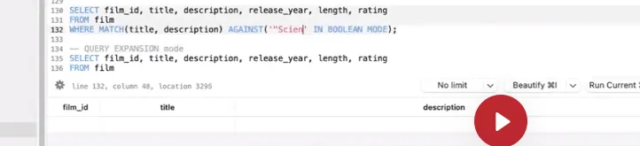

Source: [Database for Software Developers - ostad](https://ostad.app/course/database-for-developer)

```sql
SELECT film_id, title, description, release_year, length, rating
FROM film
WHERE MATCH(title, description) AGAINST('"Scien' IN BOOLEAN MODE);
```

No records

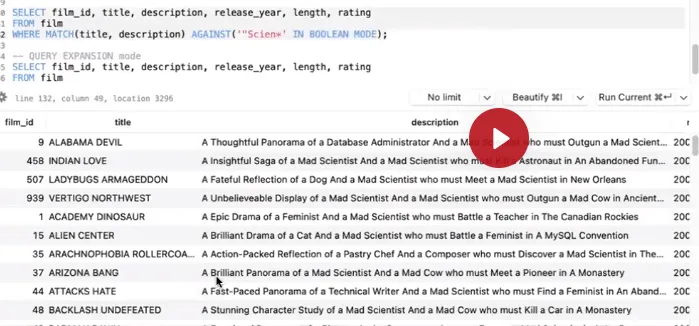

Source: [Database for Software Developers - ostad](https://ostad.app/course/database-for-developer)

```sql
SELECT film_id, title, description, release_year, length, rating
FROM film
WHERE MATCH(title, description) AGAINST('"Scien*' IN BOOLEAN MODE);
```

Also get incomplete words starts with Scien


### The QUERY EXPRESSION Mode

Execute the searching in 2 steps:

- First search in NATURAL LANGUAGE MODE
- Then do a deeper search using the unmatched words in the search result

Usefull for recommanding in while searching in ecommerce.

```sql
SELECT flim_id, title, description, release_year, length, rating
FROM flim
WHERE MATCH(title, description) AGAINST('Shark Tank', WITH QUERY EXPANSION);
```

CHATGPT


Source: [Database for Software Developers - ostad](https://ostad.app/course/database-for-developer)

```sql
SELECT film_id, title, description, release_year, length, rating
FROM film
WHERE MATCH(title, description) AGAINST('APOLLO' WITH QUERY EXPANSION);

```

Here's what each part does:

1. `SELECT film_id, title, description, release_year, length, rating`:
    - This part of the query specifies the columns to be returned by the query. It will fetch the `film_id`, `title`, `description`, `release_year`, `length`, and `rating` columns from the `film` table.
2. `FROM film`:
    - This specifies the table from which to retrieve the data, which in this case is the `film` table.
3. `WHERE MATCH(title, description) AGAINST('

'APOLLO' WITH QUERY EXPANSION)`:

- This is the `FULLTEXT` search condition.
- `MATCH(title, description)` tells MySQL to perform a full-text search on the `title` and `description` columns of the `film` table.
- `AGAINST('APOLLO' WITH QUERY EXPANSION)` is the search expression. It searches for the word 'APOLLO' within the `title` and `description` columns. The `WITH QUERY EXPANSION` option means that MySQL will first perform a search for 'APOLLO', then find all the words that are associated with 'APOLLO' in the search index, and then perform a second search including those words. This is intended to broaden the search to include rows that may not contain the exact search term but are contextually related.

The results shown beneath the query in the screenshot are the rows from the `film` table that match the search criteria. The `film_id`, `title`, and `description` are shown, which likely contain the word 'APOLLO' or contextually related terms due to the query expansion.

The query expansion feature can be useful when the initial search term may be too narrow and you want to include more related records. However, it can also bring back less relevant results because it broadens the search based on terms found in the initial results, which may not always align with the user's intent.


### Managing STOP words

Stopwords is a list of words that are ignored while searching.

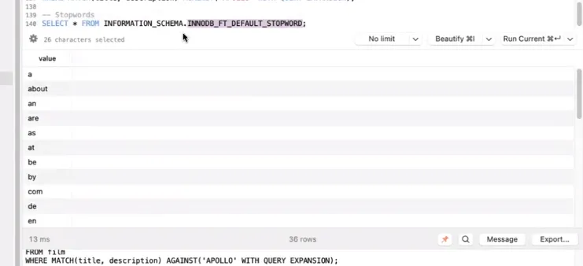

Source: [Database for Software Developers - ostad](https://ostad.app/course/database-for-developer)

```sql
SELECT * FROM INFORMATION_SCHEMA.INNODB_FT_DEFAULT_STOPWORD;
```

**Managing the STOPWORDS**

```sql
-- How can I change them?

-- Create a similar table
CREATE TABLE new_stopwords(value VARCHAR(30)) ENGINE = INNODB;

-- Add your stopwords
INSERT INTO new_stopwords(value) VALUES ('ignore-me');

-- Set the table as innodb_ft_server_stopword_table
SET GLOBAL innodb_ft_server_stopword_table = 'test/new_stopwords';

-- Build the index
CREATE FULLTEXT INDEX ft_idx ON ...;
```

CHATGPT

The image you've uploaded contains text describing SQL operations to change the stopword list for a FULLTEXT index in MySQL using the InnoDB engine. Here's what each SQL statement is doing:

1. `CREATE TABLE new_stopwords(value VARCHAR(30)) ENGINE = INNODB;`
    - This statement creates a new table named `new_stopwords` with a single column `value` that can hold a variable character string up to 30 characters long. The table is using the InnoDB storage engine.
2. `INSERT INTO my_stopwords(value) VALUES ('ignore-me');`
    - This inserts a new row into the `my_stopwords` table (which should probably be `new_stopwords`, assuming it's a typo in the text) with the value 'ignore-me' into the `value` column. This value ('ignore-me') will be treated as a stopword in the FULLTEXT index.
3. `SET GLOBAL innodb_ft_server_stopword_table = 'test/my_stopwords';`
    - This statement sets a global system variable `innodb_ft_server_stopword_table` to the value 'test/my_stopwords'. This tells MySQL to use the `my_stopwords` table in the `test` database as the stopword list for FULLTEXT indexes. Any FULLTEXT index that is created or rebuilt after this setting will use this custom stopword list instead of the default one.
4. `CREATE FULLTEXT INDEX ft_idx ON ...`
    - This is an incomplete statement intended to create a FULLTEXT index named `ft_idx` on a specified table and column(s). However, the specific table and column(s) to index are not provided in the snippet.

If you want to change the stopword list for FULLTEXT searches in MySQL, you would follow these steps, with the correction of making sure that the table names are consistent when creating and inserting into the stopword table. After changing the stopword list, you would need to rebuild any existing FULLTEXT indexes to make use of the new list.

**Remainder FULLTEXT Search**

- Supports InnoDB or MyISM storage engine.
- Can be used with only CHAR, VARCHAR and TEXT columns.
- Words with 3/4 characters and stop-words are ignored(by default).

**Use specialized tools**

- Elasticsearch
- Solr
- Algolia
- Sphinx
- MeiliSearch
- Microsoft Azure Cognitive Search


# Resources
- [Database for Software Developers - ostad](https://ostad.app/course/database-for-developer)
