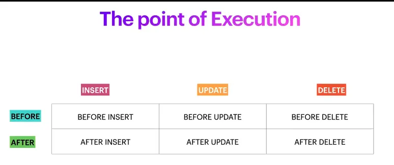
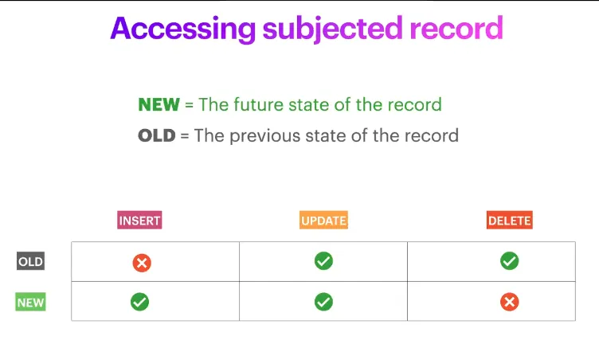

# Triggers and Procedures

////TODO: source of truth

# Triggers

## Store Procedures

**The Functions in SQL**

A named collection of SQL statements and procedural logic that is stored in a database and can be executed on demand.

```sql
-- Run just one, short, meaningful procedure
CALL update_admin_dashboard();

-- Execute a whole bunch of related, well-defined SQL to perform the task
TRUNCATE dashboard;

INSERT INTO dashboard
SELECT
  COUNT(*) AS total_inventory,
  (SELECT COUNT(*) FROM rental WHERE return_date IS NULL) AS yet_to_return,
  ... AS current_week_revenue,
  ... AS current_month_revenue
FROM inventory;
```

- It’s a named collection of SQL statements
- Can process data using conditions, loops, etc.
- Pre-compiled and stored in a database.
- Associated with a specific database schema.
- Can be executed on demand, repeatedly
- Can manipulate/modify data
- Can produces outputs(result sets, variables)

Format to create stored procedure

```sql
DELIMITER //

CREATE PROCEDURE procedure_name()
BEGIN
  One Statement;
  Another Statement;
END //

DELIMITER ;
```

Example of creating store procedure

```sql
DELIMITER //

CREATE PROCEDURE films_to_return()
BEGIN
    SELECT c.customer_id, CONCAT(c.first_name, ' ', c.last_name) AS fullname, c.email,
           r.rental_date,
           f.title, f.replacement_cost
    FROM customer c
    JOIN rental r ON r.customer_id = c.customer_id
    JOIN inventory i ON i.inventory_id = r.inventory_id
    JOIN film f ON f.film_id = i.film_id
    WHERE r.return_date IS NULL;
END //

DELIMITER ;
```

Will call that procedure like

```sql
CALL films_to_return();
```

Another example

```sql
DELIMITER //

CREATE PROCEDURE find_loyal_customers ()
BEGIN
    SELECT customer_id, first_name, last_name, rental_count,
        CASE
            WHEN rental_count >= 10 THEN 'Gold'
            WHEN rental_count >= 5 THEN 'Silver'
            ELSE 'Bronze'
        END AS loyalty_status
    FROM (
        SELECT c.customer_id, c.first_name, c.last_name, COUNT(r.rental_id) AS rental_count
        FROM customer c
        LEFT JOIN rental r ON c.customer_id = r.customer_id
        GROUP BY c.customer_id
    ) AS customer_rental_summary; -- this result table will be used by first select statement in this case
END //

DELIMITER ;
```

## Types of variables in MySql

### User Defined Variable

- Can be accessed without declaring
- Initialized using SET or SELECT statement.
- Prefixed with @
- Always session-specific ⇒ after disconnecting from the database user-defined variable will vanish.

```sql
-- Using SELECT
SELECT @with_no_value; -- value will be null as do not assign any value 
SELECT 10 INTO @with_a_value;

SELECT @with_no_value, @with_a_value; -- will get null first one and 10 for the second one

--With a value using SET
SET @min = 0, @max=1000;

-- Using user defined variables
SELECT * FROM products WHERE price BETWEEN @min AND @max;
```

### Local Variables

- Need to be declared using DECLARE
- Declare with data type and with/without value
- Scoped between the BEGIN … END block
- Used as local variables and the input parameters inside a stored procedure.

```sql
DELIMITER //
CREATE PROCEDURE sp_name(a INT)
BEGIN
	DECLARE b INT;
	DECLARE c INI DEFAULT 100;
  -- Statements using variables
END //
DELIMITER;
```

### Server System Variable

- Predefined, maintained by MySQL
- Can be of type GLOBAL, SESSION or BOTH
- Value can be updated(with permission)

```sql
-- Check system variables
SHOW VARIABLES LIKE '%general_log%';
SELECT @@general_log;

-- Set system variables
SET GLOBAL general_log = 'OFF';
SET @@global.general_log = 'OFF';

```

### Modes of Parameter in Stored Procedures

- IN
    - To pass arguments to the procedure

        ```sql
        DELIMITER //
        
        CREATE PROCEDURE get_movies_by_rating(IN rating_type VARCHAR(50))
        BEGIN
            SELECT title, description, release_year, rating
            FROM film WHERE rating = rating_type;
        END //
        
        DELIMITER ;
        
        CALL get_movies_by_rating('PG');
        ```

- OUT
    - To get a result generated by the procedure

        ```sql
        -- Procedure with Params (OUT)
        DROP PROCEDURE IF EXISTS count_movies_by_rating;
        
        DELIMITER //
        CREATE PROCEDURE count_movies_by_rating(IN rating_type VARCHAR(50), OUT total_count INT UNSIGNED)
        BEGIN
            SELECT COUNT(*) INTO total_count
            FROM film WHERE rating = rating_type;
        END //
        DELIMITER ;
        
        CALL count_movies_by_rating('PG', @total);
        SELECT @total;
        ```

- INOUT
    - To pass an argument and get a result back.

        ```sql
        -- Procedure with Params (INOUT)
        DROP PROCEDURE IF EXISTS count_and_add_by_rating;
        
        DELIMITER //
        CREATE PROCEDURE count_and_add_by_rating(
            IN rating_type VARCHAR(50), 
            INOUT collected_total INT UNSIGNED
        )
        BEGIN
            DECLARE current_total INT DEFAULT 0;
        
            SELECT COUNT(*) INTO current_total
            FROM film WHERE rating = rating_type;
            
            SET collected_total = current_total + collected_total;
        END //
        DELIMITER ;
        
        SET @last_total = 0;
        ```


Stored procedures provide a way to encapsulate and execute complex database operations as a single unit, enhancing code reusability, maintainability, and security.

**Enhanced Maintainability**

Encapsulate and execute complex database operations as a single unit.

**Reduce the Network Traffic**

Instead of sending multiple queries, we are sending only the name and the parameters.

**Reusable and Consistent**

All parts of all applications and different clients can reuse the same, defined way of performing an operation.

**Access Control and Security**

Permission can be granted to the user to execute the stored procedure without giving permission to the tables. It helps to prevent SQL injection and unintended data access.

```sql
-- Getting info

SELECT routine_name, routine_type, definer, created 
FROM information_schema.routines 
WHERE routine_type='PROCEDURE' AND routine_schema='sakila';

-- Removing store procedure
SHOW CREATE PROCEDURE count_and_add_by_rating;

-- Delete procedure
DROP PROCEDURE IF EXISTS procedure_name;
```

SQL server agent ⇒ rashed vai suggested rather than trigger

have to study ⇒ race condition

# Stored Procedures

## MySQL Triggers

**Automate intended side-effects**

A trigger is a set of SQL statements that run every time a row is inserted, updated or deleted in a table.

### products

| id  | name          | stock_quantity | ... |
|-----|---------------|----------------|-----|
| 1   | Power Phone   | 144            | ... |
| 2   | Ultra Speaker | 50             | ... |
| 3   | Mega Laptop   | 121            | ... |
| 4   | Smart Monitor | 84             | ... |

### order_items

| order_id | product_id | quantity | price  |
|----------|------------|----------|--------|
| 202      | 2          | 2        | 545.91 |
| 202      | 3          | 5        | 672.33 |


```sql
-- Making an order
INSERT INTO orders('customer_id', 'date', total_amount) VALUES (2, NOW(), 500);

-- Adding Items of the order
INSERT INTO order_items('order_id', 'product_id', quantity, price)
VALUES (4, 1, 3, 541.91),
       (4, 1, 4, 672.33)

-- Creating trigger
CREATE TRIGGER update_stock_on_order AFTER INSERT ON order_items
	FOR EACH ROW
		UPDATE products
		SET stock_quantity = stock_quantity - new.quantity
		WHERE id = new.product_id;

-- Drop trigger
DROP TRIGGER update_stock_on_order;
```

**How to define triggers**

```sql
CREATE TRIGGER {trigger_name} AFTER INSERT ON {table_name}
	FOR EACH ROW
		{SQL statement using NEW.fieldname and OLD.fieldname}

DELIMITER //
CREATE TRIGGER {trigger_name} AFTER INSERT ON {table_name}
	FOR EACH ROW
		BEGIN
			{An SQL Statement};
			{Another SQL Statement};
		END; //
DELIMITER;
```


**The point of execution**



Source: [Database for Software Developers - ostad](https://ostad.app/course/database-for-developer)

**What triggers can do?**

- Triggers can create new records.
- Triggers can update records.
- Triggers can delete records.
- Triggers can change data that is going to be inserted/updated.
- Triggers can prevent the execution of the operation.
- Trigger can use conditionals.
- Triggers can run stored procedures.

**Accessing subjected record**

NEW = The future state of the record

OLD = The previous state of the record



Source: [Database for Software Developers - ostad](https://ostad.app/course/database-for-developer)

## Trigger use case

### Creating change logs

```sql
CREATE TABLE name_changes(
	customer_id BIGINT UNSIGNED,
	old_name varchar(200),
	new_name varchar(200),
	change_time TIMESTAMP DEFAULT(CURRENT_TIMESTAMP())
);

CREATE TRIGGER name_change_history AFTER UPDATE ON customers
	FOR EACH ROW 
		INSERT INTO name_change (customer_id, old_name, new_name)
		VALUE (new.id, old.name, new.name);
```

```sql
-- Generation change log with tirgger
CREATE TABLE name_changes(
	customer_id bigint,
	old_name varchar(200),
	new_name varchar(200),
	change_time timestamp default(current_timestamp())
);

CREATE TRIGGER name_change_history
	AFTER UPDATE ON customers
	FOR EACH ROW
	INSERT INTO name_changes (customer_id, old_name, new_name)
	VALUES (new.id, old.name, new.name);

DROP TRIGGER name_change_histroy;
```

**Data sanitization with trigger**

Hashing password if application send plain text password

```sql
DELIMITER //
CREATE TRIGGE R hashed_cust_password BEFORE INSERT ON customers
	FOR EACH ROW
	BEGIN
		IF (LENGTH(new.password) < 32)
		THEN
			SET new.password = MD5(new.password)
		END IF;
	END; //
DELIMITER;
```

**Preventing Execution with trigger**

```sql
DELIMITER //
CREATE TRIGGER prevent_banned_user_order BEFORE INSERT ON orders
	FOR EACH ROW
	BEGIN
	IF (SELECT COUNT(*) FROM customers
			WHERE id = new.customer_id AND is_banned = 1)
		= (SELECT 1)
  THEN
		SIGNAL SQLSTATE '45000' SET MESSAGE_TEXT = 'Cannot accept order from banned customer';
	END IF;
	END;//
DELIMITER;
```

Some points to remember

- A trigger can’t update the table it’s defined on.
- Can’t define triggers in a circular fashion.
- Multiple triggers are executed in the order of defining(by default).
- Execution order can be modified with FOLLOWS or PRECEDES
- Triggers don’t fire on replica(but data-modification can be replicated).

How we can see all trigger from `INFORMATION_SCHEMA` database and at `TRIGGERS` table

We can add triggers, and store procedures at the database migration. Have to see if we can add a view or material view.

Banks prefer store procedure to do bulk update/large process they do not manage those logic at application level.

# Resources
- [Database for Software Developers - ostad](https://ostad.app/course/database-for-developer)
