# ER Diagram / Entity Relationship Model

> Represent things a business needs to remember in order to perform business processes.

- It’s a conceptual view of a database.
- Visualization of real-world entities and the associations among them.

### Entity
> An Entity is a distinct and recognizable thing or object with an independent existence, either physically or 
> conceptually.

- A thing or object that has independent existence.
- Can have 
  - **Physical existence:** Tangible objects like a person, car, or book. or 
  - **Conceptual Entities:** conceptual existence only like a course, job, or event.
- Represents people, things, events, locations, or concepts within the target system.
- Represents using a rectangle in the ER diagram.

### Example of Entity of

#### People
- Employees
- Students
- Payroll
- Pensions
- Sick leave
- Vendors

#### Things
- Furniture
- Equipment
- Stationery
- Fire extinguishers
- Books
- Packages
- Raw Materials
- Finished good

#### Locations
- Offices
- Address
- Warehouses
- Stock rooms
- Floors
- Shelves

#### Events
- Sale made
- Purchase Order raised
- Item hired
- Invoice issued
- Delivery received
- Check-in/Out
- Meeting Happened

### Weak Entity
- Entities whose existence depends on other entities.
- May not have a key attribute.
- Represented using a double rectangle.

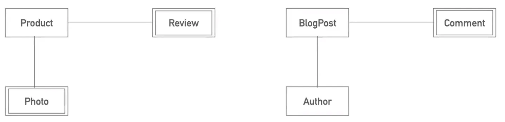

Source: - [Database for Software Developers - ostad](https://ostad.app/course/database-for-developer)

### Entity Type
Collection of entities with the same attributes.(e.g. Productions, Customers). Collection of all products or collection
of customers.

#### Example:
- **Productions:** All manufacturing processes in a factory, such as Car Assembly, Bike Assembly, etc.
- **Customers:** Individuals or companies interacting with a business, such as John Doe, Amazon Inc., etc.

### Entity Set
Collection of entities (of the same entity type) at a point in time and optionally with some conditions.

#### Example:
- **Productions:** The manufacturing processes running during **January 2025** (e.g., Car Assembly - Model X, Bike Assembly - Model Y).
- **Customers:** Customers who placed orders in **December 2024** (e.g., John Doe, Jane Smith).

Entity Set is essentially a subset of entities defined by specific criteria.

### Weak Entity Set
Entity sets that do not have sufficient attributes to form a primary key.

#### Example:
- **Order Details:** An order line item in a shopping cart (e.g., ProductName: "Phone Case", Quantity: 2). This depends
  on the associated **Order ID** and cannot exist independently.
- **Dependent:** A family member in an HR system (e.g., Name: "Emily", Relationship: "Daughter"). This depends on the 
  associated **Employee ID**.

Weak entities rely on a strong entity for identification and are connected via a foreign key.

# Attributes

- Properties that describe an entity.
- These information or properties are required to operate the target system.
- Represented with an oval in the ER diagram.

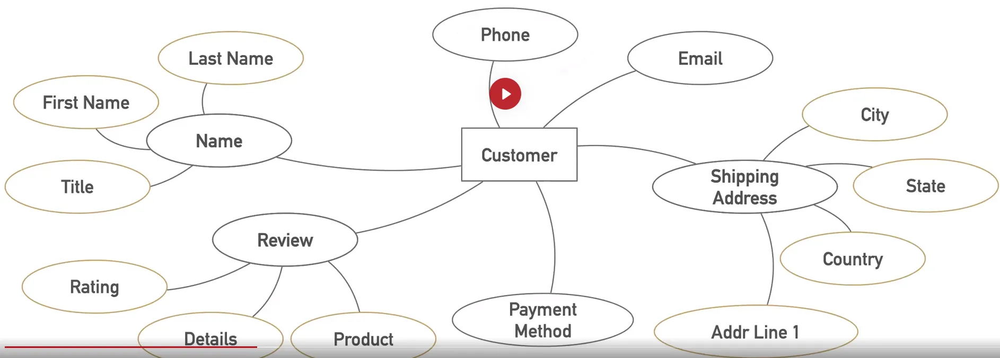

Source: - [Database for Software Developers - ostad](https://ostad.app/course/database-for-developer)

### Attributes - Simple vs Composite
- **Composite:** Can be divided into some parts, e.g. Name, Address
- **Simple:** Cannot be divided, Age, Height

### Attributes - Single-Valued vs Multi-Valued
- **Single Valued:** Can have only one value(e.g age). Represented using sign line oval.
- **Multi-Valued:** Can have a set of values e.g. Educational Certificate. Represented using double line oval.

### Attributes - Complex
- Complex = composite + multivalued
- **Example:** {Addresses(title, district, than, village, post, road)}

### Attributes - Derived vs Stored
- **Stored:** Independent information. Need to be stored. e.g. Date of Birth.
- **Derived:** Can/should be calculated from other attributes. e.g. Age. Represented as a dotted oval.

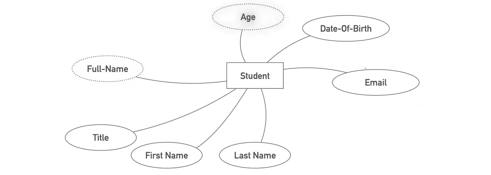

Source: - [Database for Software Developers - ostad](https://ostad.app/course/database-for-developer)

# Key Attributes

Key Attribute: Attribute that identifies entries uniquely - NID, Roll Number.

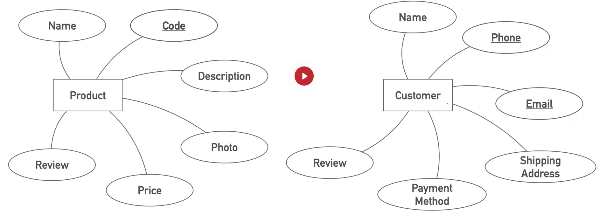

Source: - [Database for Software Developers - ostad](https://ostad.app/course/database-for-developer)

- **Primary Key:** The key attribute that is used to refer to an entity uniquely. e.g. NID, student id.
- **Candidate Key:** Key attributes other than the primary key.
- **Composite key:** Primary key that was built with multiple attributes. e.g. ISBN + Member ID.

### Attributes - Null values

When an attribute value

- Don’t exit.
- Existence unknown.
- Exits but missing.

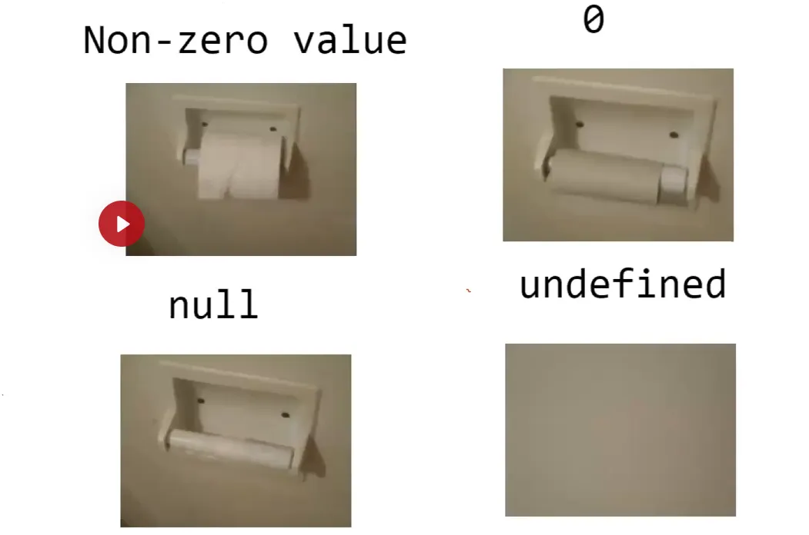

Source: - [Database for Software Developers - ostad](https://ostad.app/course/database-for-developer)

# Relationship

- Describes purposeful connection between entities.
- Represented with a diamond in the ER diagram.

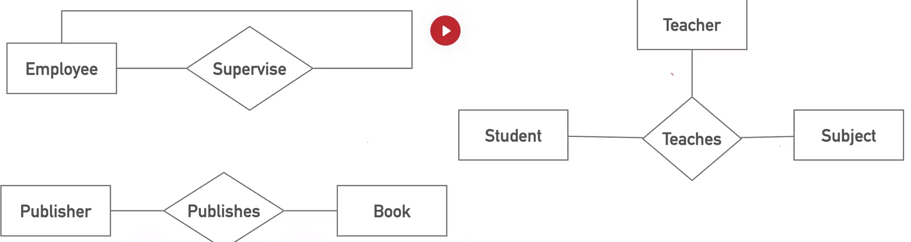

Source: - [Database for Software Developers - ostad](https://ostad.app/course/database-for-developer)

- **Unary:** Linked to the entity type. e.g. Employee supervises employee.
- **Binary:** Association amounts to two entities. e.g. Publisher publishes book
- **Ternary:** Primary key that was built with multiple attributes. e.g. Teacher teaches the subject to the student.

### Cardinality ratio

The maximum number of relationship instances that an entity can participate in.

**chen notation**
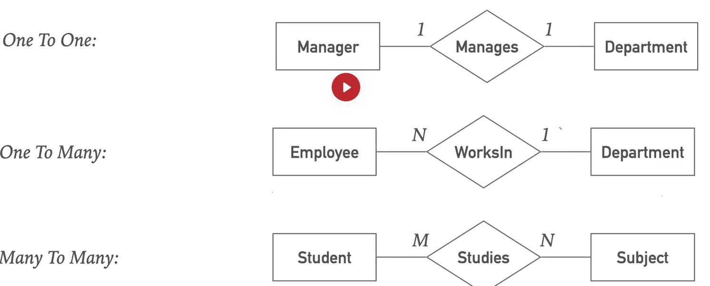

Source: - [Database for Software Developers - ostad](https://ostad.app/course/database-for-developer)

**Crows notation**
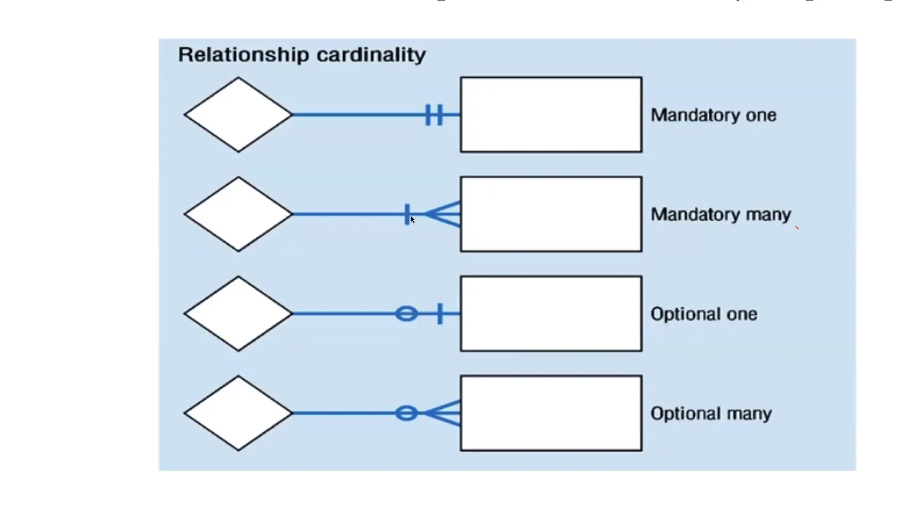

Source: - [Database for Software Developers - ostad](https://ostad.app/course/database-for-developer)

### Participation Constraints

**Definition**: Participation constraints define the extent to which entities participate in a relationship. It 
indicates whether all or only some entities in an entity set are involved in a relationship.

- **Partial Participation**: Only some entities in the entity set participate in the relationship.
- **Total Participation**: All entities in the entity set must participate in the relationship.

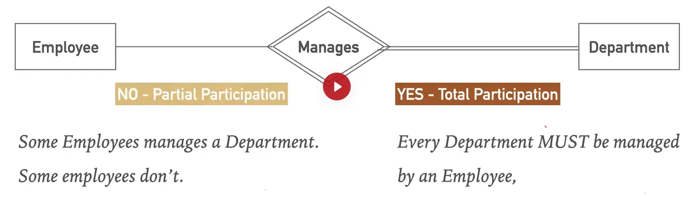

Source: - [Database for Software Developers - ostad](https://ostad.app/course/database-for-developer)

**Note**: Weak entities maintain total participation because they depend on the strong entity for their existence.
Strong entities can have either partial or total participation.

### Relationship - Associative / Intersection Entity

**Definition**: Associative entities are entities that occur in many-to-many or ternary relationships to provide
additional meaning or attributes to the relationship. These entities can also have unique identifiers and attributes of
their own.

- Generally occurs in **many-to-many** and **ternary** relationships.
- Can have unique identifiers and other attributes.
- Can have independent meaning.

Associative entities are inside rectangle like borrow.

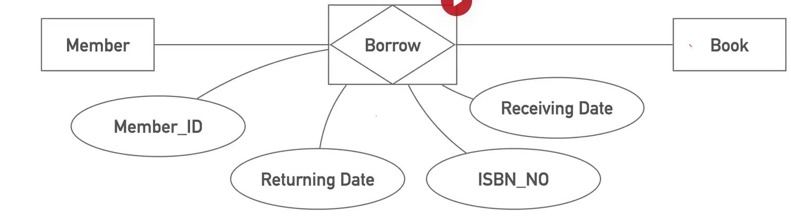

Source: - [Database for Software Developers - ostad](https://ostad.app/course/database-for-developer)

### Entity - Generalization / Specialization
**Definition**: Generalization and specialization are concepts used to define relationships between a more general 
entity type and its more specific subtypes.

- **Generalization**: An entity type that represents a general concept at a higher level.  
  **Example**: "Production" is a superclass of "Digital Production" and "Physical Production."
- **Specialization**: An entity type that represents a specific concept at a lower level.  
  **Example**: "Digital Production" and "Physical Production" are subclasses of "Production."

**Example Explanation**:  
"Digital Production" is a type of production, and "Physical Production" is another type. Both are subtypes of the 
general "Production" entity.

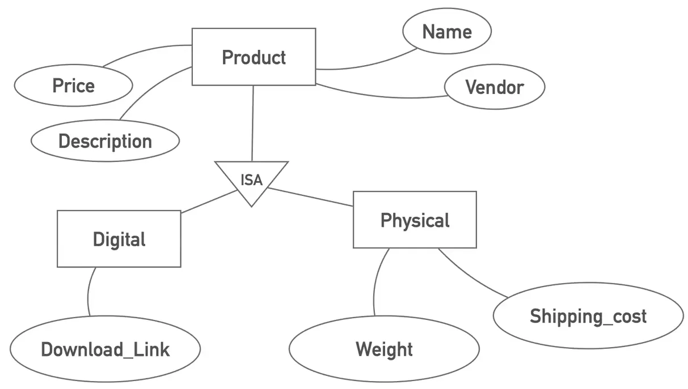

Source: - [Database for Software Developers - ostad](https://ostad.app/course/database-for-developer)

### Disjoint and Overlapping Constraints

- **Disjoint**: An entity occurrence can be a member of only one of the subclasses (OR).  
  **Example**: A student can either be a graduate or an undergraduate but not both.
- **Overlapping**: An entity occurrence can be a member of more than one of the subclasses (AND).  
  **Example**: A person can be both a teacher and a researcher simultaneously.

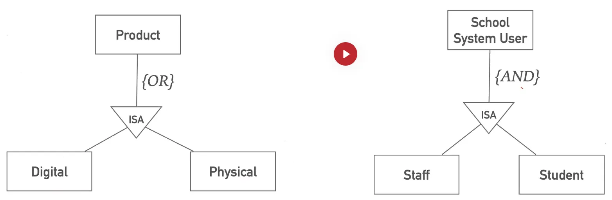

Source: - [Database for Software Developers - ostad](https://ostad.app/course/database-for-developer)

### Diagram Notation

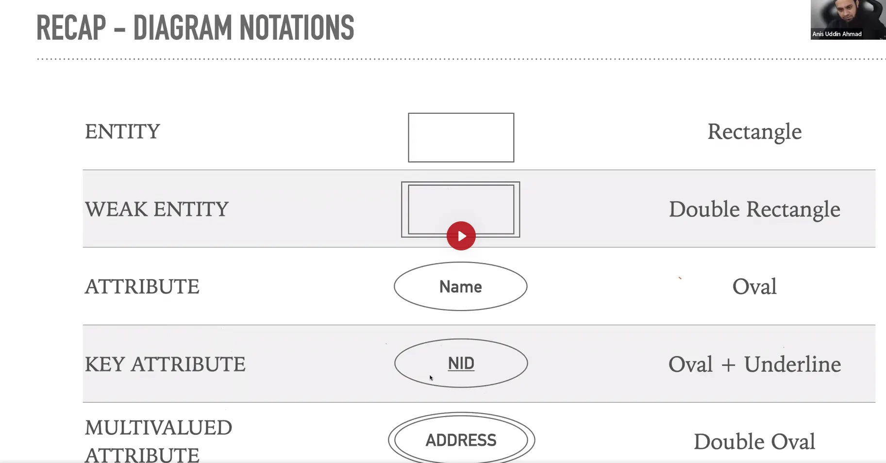

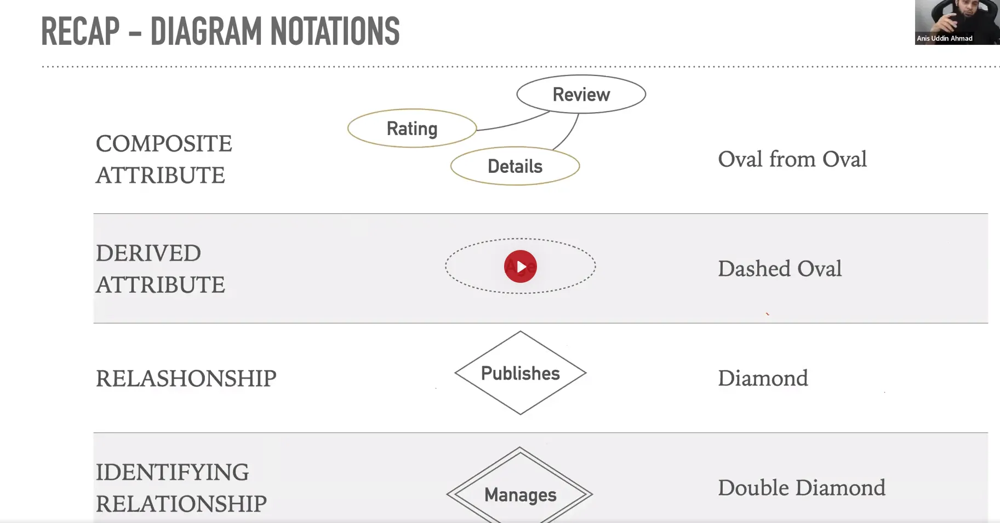

Source: - [Database for Software Developers - ostad](https://ostad.app/course/database-for-developer)

Total Participation’s identifying relationship

### ERD - University Database Example

1. The university offers one or more programs.
2. The program is made up of one or more courses.
3. Students must enroll in a program.
4. The student takes the courses that are part of his program.
5. A program has a name, a program identifier, the total credit points required to graduate, and the year it commenced.
6. A course has a name, a course identifier, a credit point value, and the year it commenced.
7. Student have a given name, a surname, a student identifier, a date of birth, and the year they first enrolled.
8. When a student takes a course, the year and semester he attempted it are recorded.
9. When he finishes the course, a grade (such as A or B) and a mark (such as 60 percent) are recorded.
10. Each course in a program is sequenced into a year(for example, year 1) and a semester(for example, semester1)

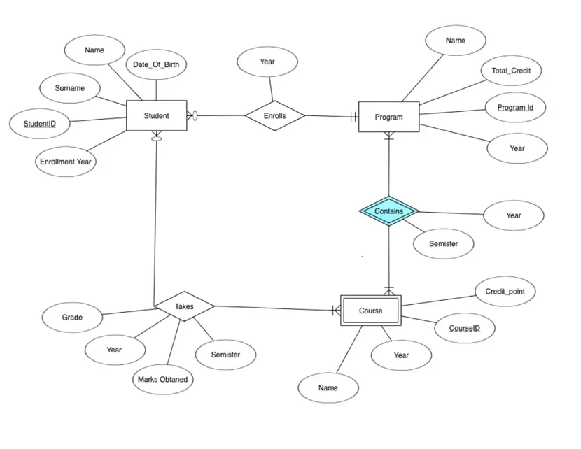

Source: - [Database for Software Developers - ostad](https://ostad.app/course/database-for-developer)

# References
- [Database for Software Developers - ostad](https://ostad.app/course/database-for-developer)

