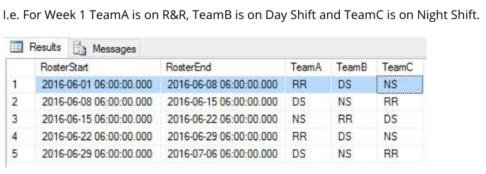

## generating values
Most databases do not have a native way of generating a series of numbers for ad-hoc use; however, common
table expressions can be used with recursion to emulate that type of function.

The following example generates a common table expression called Numbers with a column i which has a row for
numbers 1-5:

```sql
--Give a table name `Numbers" and a column `i` to hold the numbers
WITH Numbers(i) AS (
    --Starting number/index
    SELECT 1
    --Top-level UNION ALL operator required for recursion
    UNION ALL
    --Iteration expression:
    SELECT i + 1
    --Table expression we first declared used as source for recursion
    FROM Numbers
    --Clause to define the end of the recursion
WHERE i < 5
)
--Use the generated table expression like a regular table
SELECT i FROM Numbers;
```

| i |
|---|
| 1 |
| 2 |
| 3 |
| 4 |
| 5 |
This method can be used with any number interval, as well as other types of data.

## recursively enumerating a subtree
```sql
WITH RECURSIVE ManagedByJames(Level, ID, FName, LName) AS (
    -- start with this row
    SELECT 1, ID, FName, LName
    FROM Employees
    WHERE ID = 1

    UNION ALL

    -- get employees that have any of the previously selected rows as manager
    SELECT ManagedByJames.Level + 1,
        Employees.ID,
        Employees.FName,
        Employees.LName
    FROM Employees
    JOIN ManagedByJames
        ON Employees.ManagerID = ManagedByJames.ID
    ORDER BY 1 DESC  -- depth-first search
)
SELECT * FROM ManagedByJames;
```

| Level | ID  | FName     | LName      |
|-------|-----|-----------|------------|
| 1     | 1   | James     | Smith      |
| 2     | 2   | John      | Johnson    |
| 3     | 4   | Johnathon | Smith      | 
| 2     | 3   | Michael   | Williams   |

## Temporary query
These behave in the same manner as nested subqueries but with a different syntax.
```sql
WITH ReadyCars AS (
    SELECT *
    FROM Cars
    WHERE Status = 'READY'
)
SELECT ID, Model, TotalCost
FROM ReadyCars  
ORDER BY TotalCost;
```
| ID  | Model        | TotalCost |
|-----|--------------|-----------|
| 1   | Ford F-150   | 200       |
| 2   | Ford F-150   | 230       |


Equivalent subquery syntax

```sql
SELECT ID, Model, TotalCost
FROM (
    SELECT *
    FROM Cars
    WHERE Status = 'READY'
) AS ReadyCars
ORDER BY TotalCost
```

## recursively going up in a tree
```sql
WITH RECURSIVE ManagersOfJonathon AS (
    -- start with this row
    SELECT *
    FROM Employees
    WHERE ID = 4

    UNION ALL
    
    -- get manager(s) of all previously selected rows
    SELECT Employees.*
    FROM Employees
    JOIN ManagersOfJonathon
        ON Employees.ID = ManagersOfJonathon.ManagerID
)
SELECT * FROM ManagersOfJonathon;
```
| Id  | FName     | LName   | PhoneNumber | ManagerId | DepartmentId |
|-----|-----------|---------|-------------|-----------|--------------|
| 4   | Johnathon | Smith   | 1212121212  | 2         | 1            |
| 2   | John      | Johnson | 2468101214  | 1         | 1            |
| 1   | James     | Smith   | NULL        | 1         | 1            | 

## Recursively generate dates, extended to include team rostering as example
```sql
DECLARE @DateFrom DATETIME = '2016-06-01 06:00'
DECLARE @DateTo DATETIME = '2016-07-01 06:00'
DECLARE @IntervalDays INT = 7

-- Transition Sequence = Rest & Relax into Day Shift into Night Shift
-- RR (Rest & Relax) = 1
-- DS (Day Shift) = 2
-- NS (Night Shift) = 3

;WITH roster AS
(
    SELECT @DateFrom AS RosterStart, 1 AS TeamA, 2 AS TeamB, 3 AS TeamC
    UNION ALL
    SELECT DATEADD(d, @IntervalDays, RosterStart),
        CASE TeamA WHEN 1 THEN 2 WHEN 2 THEN 3 WHEN 3 THEN 1 END AS TeamA,
        CASE TeamB WHEN 1 THEN 2 WHEN 2 THEN 3 WHEN 3 THEN 1 END AS TeamB,
        CASE TeamC WHEN 1 THEN 2 WHEN 2 THEN 3 WHEN 3 THEN 1 END AS TeamC
    FROM roster WHERE RosterStart < DATEADD(d, -@IntervalDays, @DateTo)
)

SELECT RosterStart,
    ISNULL(LEAD(RosterStart) OVER (ORDER BY RosterStart), RosterStart + @IntervalDays) AS RosterEnd,
    CASE TeamA WHEN 1 THEN 'RR' WHEN 2 THEN 'DS' WHEN 3 THEN 'NS' END AS TeamA, 
    CASE TeamB WHEN 1 THEN 'RR' WHEN 2 THEN 'DS' WHEN 3 THEN 'NS' END AS TeamB,
    CASE TeamC WHEN 1 THEN 'RR' WHEN 2 THEN 'DS' WHEN 3 THEN 'NS' END AS TeamC
FROM roster
```
Result
I.e. For Week 1 TeamA is on R&R, TeamB is on Day Shift and TeamC is on Night Shift.



Source: [SQL Notes for Professionals](https://goalkicker.com/SQLBook)

## Oracle CONNECT BY functionality with recursive CTEs
Oracle's CONNECT BY functionality provides many useful and nontrivial features that are not built-in when using
SQL standard recursive CTEs. This example replicates these features (with a few additions for sake of
completeness), using SQL Server syntax. It is most useful for Oracle developers finding many features missing in
their hierarchical queries on other databases, but it also serves to showcase what can be done with a hierarchical
query in general.

```sql
WITH tbl AS (
     SELECT id, name, parent_id
        FROM mytable)
    , tbl_hierarchy AS (
    /* Anchor */
    SELECT 1 AS "LEVEL"
        --, 1 AS CONNECT_BY_ISROOT
        --, 0 AS CONNECT_BY_ISBRANCH
        , CASE WHEN t.id IN (SELECT parent_id FROM tbl) THEN 0 ELSE 1 END AS CONNECT_BY_ISLEAF
        , 0 AS CONNECT_BY_ISCYCLE
        , '/' + CAST(t.id AS VARCHAR(MAX)) + '/' AS SYS_CONNECT_BY_PATH_id
        , '/' + CAST(t.name AS VARCHAR(MAX)) + '/' AS SYS_CONNECT_BY_PATH_name
        , t.id AS root_id
        , t.*
    FROM tbl t
    WHERE t.parent_id IS NULL   -- START WITH parent_id IS NULL
    UNION ALL
    /* Recursive */
    SELECT th."LEVEL" + 1 AS "LEVEL"
        --, 0 AS CONNECT_BY_ISROOT
        --, CASE WHEN t.id IN (SELECT parent_id FROM tbl) THEN 1 ELSE 0 END AS CONNECT_BY_ISBRANCH
        , CASE WHEN t.id IN (SELECT parent_id FROM tbl) THEN 0 ELSE 1 END AS CONNECT_BY_ISLEAF
        , CASE WHEN th.SYS_CONNECT_BY_PATH_id LIKE '%/' + CAST(t.id AS VARCHAR(MAX)) + '/%' THEN 1 ELSE 0 END AS CONNECT_BY_ISCYCLE
        , th.SYS_CONNECT_BY_PATH_id + CAST(t.id AS VARCHAR(MAX)) + '/' AS SYS_CONNECT_BY_PATH_id
        , th.SYS_CONNECT_BY_PATH_name + CAST(t.name AS VARCHAR(MAX)) + '/' AS SYS_CONNECT_BY_PATH_name
        , th.root_id
        , t.*
    FROM tbl t
        JOIN tbl_hierarchy th ON (th.id = t.parent_id) -- CONNECT BY PRIOR id = parent_id
    WHERE th.CONNECT_BY_ISCYCLE = 0) -- NOCYCLE
SELECT th.*
    --, REPLICATE(' ', (th."LEVEL" - 1) * 3) + th.name AS tbl_hierarchy
FROM tbl_hierarchy th
    JOIN tbl CONNECT_BY_ROOT ON (CONNECT_BY_ROOT.id = th.root_id)
ORDER BY th.SYS_CONNECT_BY_PATH_name; -- ORDER SIBLINGS BY name
```
CONNECT BY features demonstrated above, with explanations:

* Clauses
    * CONNECT BY: Specifies the relationship that defines the hierarchy.
    * START WITH: Specifies the root nodes.
    * ORDER SIBLINGS BY: Orders results properly.
* Parameters
    * NOCYCLE: Stops processing a branch when a loop is detected. Valid hierarchies are Directed Acyclic
    Graphs, and circular references violate this construct.
* Operators
   * PRIOR: Obtains data from the node's parent.
   * CONNECT_BY_ROOT: Obtains data from the node's root.
* Pseudocolumns
   * LEVEL: Indicates the node's distance from its root.
   * CONNECT_BY_ISLEAF: Indicates a node without children.
   * CONNECT_BY_ISCYCLE: Indicates a node with a circular reference.
* Functions
   * SYS_CONNECT_BY_PATH: Returns a flattened/concatenated representation of the path to the node
     from its root.

Sources:
* [SQL Notes for Professionals](https://goalkicker.com/SQLBook)