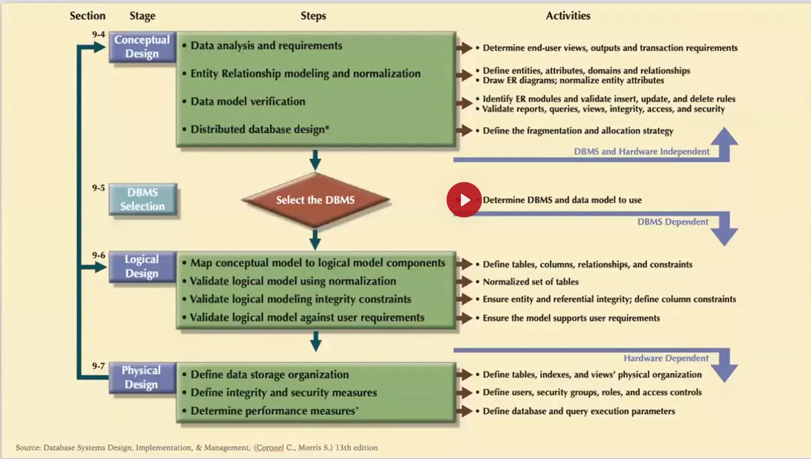

## Unnamed System

> **Customer does not know what they need.**

### Overview
Customer explain the business, requirements, and problems we need to solve.

#### Key Points:
- A stakeholder explains the current business or departments (of an office), and the responsibilities of a department or
  an individual.
- Types of reports and documents they need.
- Explanation of the government or company policies they have to maintain.

#### Objective:
- Identify challenges the stakeholders face.
- Overcome those challenges or tasks by building suitable software.

## Named System with Customizations

> **Customer knows what they need to some degree.**

### Requirements
We need a system with the following features:

1. **Point of Sales (POS):**
    - Efficient and user-friendly interface for transactions.
    - Integration with inventory and accounting systems.
2. **E-Commerce Platform:**
    - Online sales channel to complement physical sales.
    - Customizable storefronts and payment gateways.
3. **Inventory Tracking:**
    - Real-time tracking of stock levels.
    - Alerts for low stock and reordering.
4. **Accounting Software:**
    - Automated financial reporting.
    - Tax compliance and expense tracking.
5. **HR and Payroll:**
    - Employee management system.
    - Payroll processing with tax calculations.

## Design Process
* Conceptual Design
* DBMS Selection
* Logical Design
* Physical Design

Source: Database Systems Design, Implementation, and Management by Carlos Coronel, Steven Morris 13th Edition

# Database Design Process

## 1. Requirement Collection & Analysis

Discover **information** that is required to **manage** to run the operations while **maintaining** **policies and 
regulations**.

### Site Visit/In-depth Interview

- Talk with stakeholders for around 30 minutes to gain initial insights (approximately 5% of the requirement).
- Identify keywords and processes mentioned by stakeholders and follow up with individuals managing those processes.
- Visit offices or factories to observe and understand workflows in-depth.
- Document daily, weekly, monthly, and yearly tasks and reports required.

### Study Current Processes and Practices

Analyze existing documentation and tools such as:
- Forms
- Reports
- Registers
- Receipts / Challans / Memos
- Bills / Invoices
- Acknowledgements / GRNs (Good Receive Notes)
- Books / Printed Copies / Excel Sheets

### Persona Interview

> An archetype of a user that helps designers and developers empathize by understanding their user’s business and personal contexts.

### Prepare Wireframe

- **Interactive Wireframe (Figma):** Simulate user activities.
- **Low-Fidelity Design:**
   - Easy to change.
   - Avoid irrelevant feedback.
- **Focus:** Prioritize processes over design elements.

### Intensive Demonstration and Feedback Cycles

Engage in continuous iterations to refine the understanding of requirements.

### Outcome of Requirement Collection & Analysis

- Identified data requirements.
- Defined relationships between data elements.
- Documentation: BRS (Business Requirement Specification) and SRS (System Requirement Specification).

---

## 2. Conceptual Data Model

- Define entities.
- Identify attributes for each entity.
- Define relationships between entities.
- Visualize user activities against the data model to identify gaps.
- Iterate until all gaps are addressed.

### Outcome

- Captured data and operation requirements.
- Visual representation of data relationships.

### Tools and Techniques

- **Lego Serious Play:** A design thinking tool for collaborative problem-solving.

---

## 3. Logical Data Model

> Transitioning from high-level conceptual schema to implementable database structures.

- **Define Tables, Columns, Keys, and Relationships:**
   - Mapping super-type entities.
   - Mapping multi-valued attributes.
   - Breaking down composite entities.
   - Detailing relationships and their attributes.
- Specify data types and constraints.
- Verify model accuracy with realistic datasets.
- Visualize user activities and refine the data model as needed.

### Outcome

- Database schema diagram.
- Visual representation of tables, fields, and relationships.

### Tools

- **https://www.dbdesigner.net/**: For creating and refining logical database models.

---

## 4. Physical Design

> Implementing the logical schema with considerations for performance, storage, and scalability.

- **Indexing:**
   - Create indexes for frequently queried columns to enhance performance.
   - Use composite indexes where applicable to optimize multi-column queries.
- **Partitioning:**
   - Split large tables into smaller, manageable pieces to improve query performance and maintenance.
   - Employ horizontal or vertical partitioning based on data usage patterns.
- **Sharding:**
   - Distribute data across multiple servers to handle large-scale datasets.
   - Ensure proper configuration to avoid data inconsistencies.
- **Storage Optimization:**
   - Choose appropriate data types to minimize storage requirements.
   - Normalize or denormalize data as per the application needs.
- **Backups and Recovery:**
   - Set up regular automated backups to ensure data safety.
   - Implement recovery plans for disaster scenarios.
- **Performance Monitoring:**
   - Continuously monitor database performance and query execution times.
   - Use database profiling tools to identify and resolve bottlenecks.

### Outcome

- Optimized database implementation ready for deployment.
- Configurations that ensure scalability and high performance.

### Tools

- **https://www.mysql.com/products/enterprise/monitor.html**: For performance monitoring.
- **https://www.pgadmin.org/**: For managing PostgreSQL databases.
