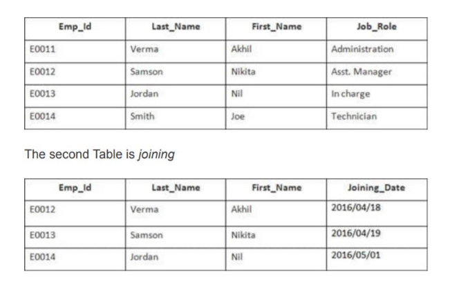
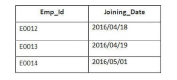
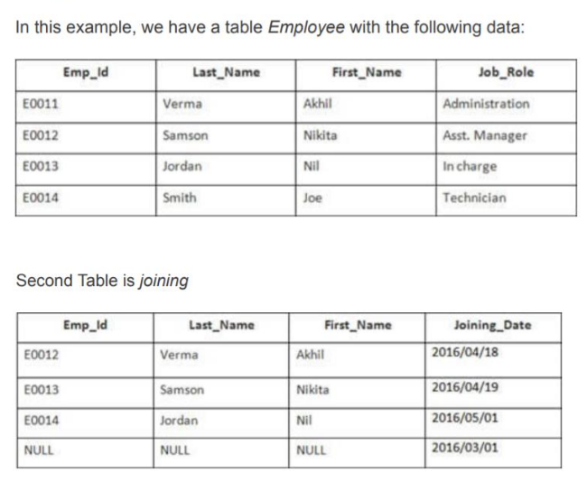
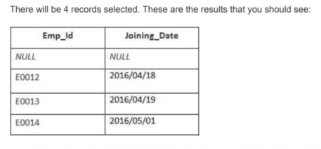
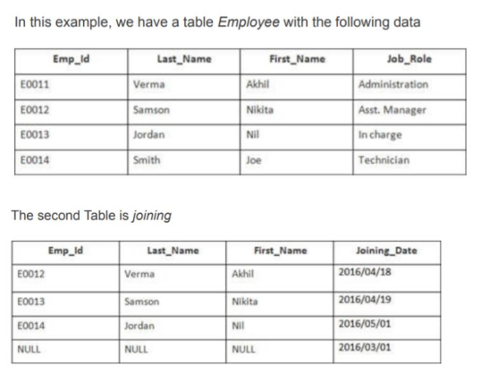
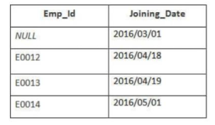
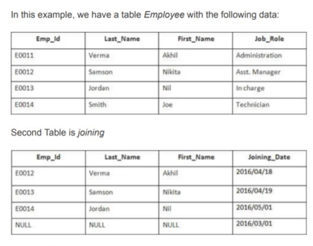
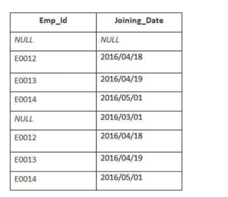

# JOIN
## INNER JOIN
It is also known as SIMPLE JOIN which returns all rows from BOTH tables when it has at least one column matched. 
```sql
SELECT column_name(s)
FROM table_name1
INNER JOIN table_name2
ON column_name1 = column_name2;
```



```sql
SELECT Employee.Emp_id, Joining.Joining_Date
FROM Employee
INNER JOIN Joining
ON Employee.Emp_id = Joining.Emp_id
ORDER BY Employee.Emp_id;
```

Result will be 



## LEFT JOIN
This join returns **all rows from LEFT table** and its **matched rows from RIGHT table**.
```sql
SELECT column_name(s)
FROM table_name1
LEFT JOIN table_name2
ON column_name1 = column_name2;
```



```sql
SELECT Employee.Emp_id, Joining.Joining_Date
FROM Employee
LEFT OUTER JOIN Joining
on Employee.Emp_id = Joining.Emp_id
ORDER BY Employee.Emp_id;
```



## RIGHT JOIN
This joins returns all rows from RIGHT table and its matched rows from a LEFT table.
```sql
SELECT column_name(s)
FROM table_name1
RIGHT JOIN table_name2
ON column_name1 = column_name2;
```



```sql
SELECT Employee.Emp_id, Joining.Joining_Date
FROM Employee
RIGHT OUTER JOIN Joining
ON Employee.Emp_id = Joining.Emp_id
ORDER BY Employee.Emp_id;
```


## FULL JOIN
This joins returns all when there is a match either in the RIGHT table or in the LEFT table.
```sql
SELECT column_name(s)
FROM table_name1
FULL OUTER JOIN table_name2
ON column_name1 = column_name2;
```



```sql
SELECT Employee.Emp_id, Joining.Emp_id
FROM Employee
FULL OUTER JOIN Joining
ON Employee.Emp_id = Joining.Emp_id
ORDER BY Employee.Emp_id;
```


## Self Join
Self Join in SQL is used for joining a table with itself. Here, depending upon some conditions, each row of the table is
joined with itself and with other rows of the table.