# JOIN
JOIN is a method of combining (joining) information from two tables. The result is a stitched set of columns from
both tables, defined by the join type (INNER/OUTER/CROSS and LEFT/RIGHT/FULL, explained below) and join criteria
(how rows from both tables relate).

A table may be joined to itself or to any other table. If information from more than two tables needs to be accessed,
multiple joins can be specified in a FROM clause.

## Self Join
A table may be joined to itself, with different rows matching each other by some condition. In this use case, aliases
must be used in order to distinguish the two occurrences of the table.

In the below example, for each Employee in the example database Employees table, a record is returned containing
the employee's first name together with the corresponding first name of the employee's manager. Since managers
are also employees, the table is joined with itself:
```sql
SELECT 
    e.FName AS "Employee",
    m.FName AS "Manager"
FROM
    Employees e
JOIN 
    Employees m
    ON e.managerId = m.Id
; 
```
This query will return the following data:

| Employee  | Manager |
|-----------|---------|
| John      | James   |
| Michael   | James   | 
| Johnathon | John    |

**So how does this work?**

The original table contains these records:

| Id  | FName     | LName    | PhoneNumber  | ManagerId | DepartmentId | Salary | HireDate   |
|-----|-----------|----------|--------------|-----------|--------------|--------|------------| 
| 1   | James     | Smith    | 1234567890   | NULL      | 1            | 1000   | 01-01-2002 |
| 2   | John      | Johnson  | 2468101214   | 1         | 1            | 400    | 23-03-2005 |
| 3   | Michael   | Williams | 1357911131   | 1         | 2            | 600    | 12-05-2009 |
| 4   | Johnathon | Smith    | 1212121212   | 2         | 1            | 500    | 24-07-2016 |

The first action is to create a Cartesian product of all records in the tables used in the FROM clause. In this case it's
the Employees table twice, so the intermediate table will look like this (I've removed any fields not used in this
example):

| e.Id | e.FName     | e.ManagerId | m.Id | m.FName   | m.ManagerId |
|------|-------------|-------------|------|-----------|-------------|
| 1    | James       | NULL        | 1    | James     | NULL        |
| 1    | James       | NULL        | 2    | John      | 1           |
| 1    | James       | NULL        | 3    | Michael   | 1           |
| 1    | James       | NULL        | 4    | Johnathon | 2           |
| 2    | John        | 1           | 1    | James     | NULL        |
| 2    | John        | 1           | 2    | John      | 1           |
| 2    | John        | 1           | 3    | Michael   | 1           |
| 2    | John        | 1           | 4    | Johnathon | 2           |
| 3    | Michael     | 1           | 1    | James     | NULL        |
| 3    | Michael     | 1           | 2    | John      | 1           |
| 3    | Michael     | 1           | 3    | Michael   | 1           |
| 3    | Michael     | 1           | 4    | Johnathon | 2           |
| 4    | Johnathon   | 2           | 1    | James     | NULL        |
| 4    | Johnathon   | 2           | 2    | John      | 1           |
| 4    | Johnathon   | 2           | 3    | Michael   | 1           |
| 4    | Johnathon   | 2           | 4    | Johnathon | 2           |

The next action is to only keep the records that meet the JOIN criteria, so any records where the aliased e table
ManagerId equals the aliased m table Id:

| e.Id | e.FName     | e.ManagerId | m.Id | m.FName | m.ManagerId |
|------|-------------|-------------|------|---------|-------------|
| 2    | John        | 1           | 1    | James   | NULL        |
| 3    | Michael     | 1           | 1    | James   | NULL        |
| 4    | Johnathon   | 2           | 2    | John    | 1           |

Then, each expression used within the SELECT clause is evaluated to return this table:

| e.FName   | m.FName |
|-----------|---------|
| John      | James   |
| Michael   | James   |
| Johnathon | John    |

Finally, column names e.FName and m.FName are replaced by their alias column names, assigned with the AS operator:

| Employee  | Manager |
|-----------|---------|
| John      | James   |
| Michael   | James   |
| Johnathon | John    |

## Differences between inner/outer joins
SQL has various join types to specify whether (non-)matching rows are included in the result: INNER JOIN, LEFT
OUTER JOIN, RIGHT OUTER JOIN, and FULL OUTER JOIN (the INNER and OUTER keywords are optional). The figure
below underlines the differences between these types of joins: the blue area represents the results returned by the
join, and the white area represents the results that the join will not return.

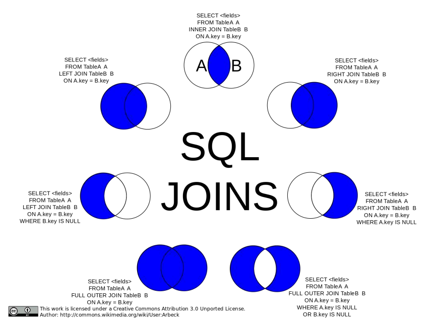

source: [SQL Notes for Professionals](https://goalkicker.com/SQLBook)

Cross Join SQL Pictorial Presentation:

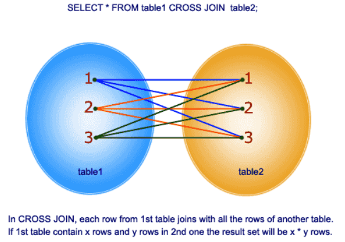

source: [SQL Notes for Professionals](https://goalkicker.com/SQLBook)

Below are examples from this answer. For instance there are two tables as below :

| A | B |
|---|---|
| 1 | 3 |
| 2 | 4 |  
| 3 | 5 |
| 4 | 6 |

Note that (1,2) are unique to A, (3,4) are common, and (5,6) are unique to B.

### Inner Join
An inner join using either of the equivalent queries gives the intersection of the two tables, i.e. the two rows they
have in common:
```sql
SELECT * FROM a INNER JOIN b ON a.a = b.b;
SELECT * a.*, b.* FROM a,b where a.a = b.b;
```
| A | B |
|---|---|  
| 3 | 3 |
| 4 | 4 |

### Left outer join
A left outer join will give all rows in A, plus any common rows in B:
```sql
SELECT * FROM a LEFT OUTER JOIN b ON a.a = b.b;
```
| A | B    |
|---|------|
| 1 | NULL |
| 2 | NULL |  
| 3 | 3    |
| 4 | 4    |

### Right outer join
Similarly, a right outer join will give all rows in B, plus any common rows in A:
```sql
SELECT * FROM a RIGHT OUTER JOIN b ON a.a = b.b;
```
| A    | B |
|------|---|
| 3    | 3 |
| 4    | 4 |  
| NULL | 5 |
| NULL | 6 |

### Full outer join
A full outer join will give you the union of A and B, i.e., all the rows in A and all the rows in B. If something in A
doesn't have a corresponding datum in B, then the B portion is null, and vice versa.

```sql
SELECT * FROM a FULL OUTER JOIN b ON a.a = b.b;
```
| A    | B    |
|------|------|
| 1    | NULL |
| 2    | NULL |  
| 3    | 3    |
| 4    | 4    |
| NULL | 5    |
| NULL | 6    |

## JOIN Terminology: Inner, Outer, Semi, Anti..
Let's say we have two tables (A and B) and some of their rows match (relative to the given JOIN condition, whatever it 
may be in the particular case):

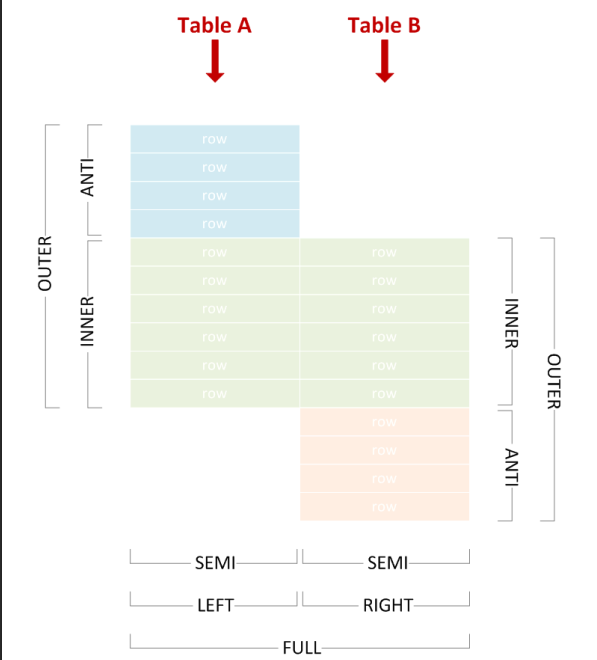

source: [SQL Notes for Professionals](https://goalkicker.com/SQLBook)

We can use various join types to include or exclude matching or non-matching rows from either side, and correctly
name the join by picking the corresponding terms from the diagram above.

The examples below use the following test data:

```sql
CREATE TABLE A (
    X varchar(255) PRIMARY KEY
);

CREATE TABLE B (
    Y varchar(255) PRIMARY KEY
);

INSERT INTO A VALUES
    ('Amy'),
    ('John'),
    ('Lisa'),
    ('Marco'),
    ('Phil')
;

INSERT INTO B VALUES
    ('Lisa'),
    ('Marco'),
    ('Phil'),
    ('Tim'),
    ('Vincent')
;
```

### Inner Join
Combines left and right rows that match.
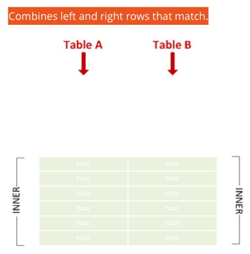

source: [SQL Notes for Professionals](https://goalkicker.com/SQLBook)
```sql
SELECT * FORM A JOIN B ON X = Y;
```

| X     | Y     |
|-------|-------|
| Lisa  | Lisa  |
| Marco | Marco |
| Phil  | Phil  |

### Left Outer Join
Sometimes abbreviated to "left join". Combines left and right rows that match, and includes non-matching left
rows.
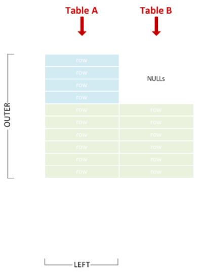

source: [SQL Notes for Professionals](https://goalkicker.com/SQLBook)

```sql
SELECT * FROM A LEFT JOIN B ON X = Y;
```
| X     | Y     |
|-------|-------|
| Amy   | NULL  |
| John  | NULL  |
| Lisa  | Lisa  |
| Marco | Marco |
| Phil  | Phil  |

### Right Outer Join
Sometimes abbreviated to "right join". Combines left and right rows that match, and includes non-matching right rows.

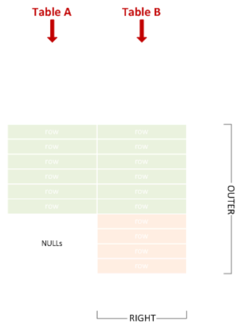

source: [SQL Notes for Professionals](https://goalkicker.com/SQLBook)

```sql
SELECT * FROM A RIGHT JOIN B ON X = Y;
```
| X     | Y       |
|-------|---------|
| Lisa  | Lisa    |
| Marco | Marco   |
| Phil  | Phil    |
| NULL  | Tim     |
| NULL  | Vincent |

### Full Outer Join
Sometimes abbreviated to "full join". Union of left and right outer join.

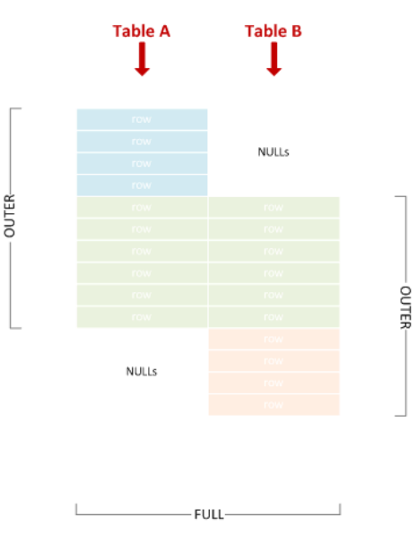

source: [SQL Notes for Professionals](https://goalkicker.com/SQLBook)

```sql
SELECT * FROM A FULL JOIN B ON X = Y;
```
| X     | Y       |
|-------|---------|
| Amy   | NULL    |
| John  | NULL    |
| Lisa  | Lisa    |
| Marco | Marco   |
| Phil  | Phil    |
| NULL  | Tim     |
| NULL  | Vincent |

### Left Semi Join
Includes left rows that match right rows.
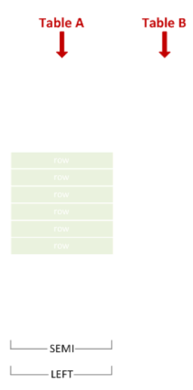

source: [SQL Notes for Professionals](https://goalkicker.com/SQLBook)

```sql
SELECT * FROM A WHERE X IN (SELECT Y FROM B);
```

| X     |
|-------|
| Lisa  |
| Marco |
| Phil  | 

### Right Semi Join
Includes right rows that match left rows.

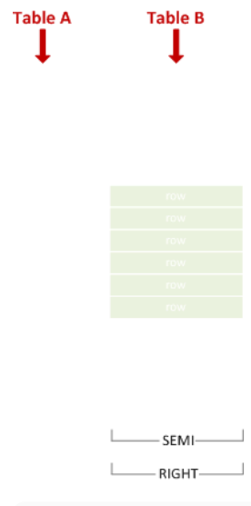

source: [SQL Notes for Professionals](https://goalkicker.com/SQLBook)
```sql
SELECT * FROM B WHERE Y IN (SELECT X FROM A);
```
| Y     |
|-------|
| Lisa  |
| Marco |
| Phil  |

As you can see, there is no dedicated IN syntax for left vs. right semi join - we achieve the effect simply by switching
the table positions within SQL text.

### Left Anti Semi Join
Includes left rows that do not match right rows.

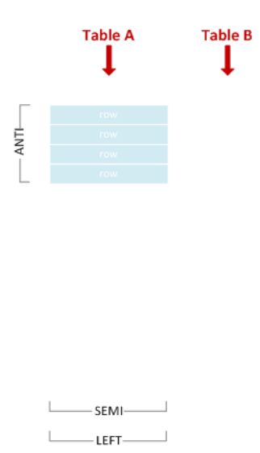

source: [SQL Notes for Professionals](https://goalkicker.com/SQLBook)

```sql
SELECT * FROM A WHERE X NOT IN (SELECT Y FROM B);
```

| X     |
|-------|
| Amy   |
| John  |

**WARNING:** Be careful if you happen to be using `NOT IN` on a nullable column! 

### Right Anti Semi Join
Includes right rows that do not match left rows.
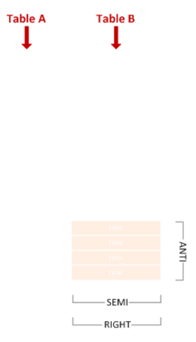

source: [SQL Notes for Professionals](https://goalkicker.com/SQLBook)

```sql
SELECT * FROM B WHERE Y NOT IN (SELECT X FROM A);
```

| Y       |
|---------|
| Tim     |
| Vincent |

As you can see, there is no dedicated `NOT IN` syntax for left vs. right anti semi join - we achieve the effect simply by
switching the table positions within SQL text.

### Cross Join
A Cartesian product of all left with all right rows.
```sql
SELECT * FROM A CROSS JOIN B;
```
| X     | Y       |
|-------|---------|
| Amy   | Lisa    |
| John  | Lisa    |
| Lisa  | Lisa    |
| Marco | Lisa    |
| Phil  | Lisa    |
| Amy   | Marco   |
| John  | Marco   |
| Lisa  | Marco   |
| Marco | Marco   |
| Phil  | Marco   |
| Amy   | Phil    |
| John  | Phil    |
| Lisa  | Phil    |
| Marco | Phil    |
| Phil  | Phil    |
| Amy   | Tim     |
| John  | Tim     |
| Lisa  | Tim     |
| Marco | Tim     |
| Phil  | Tim     |
| Amy   | Vincent |
| John  | Vincent |
| Lisa  | Vincent |
| Marco | Vincent |
| Phil  | Vincent |

Cross join is equivalent to an inner join with join condition which always matches, so the following query would
have returned the same result:
```sql
SELECT * FROM A JOIN B ON 1 = 1;
```

### Self-Join
This simply denotes a table joining with itself. A self-join can be any of the join types discussed above. For example,
this is a an inner self-join:

```sql
SELECT * FROM A A1 JOIN A A2 ON LEN(A1.X) < LEN(A2.X);
```

| X     | Y      |
|-------|--------|
| Amy   | John   |
| Amy   | Lisa   |
| Amy   | Marco  |
| John  | Marco  |
| Lisa  | Marco  |
| Phil  | Marco  |
| Amy   | Phil   |

## Left Outer Join
A Left Outer Join (also known as a Left Join or Outer Join) is a Join that ensures all rows from the left table are
represented; if no matching row from the right table exists, its corresponding fields are NULL.

The following example will select all departments and the first name of employees that work in that department.
Departments with no employees are still returned in the results, but will have NULL for the employee name:

```sql
SELECT                  Departments.Name, Employees.FName
FROM                    Departmants 
LEFT OUTER JOIN         Employees
ON                      Department.Id = Employees.DepartmentId
```
This would return the following from the example database:

| Departments.Name | Employees.FName |
|------------------|-----------------|
| HR               | James           |
| HR               | John            |
| HR               | Johnathon       |
| Sales            | Michael         |
| Tech             | NULL            |

So how does this work?

There are two tables in the FROM clause:

Employees Table

| Id | FName     | LName    | PhoneNumber  | ManagerId | DepartmentId | Salary | HireDate   |
|----|-----------|----------|--------------|-----------|--------------|--------|------------|
| 1  | James     | Smith    | 1234567890   | NULL      | 1            | 1000   | 01-01-2002 |
| 2  | John      | Johnson  | 2468101214   | 1         | 1            | 400    | 23-03-2005 |
| 3  | Michael   | Williams | 1357911131   | 1         | 2            | 600    | 12-05-2009 |
| 4  | Johnathon | Smith    | 1212121212   | 2         | 1            | 500    | 24-07-2016 |

And 
Departments Table

| Id  | Name  |
|-----|-------|
| 1   | HR    |
| 2   | Sales |
| 3   | Tech  |

First a Cartesian product is created from the two tables giving an intermediate table. The records that meet the join 
criteria (Departments.Id = Employees.DepartmentId) are highlighted in bold; these are passed to the next stage of the 
query.

As this is a LEFT OUTER JOIN all records are returned from the LEFT side of the join (Departments), while any
records on the RIGHT side are given a NULL marker if they do not match the join criteria. In the table below this will
return Tech with NULL


| Id    | Name      | Id    | FName         | LName        | PhoneNumber    | ManagerId | DepartmentId | Salary   | HireDate       |
|-------|-----------|-------|---------------|--------------|----------------|-----------|--------------|----------|----------------|
| **1** | **HR**    | **1** | **James**     | **Smith**    | **1234567890** | **NULL**  | **1**        | **1000** | **01-01-2002** |
| **1** | **HR**    | **2** | **John**      | **Johnson**  | **2468101214** | **1**     | **1**        | **400**  | **23-03-2005** |
| 1     | HR        | 3     | Michael       | Williams     | 1357911131     | 1         | 2            | 600      | 12-05-2009     |
| **1** | **HR**    | **4** | **Johnathon** | **Smith**    | **1212121212** | **2**     | **1**        | **500**  | **24-07-2016** |
| 2     | Sales     | 1     | James         | Smith        | 1234567890     | NULL      | 1            | 1000     | 01-01-2002     |
| 2     | Sales     | 2     | John          | Johnson      | 2468101214     | 1         | 1            | 400      | 23-03-2005     |
| **2** | **Sales** | **3** | **Michael**   | **Williams** | **1357911131** | **1**     | **2**        | **600**  | **12-05-2009** |
| 2     | Sales     | 4     | Johnathon     | Smith        | 1212121212     | 2         | 1            | 500      | 24-07-2016     |
| 3     | Tech      | 1     | James         | Smith        | 1234567890     | NULL      | 1            | 1000     | 01-01-2002     |
| 3     | Tech      | 2     | John          | Johnson      | 2468101214     | 1         | 1            | 400      | 23-03-2005     |
| 3     | Tech      | 3     | Michael       | Williams     | 1357911131     | 1         | 2            | 600      | 12-05-2009     |
| 3     | Tech      | 4     | Johnathon     | Smith        | 1212121212     | 2         | 1            | 500      | 24-07-2016     |

Finally each expression used within the SELECT clause is evaluated to return our final table:

| Departments.Name | Employees.FName |
|------------------|-----------------| 
| HR               | James           |
| HR               | John            | 
| Sales            | Richard         |
| Tech             | NULL            |

## Implicit Join
Joins can also be performed by having several tables in the from clause, separated with commas , and defining the
relationship between them in the where clause. This technique is called an Implicit Join (since it doesn't actually
contain a join clause).

All RDBMSs support it, but the syntax is usually advised against. The reasons why it is a bad idea to use this syntax
are:
* It is possible to get accidental cross joins which then return incorrect results, especially if you have a lot of
  joins in the query.
* If you intended a cross join, then it is not clear from the syntax (write out CROSS JOIN instead), and someone
  is likely to change it during maintenance.

The following example will select employee's first names and the name of the departments they work for:
```sql
SELECT e.FName, d.Name
FROM
Employee e, Departments d
WHERE e.DeptartmentId = d.Id
```
This would return the following from the example database:

| e.FName | d.Name |
|---------|--------|
| James   | HR     |
| John    | HR     |
| Richard | Sales  |

## CROSS JOIN
Cross join does a Cartesian product of the two members, A Cartesian product means each row of one table is
combined with each row of the second table in the join. For example, if TABLEA has 20 rows and TABLEB has 20
rows, the result would be 20*20 = 400 output rows

Using example database
```sql
SELECT d.Name, e.FName
FROM
Departments d
CROSS JOIN Employees e;
```
Which returns:

| d.Name | e.FName   |
|--------|-----------|
| HR     | James     |
| HR     | John      |
| HR     | Michael   |
| HR     | Johnathon |
| Sales  | James     |
| Sales  | John      |
| Sales  | Michael   |
| Sales  | Johnathon |
| Tech   | James     |
| Tech   | John      |
| Tech   | Michael   |
| Tech   | Johnathon |

It is recommended to write an explicit CROSS JOIN if you want to do a cartesian join, to highlight that this is what you
want.

## CROSS APPLY & LATERAL JOIN
A very interesting type of JOIN is the LATERAL JOIN (new in PostgreSQL 9.3+),
which is also known as CROSS APPLY/OUTER APPLY in SQL-Server & Oracle.

The basic idea is that a table-valued function (or inline subquery) gets applied for every row you join.

This makes it possible to, for example, only join the first matching entry in another table.
The difference between a normal and a lateral join lies in the fact that you can use a column that you previously
joined in the subquery that you "CROSS APPLY".

Syntax:

PostgreSQL 9.3+

> left | right | inner JOIN LATERAL

SQL-Server:

> CROSS | OUTER APPLY

`INNER JOIN LATERAL` is the same as `CROSS APPLY`
and `LEFT JOIN LATERAL` is the same as `OUTER APPLY`

Example usage (PostgreSQL 9.3+):

```sql
SELECT * FROM T_Contacts
--LEFT JOIN T_MAP_Contacts_Ref_OrganisationalUnit ON MAP_CTCOU_CT_UID = T_Contacts.CT_UID AND
MAP_CTCOU_SoftDeleteStatus = 1
--WHERE T_MAP_Contacts_Ref_OrganisationalUnit.MAP_CTCOU_UID IS NULL -- 989


LEFT JOIN LATERAL
(
    SELECT
      --MAP_CTCOU_UID
      MAP_CTCOU_CT_UID
      ,MAP_CTCOU_COU_UID
      ,MAP_CTCOU_DateFrom
      ,MAP_CTCOU_DateTo
    FROM T_MAP_Contacts_Ref_OrganisationalUnit
    WHERE MAP_CTCOU_SoftDeleteStatus = 1
    AND MAP_CTCOU_CT_UID = T_Contacts.CT_UID
   
   /*
  AND
  (
      (__in_DateFrom <= T_MAP_Contacts_Ref_OrganisationalUnit.MAP_KTKOE_DateTo)
      AND
      (__in_DateTo >= T_MAP_Contacts_Ref_OrganisationalUnit.MAP_KTKOE_DateFrom)
  )
  */
  ORDER BY MAP_CTCOU_DateFrom
  LIMIT 1
) AS FirstOE
```
And for SQL-Server
```sql
SELECT * FROM T_Contacts

--LEFT JOIN T_MAP_Contacts_Ref_OrganisationalUnit ON MAP_CTCOU_CT_UID = T_Contacts.CT_UID AND
MAP_CTCOU_SoftDeleteStatus = 1
--WHERE T_MAP_Contacts_Ref_OrganisationalUnit.MAP_CTCOU_UID IS NULL -- 989

-- CROSS APPLY -- = INNER JOIN
OUTER APPLY    -- = LEFT JOIN
(
    SELECT TOP 1
         --MAP_CTCOU_UID
         MAP_CTCOU_CT_UID
        ,MAP_CTCOU_COU_UID
        ,MAP_CTCOU_DateFrom
        ,MAP_CTCOU_DateTo
    FROM T_MAP_Contacts_Ref_OrganisationalUnit
    WHERE MAP_CTCOU_SoftDeleteStatus = 1
    AND MAP_CTCOU_CT_UID = T_Contacts.CT_UID
    
    /*
    AND
    (
        (@in_DateFrom <= T_MAP_Contacts_Ref_OrganisationalUnit.MAP_KTKOE_DateTo)
        AND
        (@in_DateTo >= T_MAP_Contacts_Ref_OrganisationalUnit.MAP_KTKOE_DateFrom)
    )
    */
    ORDER BY MAP_CTCOU_DateFrom
) AS FirstOE
```

## FULL JOIN
One type of JOIN that is less known, is the FULL JOIN.
(Note: FULL JOIN is not supported by MySQL as per 2016)

A FULL OUTER JOIN returns all rows from the left table, and all rows from the right table.

If there are rows in the left table that do not have matches in the right table, or if there are rows in right table that
do not have matches in the left table, then those rows will be listed, too.

Example 1
```sql
SELECT * FROM Table1

FULL JOIN Table2
  ON 1 = 2
```
Example 2
```sql
SELECT
      COALESCE(T_Budget.Year, tYear.Year) AS RPT_BudgetInYear
      ,COALESCE(T_Budget.Value, 0.0) AS RPT_Value
FROM T_Budget

FULL JOIN tfu_RPT_All_CreateYearInterval(@budget_year_from, @budget_year_to) AS tYear
      ON tYear.Year = T_Budget.Year 
```
Note that if you're using soft-deletes, you'll have to check the soft-delete status again in the WHERE-clause (because
FULL JOIN behaves kind-of like a UNION);
It's easy to overlook this little fact, since you put AP_SoftDeleteStatus = 1 in the join clause.

Also, if you are doing a FULL JOIN, you'll usually have to allow NULL in the WHERE-clause; forgetting to allow NULL
on a value will have the same effects as an INNER join, which is something you don't want if you're doing a FULL
JOIN.

Example:
```sql
SELECT
    T_AccountPlan.AP_UID
    ,T_AccountPlan.AP_Code
    ,T_AccountPlan.AP_Lang_EN
    ,T_BudgetPositions.BUP_Budget
    ,T_BudgetPositions.BUP_UID
    ,T_BudgetPositions.BUP_Jahr
FROM T_BudgetPositions

FULL JOIN T_AccountPlan
    ON T_AccountPlan.AP_UID = T_BudgetPositions.BUP_AP_UID
    AND T_AccountPlan.AP_SoftDeleteStatus = 1

WHERE (1=1)
AND (T_BudgetPositions.BUP_SoftDeleteStatus = 1 OR T_BudgetPositions.BUP_SoftDeleteStatus IS NULL)
AND (T_AccountPlan.AP_SoftDeleteStatus = 1 OR T_AccountPlan.AP_SoftDeleteStatus IS NULL)
```

## Recursive JOINs
Recursive joins are often used to obtain parent-child data. In SQL, they are implemented with recursive common
table expressions, for example:
```sql
WITH RECURSIVE MyDescendants AS (
    SELECT Name
    FROM People
    WHERE Name = 'John Doe'

    UNION ALL
    SELECT People.Name
    FROM People
    JOIN MyDescendants ON People.Name = MyDescendants.Parent
)
SELECT * FROM MyDescendants;
```

## Basic explicit inner join
A basic join (also called "inner join") queries data from two tables, with their relationship defined in a join clause.

The following example will select employees' first names (FName) from the Employees table and the name of the
department they work for (Name) from the Departments table:

```sql
SELECT Employees.FName, Departments.Name
FROM Employees
JOIN Departments
ON Employees.DepartmentId = Departments.Id
```
This would return the following from the example database:

| Employees.FName | Departments.Name |
|-----------------|------------------| 
| James           | HR               |
| John            | HR               |
| Richard         | Sales            |


## Joining on a Subquery
Joining a subquery is often used when you want to get aggregate data from a child/details table and display that
along with records from the parent/header table. For example, you might want to get a count of child records, an
average of some numeric column in child records, or the top or bottom row based on a date or numeric field. This
example uses aliases, which arguable makes queries easier to read when you have multiple tables involved. Here's
what a fairly typical subquery join looks like. In this case we are retrieving all rows from the parent table Purchase
Orders and retrieving only the first row for each parent record of the child table PurchaseOrderLineItems.

```sql
SELECT po.Id, po.PODate, po.VendorName, po.Status, item.ItemNo,
    item.Description, item.Cost, item.Price
FROM PurchaseOrders po
LEFT JOIN
      (
        SELECT l.PurchaseOrderId, l.ItemNo, l.Description, l.Cost, l.Price, Min(l.id) as Id
        FROM PurchaseOrderLineItems l
        GROUP BY l.PurchaseOrderId, l.ItemNo, l.Description, l.Cost, l.Price
      ) AS item ON item.PurchaseOrderId = po.Id
```

Sources:
* [SQL Notes for Professionals](https://goalkicker.com/SQLBook)