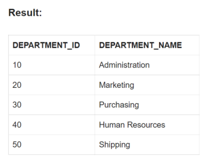
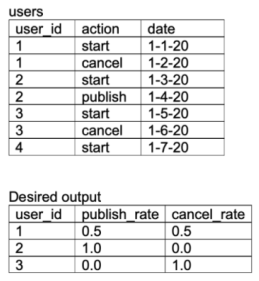
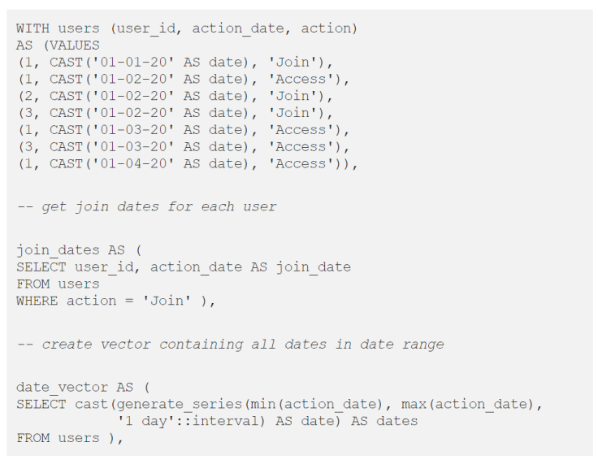
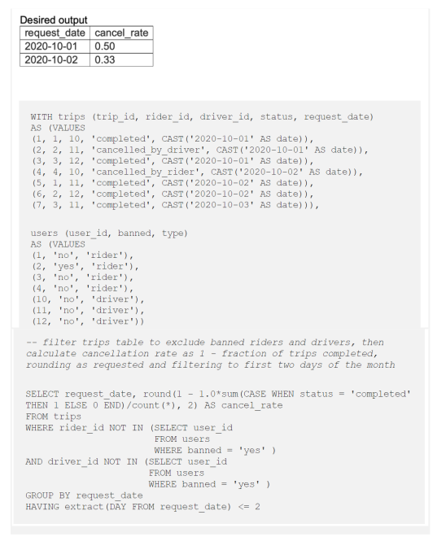

## select `UNIQUE` records from a table


```sql
SELECT EMPLOYEE_ID,
       NAME,
       SALRY
FROM EMPLOYEE
GROUP BY EMPLOYEE_ID, NAME, SALARY;
```


### delete `DUPLICATE` records from a table
Considering the same EMPLOYEE table as source.
Using ROWID and ROW_NUMBER analytic function

#### STEP-1: Using ROW_NUMBER analytic function, assign row numbers to each unique set of records. Select ROWID of the rows along with the source columns 
```sql
SELECT ROWID,
       EMPLOYEE_ID,
       NAME,
       SALARY,
       ROW_NUMBER() OVER(PARTITION BY EMPLOYEE_ID,NAME,SALARY ORDER BY EMPLOYEE_ID) AS ROW_NUMBER
FROM EMPLOYEE;
```


#### STEP-2: Select ROWID of records with ROW_NUMBER > 1
```sql
SELECT ROWID FROM(
       SELECT ROWID,
              EMPLOYEE_ID,
              NAME,
              SALARY,
              ROW_NUMBER() OVER(PARTITION BY EMPLOYEE_ID,NAME,SALARY ORDER BY EMPLOYEE_ID) AS
ROW_NUMBER
       FROM EMPLOYEE)
WHERE ROW_NUMBER > 1;
```


#### STEP-3: Delete the records from the source table using the ROWID values fetched in previous step
```sql
DELETE FROM EMP WHERE ROWID IN (
    SELECT ROWID FROM(
        SELECT ROWID,
        ROW_NUMBER() OVER(PARTITION BY EMPLOYEE_ID,NAME,SALARY ORDER BY EMPLOYEE_ID) AS ROW_NUMBER 
    FROM EMPLOYEE)
WHERE ROW_NUMBER > 1);
```


## Read TOP 5 records from a table
Consider below table DEPARTMENTS as the source data


ROWNUM is a “Pseudocolumn” that assigns a number to each row returned by a query indicating the order in which Oracle 
selects the row from a table. The first row selected has a ROWNUM of 1, the second has 2, and so on.

Query:
```sql
SELECT * FROM Departments WHERE ROWNUM <= 5;
```



## Read LAST 5 records from a table
Consider the same DEPARTMENTS table as source discussed in previous question.

In order to select the last 5 records we need to find (count of total number of records – 5) which gives the count of 
records from first to last but 5 records.Using the MINUS function we can compare all records from DEPARTMENTS table with
records from first to last but 5 from DEPARTMENTS table which give the last 5 records of the table as result.

MINUS operator is used to return all rows in the first SELECT statement that are not present in the second SELECT
statement.

```sql
SELECT * FROM Departments
MINUS
SELECT * FROM Departments WHERE ROWNUM <= (SELECT COUNT(*) - 5 FROM Department);
```


## Find the employee with second MAX salary 
Consider below EMPLOYEES table as the source data


Without using SQL Analytic Functions

In order to find the second MAX salary, employee record with max salary needs to be eliminated. It can be achieved by 
using below SQL query.

```sql
SELECT MAX(salary) AS salary FROM Employee WHERE salary NOT IN (
SELECT MAX(salary) AS salary FROM Employee);
```

RESULT:

| SALARY |
|--------|
| 11000  |

 The above query only gives the second MAX salary value. In order to fetch the entire employee record with second MAX 
 salary we need to do a self-join on Employee table based on salary value.
 
```sql
WITH 
TEMP AS (
    SELECT MAX(salary) AS salary FROM Employee WHERE salary NOT IN (
    SELECT MAX(salary) AS salary FROM Employee
    )
)
SELECT a.* FROM Employees a JOIN TEMP on a.salary = b.salary;
```

RESULT 

| EMPLOYEE_ID | NAME | SALARY |
|-------------|------|--------|
| 103         |Den   | 11000  | 

## Find the employee with third MAX salary without using Analytic Functions
Consider the same EMPLOYEES table as source discussed in previous question

In order to find the third MAX salary, we need to eliminate the top 2 salary records. But we cannot use the same method
we used for finding second MAX salary(not a best practice). Imagine if we have to find the fifth MAX salary. We should 
not be writing a query with four nested sub queries.

STEP-1:
```sql
SELECT salary FROM (
    SELECT salary FROM Employee ORDER BY salary DESC
)
WHERE ROWNUM < 3;
```
RESULT:


| SALARY |
|--------|
| 13000  |
| 11000  |

STEP-2:
Next find the MAX salary from EMPLOYEE table which is not one of top two salary values fetched in the earlier step.
```sql
SELECT MAX(salary) as salary FROM Employee WHERE salary NOT IN (
    SELECT salary FROM(
    SELECT salary FROM employee ORDER BY salary DESC)
    WHERE ROWNUM < 3
);
```

| SALARY |
|--------|
| 6000   |

STEP-3:
In order to fetch the entire employee record with third MAX salary we need to do a self-join on Employee table based on 
Salary value.

```sql
WITH
TEMP AS(
    SELECT MAX(salary) as salary FROM Employee WHERE salary NOT IN(
        SELECT salary FROM (
        SELECT salary FROM Employee ORDER BY salary DESC)
        WHERE ROWNUM < 3)
)
SELECT a.* FROM Employees a join TEMP b on a.salary = b.salary;
```

RESULT

| EMPLOYEE_ID | NAME | SALARY |
|-------------|------|--------|
| 102         | Pat  | 6000   | 


________________________________________________________________________________________________________________________
### Assume we have the below tables on sessions that users have, and a users table. Write a query to get the active user
count of daily cohorts.
### sessions
| column_name | Type     |
|-------------|----------|
| user_id     | integer  |
| session_id  | integer  |
| date        | datetime |

### users
| column_name | Type     |
|-------------|----------|
| user_id     | integer  |
| email       | string   |
| date        | datetime |

By definition, daily cohorts are active users from a particular day. First, we can use a subquery to get the sessions of 
new users by day using an inner join with users. This is to filter for only active users by particular join date for the 
cohort. Then we can get a distinct count to return the active user count:
```sql
WITH new_users_by_date AS(
   SELECT sessions.*
   FROM sesions
 JOIN users on 
   sessions.user_id = users.user_id
   session.date = users.date
)
SELECT date, COUNT(DISTINCT user_id) as active_user_count
   FROM new_users_by_date
   GROUP BY 1 ORDER BY 1 ASC;
```

### We are given the below table on transactions from users for purchases. Write a query to get the list of customers where their earliest purchase was at least $50.
#### user_transactions
| column_name      | Type     |
|------------------|----------|
| transaction_id   | integer  |
| product_id       | integer  |
| user_id          | integer  |
| spend            | float    |
| transaction_date | datetime |

Although we could use a self join on transaction_date = MIN(transaction_date) for each user, we can also use the RANK()
window function to get the ordering of purchase by customer, and then use that subquery to filter on customers where the
first purchase(rank one) is at least 50 dollars. Note that this requires the subquery to include send as well.

```sql
WITH purchase_rank AS(
    SELECT user_id, spend,
        RANK() OVER
            (PARTITION BY user_id ORDER BY transaction_date ASC) as rank
        FROM user_transactions u
)

SELECT 
    user_id
FROM
    purchase_rank
WHERE rank = 1 AND spend >= 50.00
```

### Assume you are given the below table on transactions from users. Write a query to get the number of users and total products bought per latest transaction date where each user is bucketed into their latest transaction date
| column_name      | Type     |
|------------------|----------|
| transaction_id   | integer  |
| product_id       | integer  |
| user_id          | integer  |
| spend            | float    |
| transaction_date | datetime |

First, we need to get the latest transaction date for each user, along with the number of products they have purchased. 
This can be done in a subquery where we GROUP BY user_id and take a COUNT(DISTINCT product_id) to get the number of 
products they have purchased, and a MAX(transaction_date) to get the latest transaction date(while casting to a date).
Then, using this subquery, we can simply do an aggregation by the transaction date column in the previous subquery, while
doing a COUNT() on the number of users, and a SUM() on the number of products:
```sql
WITH latest_date AS (
    SELECT user_id,
       COUNT(DISTINCT product_id) AS num_products,
       MAX(transaction_date::DATE) AS curr_date
    FROM user_transactions
    GROUP BY 
)

SELECT curr_date,
    COUNT(user_id) AS num_users,
    SUM(num_products) AS total_products
FROM
latest_date
GROUP BY 1
```

### Assume we are given the below tables on users and their time spent on sending and opening Snaps. Write a query to get the breakdown for each age breakdown of the percentage of time spent on sending versus opening snaps.
**activities**

| column_name   | Type                   |
|---------------|------------------------|
| activity_id   | integer                |
| user_id       | integer                |
| type          | string('send', 'open') |
| time_spend    | float                  |
| activity_date | datetime               |

**age_breakdown**

| column_name   | Type                   |
|---------------|------------------------|
| user_id       | integer                |
| age_bucket    | string                 |

We can get the breakdown of total time spent on each activity by each user by filtering out for the activity_type and 
taking the sum of time spent. In doing this, we want to do an outer join with the age bucket to get the total time by age
bucket for both activity types. This results in the below two subqueries. Then, we can use those two subqueries to sum 
them by joining on the appropriate age bucket and take the proportion for send time and the proportion for open time per
age bucket.
```sql
WITH send_timespent AS (
    SELECT age_breakdown.age_bucket, SUM(activities.time_spent) AS send_timespent 
    FROM age_breakdown
  LEFT JOIN activities on age_breakdown.user_id = activities.user_id
    WHERE activities.type = 'send'
    GROUP BY 1
),
open_timespent AS (
    SELECT age_breakdown.age_bucket, SUM(activities.time_spent) AS open_timespent
    FROM age_breakdown
  LEFT JOIN activities on age_breakdown.user_id = activities.user_id
    WHERE activities.type = 'open'
    GROUP BY 1
),

SELECT a.age_bucket,
    a.send_timespent / (s.send_timespent + o.open_timespent) AS pct_send,
    o.open_timespent / (s.send_timespent + o.open_timespent) AS pct_open,
FROM age_breakdown a
LEFT JOIN send_timespent s ON a.age_bucket = s.age_bucket
LEFT JOIN open_timespent o ON a.age_bucket = o.age_bucket
GROUP BY 1
```

### Assume we are given the below table on reviews from users. Define a top-rated place as a business whose reviews only consist of 4 or 5 stars. Write a query to get the number and percentage of businesses that are top-rated places.
First, we need to get the places where the reviews are all 4 or 5 starts. We can do this using a HAVING clause, instead
of a WHERE clause since the reviews need to all be 4 starts or above. For the HAVING condition, we can use a CASE statement
that filters for 4 or 5 starts and then take a SUM over them. This can then be compared with the total row count of the 
particular business_id reviews to ensure that the count of top reviews matches with the total review count. With the 
relevant business, we can then do an outer join with the original table on business_id to get a COUNT of distinct business_id
matches, and then the percentage by comparing the COUNT from the top places with the overall COUNT of business_id:
```sql
WITH top_places AS (
    SELECT business_id
    FROM user_transactions
    GROUP BY 1
    HAVING 
        SUM(CASE WHEN rating >= 4) THEN 1 ELSE 0 END) = COUNT(*)
    )
    
SELECT 
    COUNT(DISTINCT t.business_id) AS top_places,
    COUNT(DISTINCT t.business_id)/COUNT(DISTINCT r.business_id) AS top_places_pct
FROM reviews r
LEFT JOIN top_places t
    ON r.business_id = t.business_id    
```

### Another Example
**runners**

| id | name        |
|----|-------------|
| 1  | John Deo    |
| 2  | Jane Doe    |
| 3  | Alice Jones |
| 4  | Bobby Louis |
| 5  | Lisa Romero |

**races**

| id | event          | winner_id |
|----|----------------|-----------|
| 1  | 100 meter dash | 2         |
| 2  | 500 meter dash | 3         |
| 3  | cross-country  | 2         |
| 4  | triathalon     | NULL      |


#### What will be the result of the query below?
`SELECT * FROM runners WHERE id NOT IN (SELECT winner_id WHERE races)` <br/>
The result of this query will be an empty set. If the set being evaluated by the `SQL NOT IN` condition contains any values
that are null, then the outer query here will return an empty set, even if there are many runner ids that matches winner_ids
in the `races` table. Knowing this, a query that avoids this issue would be as follows:
`SELECT * FROM runners WHERE id NOT IN (SELECT winner_id FROM races WHERE winner_id IS NOT NULL)`.
Note, this is assuming the standard SQL behavior that you get without modifying the default `ANSI_NULLS` settings.

### Another Example
Given two tables created and populated as follows
```sql
CREATE TABLE dbo.envelope(id int, user_id int);
CREATE TABLE dbo.docs(idnum int, pageseq int, doctext varchar(100));

INSERT INTO dbo.envelope VALUES
   (1,1),
   (2,2),
   (3,3);
   
INSERT INTO dbo.docs(idnum,pageseq) VALUES
   (1,5),
   (2,6),
   (null,0);
```
If we run this query
```sql
UPDATE docs SET doctext=pageseq FROM docs INNER JOIN envelope ON envelope.id = docs.idnum
WHERE EXISTS (
   SELECT 1 FROM dbo.docs
   WHERE id=envelope.id
)
```
The result will be

| idnum | pageseq | doctext |
|-------|---------|---------|
| 1     | 5       | 5       |
| 2     | 6       | 6       |
| NULL  | 0       | NULL    |

The `EXISTS` clause in the above query is a red herring. It will always be true since `ID` is not member of `dbo.docs`.
As such, it will refer to the `envelope` table comparing itself to itself!.

The `idnum` value of `NULL` will not be set since the join of `NULL` will not return a result when attempting a match 
with any value of `envelope`.

### Assume a schema `Emp(Id, Name, DeptId)`, `Dept(Id, Name)`. If there are 10 records in the `Emp` table and 5 records in the `Dept` table, how many rows will be displayed in the result of the following SQL query: `SELECT * FROM Emp, Dept`
**ANSWER:** <br/>
The query will result in 50 rows as a "cartesian product" or "cross join", which is the default whenever the 'where' 
clause is omitted.

**Another Question**


`SELECT cid FROM ENROLLED WHERE grade = 'c'` will extract the course ids(cid) where student receive the grade C in the 
course.

The below query first joined the ENROLLED and STUDENT tables then it will evaluate the where condition and then it will 
return the name, grade of the students, those took 15-415 and got a grade 'A' or 'B' in the course. But for the given 
two tables it will give zero records in output.
```sql
SELECT student.name, enrolled.grade FROM student, enrolled WHERE student.sid = enrolled.sid AND enrolled.cid = '15-415'
AND enrolled.grade IN ('A', 'B');
```

The below query will find all the unique students who have taken more that one course. This query first apply self join
on enrolled table and then it evaluate the condition e1.sid = e2.sid AND e1.cid != e2.cid.
```sql
SELECT DISTINCT e1.sid FROM enrolled AS e1, enrolled AS e2 WHERE e1.sid = e2.sid AND e1.cid != e2.cid;
```

### What are the tuples additionally deleted to preserve reference integrity when the rows (2,4) are deleted from the below table. Suppose you are using ‘ON DELETE CASCADE’.
| A | C |
|---|---|
| 2 | 4 |
| 3 | 4 |
| 4 | 3 |
| 5 | 2 |
| 7 | 2 |
| 9 | 5 |
| 6 | 4 |

When (2,4) is deleted. Since C is a foreign key referring A with delete on cascade, all entries with value 2 in C must
be deleted. So (5, 2) and (7,2) are deleted. As a result of this 5 and 7 are deleted from A which causes (9, 5) to be 
deleted.

### Another example
Suppose loan records

| Borrower  | Bank Manager | Loan Amount |
|-----------|--------------|-------------|
| Ramesh    | Sunderajan   | 10000.00    |
| Suresh    | Ramgopal     | 5000.00     |
| Mahesh    | Sunderrajan  | 7000.00     | 

```sql
SELECT Count(*) FROM (( SELECT Borrower, Bank_Manager FROM Load_Records) AS S NATURAL JOIN (SELECT Bank_Manager,
Loan_Amount FROM Loan_Record) AS T);
```
If we run the  query above temporary table S is given below

| Borrower  | Bank Manager | 
|-----------|--------------|
| Ramesh    | Sunderajan   | 
| Suresh    | Ramgopal     |
| Mahesh    | Sunderrajan  |

and the temporary table T is given below

| Bank Manager | Loan Amount |
|--------------|-------------|
| Sunderajan   | 10000.00    |
| Ramgopal     | 5000.00     |
| Sunderrajan  | 7000.00     | 

If we apply natural join on both tables(S and T) and evaluate the condition on 'Bank_Manager'. You will get the following
intermediate table after apply natural join

| Borrower  | Bank Manager | Loan Amount |
|-----------|--------------|-------------|
| Ramesh    | Sunderajan   | 10000.00    |
| Ramesh    | Sunderajan   | 7000.00     |
| Suresh    | Ramgopal     | 5000.00     |
| Mahesh    | Sunderrajan  | 10000.00    | 
| Mahesh    | Sunderrajan  | 7000.00     | 

"Sunderjan" appears two times in Bank_Manager column, so their will be four entries with Bank_Manger as "Sunderjan". So
count(*) will give the 5 output in outer query.

### Another Example
```sql
SELECT Company, AVG(Salary) FROM AV1 HAVING AVG(Salary) > 1200 GROUP BY Company WHERE Salary > 1000;
```
This query will give the error because ‘WHERE’ is always evaluated before ‘GROUP BY’ and ‘Having’ is always evaluated 
after ‘GROUP BY’.

### Find the second highest salary of employee
```sql
SELECT MAX(Salary)
FROM Employee
WHERE Salary NOT IN(SELECT MAX(Salary) FROM Employee);
```

### Find max salary from each department.
```sql
SELECT DeptID, MAX(salary)
FROM Employee
GROUP BY DeptID
```
These questions become more interesting if the Interviewer will ask you to print the department name instead of the
department id, in that case, you need to join the Employee table with Department using the foreign key DeptID, make sure
you do LEFT or RIGHT OUTER JOIN to include departments without any employee as well.

```sql
SELECT DeptName, MAX(Salary)
FROM Employee e RIGHT JOIN Department d
ON e.DeptId = d.DeptID
GROUP BY DeptName;
```
In this query, we have used RIGHT OUTER JOIN because we need the name of the department from the Department table which
is on the right side of the JOIN clause, even if there is no reference of dept_id on the Employee table.

### Display the current date
`SELECT GetDate();`

### Print the name of the distinct employee whose DOB is between 01/01/1960 to 31/12/1975
```sql
SELECT DISTINCT EmpName
FROM Employees
WHERE DOB BETWEEN '01/01/1960' AND '31/12/1975';
```

### Give the employee whose salary is equal to or greater than 10000
`SELECT EmpName FROM Employees WHERE Salary >= 10000;`

### Find duplicate rows in a database? and then write SQL query to delete them
```sql
SELECET * FROM emp a 
WHERE rowid = (SELECT MAX(rowid)
FROM EMP b
WHERE a.empno=b.empno)
```
TO DELETE
```sql
DELETE FROM emp a
WHERE rowid != (SELECT MAX(rowid) FROM emp b WHERE a.empno=b.empno);
```

### Find all employees who are also managers
You have given a standard employee table with an additional column mgr_id, which contains the employee id of the manager.


You need to know about self-join to solve this problem. In Self Join, you can join two instances of the same table to 
find out additional details as shown below
```sql
SELECT e.name, m.name
FROM Employee e, Employee m
WHERE e.mgr_id = m.emp_id;
```
this will show employee name and manager name in two columns like

| name   | manager_name |
|--------|--------------|
| John   | David        |

One follow-up is to modify this query to include employees which don't have a manager. To solve that, instead of using 
the inner join, just use the left outer join, this will also include employees without managers.

### The Trips table holds all taxi trips. Each trip has a unique Id, while Client_Id and Driver_Id are both foreign keys to the Users_Id at the Users table. Status is an ENUM type of (‘completed’, ‘cancelled_by_driver’, ‘cancelled_by_client’).

The `users` table holds all users. Each user has an unique user_id and role is an ENUM type of ('client', 'driver', 
'partner').

Write a SQL query to find the cancellation rate of requests made by unbanned users between Oct 1, 2013 and Oct 3, 2013.
For the above tables, your SQL query should return the following rows with the cancellation rate being rounded to two 
decimal places.


**The solution looks like that:**


### Find all duplicated emails in a table.
Table: Customers

| Id | Email   |
|----|---------|
| 1  | a@b.com |
| 2  | b@b.com |
| 3  | a@b.com |

The query should return this

| Email   |
|---------|
| a@b.com |

Solution
```sql
SELECT EMAIL
FROM PERSON
GROUP BY EMAIL
HAVING COUNT(*) > 1;
```

### Given a Weather table, write a SQL query to find all dates' Ids with higher temperature compared to its previous (yesterday's) dates.
| Id(INT) | RecordedDate(DATE) | Temperature(INT) |
|---------|--------------------|------------------|
| 1       | 2015-01-01         |  10              |
| 2       | 2015-01-02         |  25              |
| 3       | 2015-01-03         |  20              |
| 4       | 2015-01-04         |  30              |

For example, return the following Ids for the above `Weather` table.

| Id |
|----|
| 2  |
| 4  |

The solution is to join the table to itself when the dates differ by one day (DATEDIFF() function) and make sure that 
the temperature is higher than the previous date.
```sql
SELECT W1.ID
FROM WEATHER W1 INNER JOIN WEATHER W2 ON DATEDIFF(W1.RecordDate, W2.RecordDate) = 1
WHERE W1.Temperature > W2.Temperature;
```

### The Employee table holds all employees including their managers. Every employee has an Id, and there is also a column for the manager Id.

| Id | Name  | Salary | ManagerId |
|----|-------|--------|-----------|       
| 1  | Joe   | 70000  | 3         |
| 2  | Henry | 80000  | 4         |
| 3  | Sam   | 60000  | NULL      |
| 4  | Max   | 90000  | NULL      |

Given the `Employee` table, write a SQL query that finds out employees who earn more than their managers. For the above 
table, Joe is the only employee who earns more than his manager.

| Employee |
|----------|
| Joe      |

The solution is to join again the table to itself as shown below:
```sql
SELECT E1.NAME AS EMPLOYEE
FROM EMPLOYEE E1 INNER JOIN EMPLOYEE E2 ON E1.MANAGERID=E2.ID
WHERE E1.SALARY>E2.SALARY;
```
### The Employee table holds all employees. Every employee has an Id, a salary, and there is also a column for the department Id.
| Id | Name  | Salary | DepartmentId |
|----|-------|--------|--------------|       
| 1  | Joe   | 70000  | 1            |
| 2  | Jim   | 90000  | 1            |
| 3  | Henry | 80000  | 2            |
| 4  | Sum   | 60000  | 2            |
| 5  | Max   | 90000  | 1            |

| Department | Employee | Salary |
|------------|----------|--------|       
| 1          | Joe      | 70000  |
| 2          | Jim      | 90000  |
| 3          | Henry    | 80000  |
| 4          | Sum      | 60000  |
| 5          | Max      | 90000  |

The `Department` table holds all departments of company.

| Id | Name  |
|----|-------|
| 1  | IT    |
| 2  | Sales |

Write a SQL query to find employees who have the highest salary in each of the departments. For the above tables, your 
SQL query should return the following rows (order of rows does not matter)
The solution is


### X city opened a new cinema, many people would like to go to this cinema. The cinema also gives out a poster indicating the movies’ ratings and descriptions.
Please write a SQL query to output movies with an odd numbered ID and a description that is not 'boring'. Order the 
result by rating.

For example, table `cinema`:

| id | movie      | description | rating |
|----|------------|-------------|--------|       
| 1  | War        | great 3D    | 8.9    |
| 2  | Science    | fiction     | 8.5    |
| 3  | irish      | boring      | 6.2    |
| 4  | Ice Song   | Fantacy     | 8.6    |
| 5  | House Card | Interesting | 9.1    |

**Solution**
```sql
SELECT *
FROM CINEMA
WHERE ID%2=1 AND DESCRIPTION != 'BORING'
ORDER BY RATING DESC;
```

### Write SQL query to get the nth highest salary from the `Employee` table.
| Id | Salary  |
|----|---------|
| 1  | 100     |
| 2  | 200     |
| 3  | 300     |

For example, given the above Employee table, the nth highest salary where n = 2 is 200. If there is no nth highest 
salary, then the query should return null.

| getNthHighestSalary(2) |
|------------------------|
| 200                    |

**Solution**
```sql
CREATE FUNCTION getNthHighestSalary(N INT) RETURN INT
BEGAIN
    RETURN(
        SELECT E1.SALARY 
        FROM EMPLOYEE E1 LEFT JOIN EMPLOYEE E2 ON E1.SALARY <= E2.SALARY
        GROUP BY E1.SALARY 
        HAVING COUNT(DISTINCT E2.SALARY) = N
    );
END    
```

### From the following table of user IDs, actions, and dates, write a query to return the publication and cancellation rate for each user



### From the following table of transactions between two users, write a query to return the change in net worth for each user, ordered by decreasing net change.


### From the following table containing a list of dates and items ordered, write a query to return the most frequent item ordered on each date. Return multiple items in the case of a tie.


### From the following table of user actions, write a query to return for each user time elapsed between the last action and the second-to-last action, in ascending order by user ID.


### A company defines its super users as those who have made at least two transactions. From the following table, write a query to return, for each user, the date when they become a super user, ordered by oldest super users first. Users who are not super users should also be present in the table.


### From the following user activity table, write a query to return the fraction of users who are retained (show some activity) a given number of days after joining. By convention, users are considered active on their join day (day 0).




### From the given trips and users tables for a taxi service, write a query to return the cancellation rate in the first two days in October, rounded to two decimal places, for trips not involving banned riders or drivers


