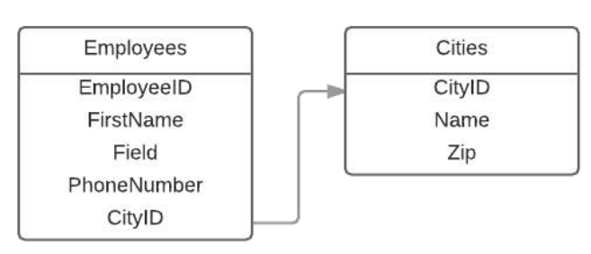

| Parameter | Details                                                                                                    |
|-----------|------------------------------------------------------------------------------------------------------------|
| tableName | The name of the table                                                                                      |
| columns   | Contains an 'enumeration' of all the columns that the table have. See Create a New Table for more details. |

# Create Table From `SELECT`

<details>
<summary>Creation of Employees table and insert data</summary>

```sql
CREATE TABLE Employees (
    Id INT PRIMARY KEY,
    FName VARCHAR(50),
    LName VARCHAR(50),
    PhoneNumber VARCHAR(15),
    ManagerId INT NULL,
    DepartmentId INT,
    Salary DECIMAL(10 , 2 ),
    HireDate DATE
);

INSERT INTO Employees (Id, FName, LName, PhoneNumber, ManagerId, DepartmentId, Salary, HireDate) VALUES
(1, 'James', 'Smith', '1234567890', NULL, 1, 1000, '2002-01-01'),
(2, 'John', 'Johnson', '2468101214', 1, 1, 400, '2005-03-23'),
(3, 'Michael', 'Williams', '1357911131', 1, 2, 600, '2009-05-12'),
(4, 'Johnathon', 'Smith', '1212121212', 2, 1, 500, '2016-07-24');
```
</details>

Data of the Employees table:
```sql
mysql> SELECT * FROM Employees;
+----+-----------+----------+-------------+-----------+--------------+---------+------------+
| Id | FName     | LName    | PhoneNumber | ManagerId | DepartmentId | Salary  | HireDate   |
+----+-----------+----------+-------------+-----------+--------------+---------+------------+
|  1 | James     | Smith    | 1234567890  |      NULL |            1 | 1000.00 | 2002-01-01 |
|  2 | John      | Johnson  | 2468101214  |         1 |            1 |  400.00 | 2005-03-23 |
|  3 | Michael   | Williams | 1357911131  |         1 |            2 |  600.00 | 2009-05-12 |
|  4 | Johnathon | Smith    | 1212121212  |         2 |            1 |  500.00 | 2016-07-24 |
+----+-----------+----------+-------------+-----------+--------------+---------+------------+
4 rows in set (0.00 sec)
```

You may want to create a duplicate of a table:
```sql
CREATE TABLE ClonedEmployees AS SELECT * FROM
    Employees;
```
Now `ClonedEmployees` table is created with the same columns and data as the `Employees` table.

```sql
mysql> SELECT * FROM ClonedEmployees;
+----+-----------+----------+-------------+-----------+--------------+---------+------------+
| Id | FName     | LName    | PhoneNumber | ManagerId | DepartmentId | Salary  | HireDate   |
+----+-----------+----------+-------------+-----------+--------------+---------+------------+
|  1 | James     | Smith    | 1234567890  |      NULL |            1 | 1000.00 | 2002-01-01 |
|  2 | John      | Johnson  | 2468101214  |         1 |            1 |  400.00 | 2005-03-23 |
|  3 | Michael   | Williams | 1357911131  |         1 |            2 |  600.00 | 2009-05-12 |
|  4 | Johnathon | Smith    | 1212121212  |         2 |            1 |  500.00 | 2016-07-24 |
+----+-----------+----------+-------------+-----------+--------------+---------+------------+
4 rows in set (0.00 sec)
```

You can use any of the other features of a `SELECT` statement to modify the data before passing it to the new table. The 
columns of the new table are automatically created according to the selected rows.
```sql
CREATE TABLE ModifiedEmployees AS SELECT Id, CONCAT(FName, ' ', LName) AS FullName FROM
    Employees
WHERE
    Id > 2;
```
The `ModifiedEmployees` table is created with the `Id` and `FullName` columns. The `FullName` column is created by
concatenating the `FName` and `LName` columns. The data is filtered to include only rows where the `Id` is greater than 2.

```sql
mysql> SELECT * FROM ModifiedEmployees;
+----+------------------+
| Id | FullName         |
+----+------------------+
|  3 | Michael Williams |
|  4 | Johnathon Smith  |
+----+------------------+
2 rows in set (0.00 sec)
```


## Understanding the `AS` Keyword in `CREATE TABLE ... AS SELECT`

This document explains the role of the `AS` keyword in the context of `CREATE TABLE ... AS SELECT` statements, clarifying
its purpose and how it differs from aliasing.

### Role of `AS` in `CREATE TABLE ... AS SELECT`

In `CREATE TABLE ... AS SELECT`, the `AS` keyword is not used for aliasing. Instead, it serves as part of the SQL syntax
to specify that the new table should be created with the structure and data derived from the result of the `SELECT`
statement.

#### Purpose of `AS`:

- The `AS` keyword connects the `CREATE TABLE` command with a `SELECT` statement that defines the schema and populates
  the new table.
- It tells the SQL engine that the new table should be created based on the results of the `SELECT` query, including 
  both column definitions and data.

### Examples Explained

#### 1. Creating `ClonedEmployees`

```sql
CREATE TABLE ClonedEmployees AS 
SELECT * FROM Employees;
```

- Here, `AS` indicates that `ClonedEmployees` should be created using the results of the `SELECT * FROM Employees` query.
- The new table copies both the structure (column definitions) and data from the `Employees` table.

#### 2. Creating `ModifiedEmployees`

```sql
CREATE TABLE ModifiedEmployees AS 
SELECT Id, CONCAT(FName, ' ', LName) AS FullName 
FROM Employees 
WHERE Id > 2;
```

- In this case, `AS` serves two roles:
    - The first `AS` is part of the `CREATE TABLE ... AS SELECT` syntax, linking the table creation with the `SELECT`
      statement.
    - The second `AS` (`AS FullName`) is used to alias the concatenated result as `FullName`.

### Summary

- In `CREATE TABLE ... AS SELECT`, `AS` is an integral part of the syntax that instructs SQL to create a new table based
  on the output of the `SELECT` statement.
- It effectively means "create the table with the structure and data from the following `SELECT` statement," not an 
  alias.

By understanding this use of `AS`, you can effectively create new tables from existing data sets with customized 
structures as needed.


# Create a New Table
A basic Employees table, containing an ID, and the employee's first and last name along with their phone number
can be created using
**MS SQL Server**
```sql
CREATE TABLE Employees (
    Id Int indentity(1,1) primary key not null,
    FName varchar(20) not null,
    LName varchar(20) not null,
    PhoneNumber varchar(10) not null
);
```
**MySQL**
```sql
CREATE TABLE Employees (
    Id INT AUTO_INCREMENT PRIMARY KEY,
    FName VARCHAR(20) NOT NULL,
    LName VARCHAR(20) NOT NULL,
    PhoneNumber VARCHAR(10) NOT NULL
);
```

This example is specific to Transact-SQL.<br/>
`CREATE TABLE` creates a new table in the database, followed by the table name, `Employees`<br/>
This is then followed by the list of column names and their properties, such as the ID<br/>
``Id int identity(1,1) not null`` at ms sql server or ``Id INT AUTO_INCREMENT PRIMARY KEY`` at MySQL<br/>

| Value          | Meaning                                                                                                  |
|----------------|----------------------------------------------------------------------------------------------------------|
| Id             | the column's name.                                                                                       |
| int            | is the data type.                                                                                        |
| identity(1,1)  | states that column will have auto generated values starting at 1 and incrementing by 1 for each new row. |
| auto_increment | states that column will have auto generated values starting at 1 and incrementing by 1 for each new row. |
| primary key    | states that all values in this column will have unique values                                            |
| not null       | states that this column cannot have null values                                                          |

## CREATE TABLE With FOREIGN KEY
Below you could find the table Employees with a reference to the table Cities.
**MS SQL Server**
```sql
CREATE TABLE Cities (
    CityID INT INDENTITY(1,1) NOT NULL,
    NAME VARCHAR(20) NOT NULL,
    Zip VARCHAR(10) NOT NULL
);

CREATE TABLE Employees (
    EmployeeID INT IDENTITY(1,1) NOT NULL,
    FirstName VARCHAR(20) NOT NULL,
    LastName VARCHAR(20) NOT NULL,
    PhoneNumber VARCHAR(10) NOT NULL,
    CityID INT FOREIGN KEY REFERENCES Cities(CityID)
);
```
**MySQL**
```sql
CREATE TABLE Cities (
    CityID INT AUTO_INCREMENT PRIMARY KEY,
    NAME VARCHAR(20) NOT NULL,
    Zip VARCHAR(10) NOT NULL
);

CREATE TABLE Employees (
    EmployeeID INT AUTO_INCREMENT PRIMARY KEY,
    FirstName VARCHAR(20) NOT NULL,
    LastName VARCHAR(20) NOT NULL,
    PhoneNumber VARCHAR(10) NOT NULL,
    CityID INT,
    FOREIGN KEY (CityID) REFERENCES Cities(CityID)
);
```
Here could you find a database diagram.



The column CityID of table Employees will reference to the column CityID of table Cities. Below you could find
the syntax to make this.

``CityID INT FOREIGN KEY REFERENCES Cities(CityID)``

| Value            | Meaning                             |
|------------------|-------------------------------------|
| CityID           | Name of the column                  |
| int              | type of the column                  |
| FOREIGN KEY      | Makes the foreign key (optional)    |
| REFERENCES       | Makes the reference                 |
| Cities(CityID)   | to the table Cities column CityID   |

**Important:** You couldn't make a reference to a table that not exists in the database. Be source to make first the
table Cities and second the table Employees. If you do it vise versa, it will throw an error.


## Duplicate a table
To duplicate a table, simply do the following:
```sql
CREATE TABLE newtable LIKE oldtable;
INSERT newtable SELECT * FROM oldtable;
```

## Create a Temporary or In-Memory Table
**PostgreSQL and SQLite**

To create a temporary table local to the session:
```sql
CREATE TEMP TABLE MyTable(...);
```


**SQL Server**

To create a temporary table local to the session:
```sql
CREATE TABLE #TempPhysical(...);
```


**MySQL**

To create a temporary table local to the session:
```sql
CREATE TEMPORARY TABLE MyTable(...);
```


### To create a temporary table visible to everyone

**SQL Server** <br/>
`##` prefix creates a global temporary table that is visible to all sessions and users. It persists until the last session
referencing it is closed.

```sql
CREATE TABLE ##TempPhysicalVisibleToEveryone(...);
```
To create an in-memory table:
```sql
DECLARE @TempMemory TABLE(...);
```


Sources:
* [SQL Notes for Professionals](https://goalkicker.com/SQLBook)